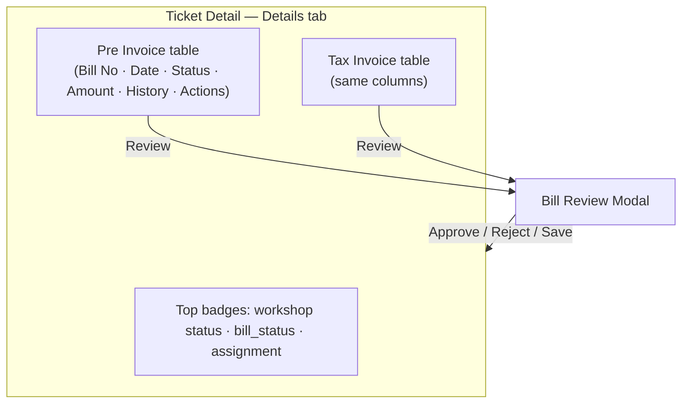
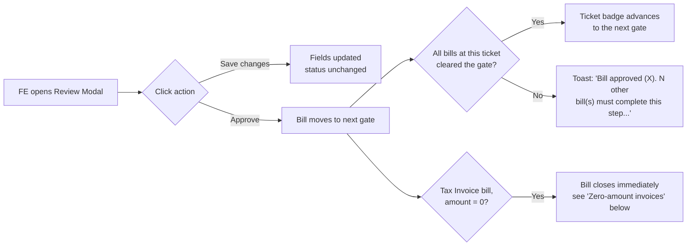

# Bill Approval Engine — Product Guide

**Feature:** Maintenance Bill approval chain (Pre Invoice + Tax Invoice) on the Maintenance Ticket screen, and the Bill / Finance Dashboards it feeds
**Status:** Live
**Screens:** Ticket Detail (`/dashboard/ticket/:ticketId`) → **Details** tab → Pre Invoice / Tax Invoice sections; Bill Dashboard (`/dashboard/bills/view`)
**Technical docs:** `[../technical/bill_approval_engine_backend.md](../technical/bill_approval_engine_backend.md)` · `[../technical/bill_approval_engine_frontend.md](../technical/bill_approval_engine_frontend.md)`

---

## What is the Bill Approval Engine?

Every Maintenance Ticket carries a chain of bills that have to be signed off by a sequence of roles before the ticket can be closed:

1. **Pre Invoice** bills (the estimate) — approved step by step by **FE → MM → FGM → SGM → Admin**.
2. **Tax Invoice** bills (the final invoice) — approved by **FE**, then **Finance**.

The screen shows this as two tables on the ticket's **Details** tab — **Pre Invoice** and **Tax Invoice** — each with a **Status** badge per bill, and the ticket itself carries one overall badge at the top of the screen (e.g. `In Workshop`, `FE Pending (TI)`, `Finance Approved`, `Closed`) that reflects whichever bill is furthest behind.

Approving a bill is done from the **Review Modal**: click **Review** on a bill row, check the extracted invoice fields, and click **Approve** (or **Reject**).

---

## Who is this for?

| Role                                        | Typical use                                                                                           |
| ------------------------------------------- | ----------------------------------------------------------------------------------------------------- |
| **Fleet Executive (FE)**                    | Uploads bills, does the first review/approve pass on both Pre Invoice and Tax Invoice bills           |
| **Maintenance Manager / FGM / SGM / Admin** | Successive approval gates on the Pre Invoice (estimate) chain                                         |
| **Finance**                                 | Final sign-off on Tax Invoice bills, from the Bill Dashboard's finance tabs                           |
| **Administrator / System Manager**          | Privileged — can approve at any gate regardless of role, and see the debug detail in the Review Modal |

---

## Screen layout

- **Top badges** — the leftmost badge is workshop status (`In Workshop`, etc.); the next one is the ticket's overall `bill_status` — this is the one driven by the approval chain covered in this doc.
- **Pre Invoice / Tax Invoice tables** — one row per bill. **Status** is a colored pill (orange = pending/in-progress, green = approved, red = rejected). **Amount**, **History** (view past actions), and **Actions** (View / Remove) sit alongside.
- **Bill Review Modal** — opens over the ticket screen. Shows the extracted invoice image/fields on the left, editable fields on the right, and **Approve** / **Reject** / **Save changes** buttons at the bottom, gated by the viewer's role and the bill's current gate.

---

## How approving a bill works

**Key rule — the ticket waits for the slowest bill.** If a ticket has two Tax Invoice bills and one is approved before the other, the ticket's badge does **not** advance until *both* have cleared that gate. This is intentional: the ticket represents the whole job, not one bill.

**A plain "Save changes" never approves anything.** Editing a field (including the amount) and saving does not move the bill forward — only clicking **Approve** does. This matters for the zero-amount rule below: uploading (or correcting) a bill to ₹0 and just saving does nothing; the FE still has to click Approve.

---

## Zero-amount Tax Invoice bills — the "no Finance needed" rule

**Business rule:** if a Tax Invoice bill's amount is exactly ₹0, it never needs Finance's sign-off. Clicking **Approve** on it closes the bill immediately (`Closed`), skipping `Finance Pending` and `Finance Approved` entirely.

What this looks like on screen:

| Situation                                                                              | Bill's Status badge | Ticket's top badge                                                     |
| --------------------------------------------------------------------------------------- | ------------------- | ------------------------------------------------------------------------ |
| Only Tax Invoice bill on the ticket, ₹0, just approved                                  | **Closed**          | **Closed**                                                                |
| Other Tax Invoice bills also exist, but at least one of them is genuinely Finance Approved | **Closed**          | **Finance Approved** — the ticket reflects the real finance sign-off, not the zero-amount bill's shortcut |
| Other Tax Invoice bills exist and *every one* of them is also a zero-amount `Closed` bill | **Closed**          | **Closed**                                                                |
| Other Tax Invoice bills exist and are still mid-chain (not yet Finance Approved or Closed) | **Closed**          | *unchanged* — still reflects the other, still-open bill(s)               |

A `Closed` zero-amount bill also does **not** appear on the **Bill Dashboard**'s Finance tabs (Reconcile Pending / Finance Pending / Finance Rejected / Finance Approved) — its Finance Status stays blank, because it was never sent to Finance in the first place. It's still visible under the dashboard's **All** tab.

> Before 2026-09-29 this rule had several visible bugs (fixed across two rounds the same day, see the technical docs for the code-level detail):
>
> - Approving a zero-amount bill sometimes appeared to do nothing — the toast read `"Bill approved (Pending)."` and the bill's Status badge stayed on **Pending**.
> - The ticket's top badge showed **Finance Approved** instead of **Closed** once every Tax Invoice bill on the ticket was done.
> - If a *different*, non-zero bill on the same ticket reached Finance Pending first, the zero-amount bill could pick up a **Finance Pending** Finance Status and briefly show up on the Bill Dashboard's Finance tabs even after it was later closed.
> - (Found later, against ticket MNT-32634) A ticket with **one** zero-amount bill and **one** genuinely Finance-Approved bill wrongly showed **Closed** instead of **Finance Approved** — hiding that Finance had actually signed off on the real invoice.
> - Finance's Approve button sometimes visibly needed two clicks: the first click correctly approved the bill underneath, but the ticket's badge didn't update until a second, differently-timed save happened to run the sync uninterrupted.
>
> All three are fixed. If you see any of them again, it's a regression, not expected behavior — flag it as a bug against this rule specifically.

---

## Toasts you'll see

| Toast                                                                                                  | When                                                                            | Meaning                                                                           |
| ------------------------------------------------------------------------------------------------------ | ------------------------------------------------------------------------------- | --------------------------------------------------------------------------------- |
| **"Bill approved ({status})."**                                                                        | You approved a bill and no other bill on the ticket is waiting on the same gate | The ticket badge moved too                                                        |
| **"Bill approved ({status}). N other bill(s) must complete this step before the ticket moves{to X}."** | You approved a bill, but a sibling bill hasn't cleared the same gate yet        | Your bill is done; the ticket is waiting on the other one(s)                      |
| **"Ticket moved to {state}."**                                                                         | The ticket badge itself advanced as a direct result of this approval            | Includes the zero-amount `Closed` case                                            |
| **"Bill saved, but the ticket workflow could not be updated..."**                                      | The bill saved correctly but the follow-up ticket sync call failed              | Bill state is fine; use **Take Actions** or Desk to fix the ticket state manually |

---

## Statuses glossary

| Status                                                                         | Applies to                | Meaning                                                                                                                                              |
| ------------------------------------------------------------------------------ | ------------------------- | ---------------------------------------------------------------------------------------------------------------------------------------------------- |
| `Pending`                                                                      | Bill                      | Uploaded, not yet acted on                                                                                                                           |
| `FE Approved`, `MM Approved`, `FGM Approved`, `SGM Approved`, `Admin Approved` | Pre Invoice bill          | Cleared that specific gate                                                                                                                           |
| `FE Approved`                                                                  | Tax Invoice bill          | Cleared the FE gate — waiting on Finance (unless the ₹0 rule applies)                                                                                |
| `Finance Approved`                                                             | Tax Invoice bill / ticket | Finance signed off                                                                                                                                   |
| `Closed`                                                                       | Bill / ticket             | Fully done — either the normal chain finished, the zero-amount rule fired, or (for inhouse workshops) the whole Tax Invoice step is skipped entirely |
| `{Role} Rejected`                                                              | Bill                      | Sent back — **all** prior progress on that bill is discarded; it restarts from FE                                                                    |
| `FE Pending (TI)`                                                              | Ticket                    | Waiting on an FE to submit the Tax Invoice chain forward                                                                                             |
| `Finance Pending`                                                              | Ticket                    | Waiting on Finance                                                                                                                                   |

---

## Related screens

- **Bill Dashboard** (`/dashboard/bills/view`) — see `[bill-dashboard-product.md](../../../crm/docs/bill-dashboard-product.md)` for the full filter/stats reference. Its **Finance Status** tabs (Reconcile Pending / Finance Pending / Finance Rejected / Finance Approved) are driven by `finance_approval_status`, the same field this doc's zero-amount rule keeps `null` on a closed ₹0 bill.
- **Take Actions** (ticket header) — manual escalation path when the automatic sync toast reports a failure.

