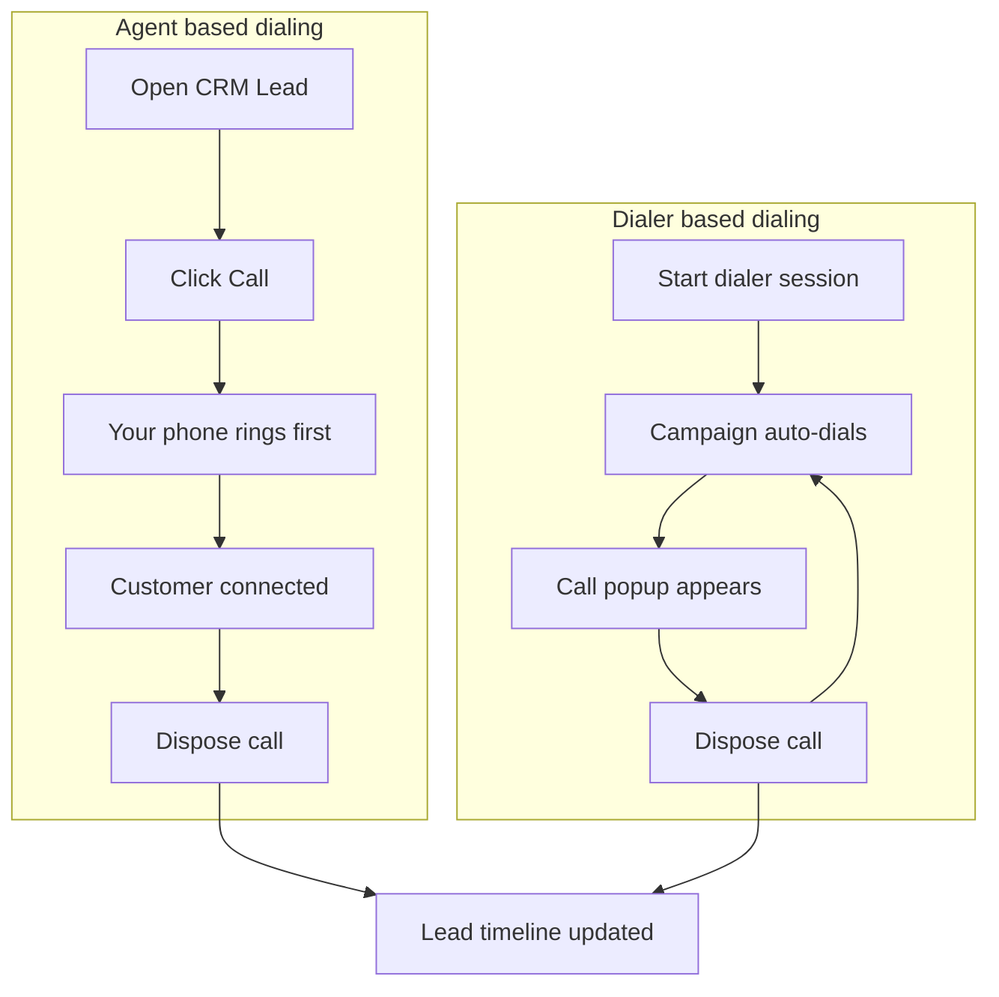

# Calling — Product Guide

**Feature:** CRM Telephony  
**Status:** Live  
**Vendors:** Smartflo, Callmatic (role-based)

---

## What is Calling?

**Calling** lets telecallers talk to leads from CRM — either by clicking **Call** on a lead (**Agent based dialing**) or by running an auto-dial **campaign session** (**Dialer based dialing**).

Every call is recorded as a **Call Session** on the lead timeline. After a call, the agent saves a **disposition** (status, remarks, callback, visit date) so the team has a full history.

---

## Two ways to call

| Mode | Best for | How it starts |
|---|---|---|
| **Agent based dialing** | Calling one specific lead from their CRM record | **Call** button on CRM Lead |
| **Dialer based dialing** | High-volume outbound/inbound from a campaign | **Start dialer session** → platform dials next lead |

You cannot use **Agent based dialing** while a **dialer session** is active — end the session first.

---

## Who is this for?

**Telecallers** and **Telecaller Lead** users who:

- Call leads assigned to them (or unassigned leads, per assignment rules)
- Run campaign dialer sessions
- Log dispositions and schedule callbacks or visits after calls

**Administrators / ops** configure vendors, campaigns, DIDs, and disposition mappings.

---

## How it works (high level)

---

## What you see during a call

A floating **call popup** (Auto Dialing panel) shows:

- Lead ID (click to open lead)
- Call direction — **Incoming** or **Outgoing**
- Lead source and DP name (when available)
- Line status — e.g. initiated, connected, disconnected
- **Call timer** when the customer is connected

If the call fails or is missed, the popup shows the reason and may offer **Retry** (Agent based dialing).

---

## What you see after a call

### Lead → Activities → Calls

Each call appears as a row with:

- Who called whom (agent ↔ lead)
- **Outgoing** or **Incoming**
- Status — e.g. Disconnected, OB Missed, Failed, Disposed
- Duration and date/time

Click a row to open **Call session** detail:

| Field | Description |
|---|---|
| Agent | Who handled the call |
| Status | Final call outcome |
| Disposition status / sub-disposition | What you selected after the call |
| Disposition remarks | Your notes |
| Hangup by / reason | Who ended the call and why (when available) |
| Failure reason | Shown in red if the call failed to connect |
| Direction | Inbound or Outbound |
| Duration | Talk time |

---

## Call outcomes (plain language)

| Status you may see | What it means |
|---|---|
| **Initiated** | Call was started; still connecting |
| **Agent connected** | You answered; customer may still be ringing |
| **Customer connected** | Both parties on the line |
| **Disconnected** | Call ended after a conversation |
| **OB Missed** | Outbound — customer did not answer |
| **IB Missed** | Inbound — call was missed |
| **Failed** | Could not connect (e.g. you did not answer in time, line busy, setup error) |
| **Disposed** | Disposition saved |

---

## Getting started

### Prerequisites

1. Your role has calling enabled (Smartflo and/or Callmatic — set by admin).
2. Your **Carrum user profile** has telephony details (phone, extension, hub, DID where applicable).
3. For **dialer**: a campaign is assigned and you know how to start/end session.
4. For **Agent based Callmatic**: a caller ID (DID) is configured for your account or hub.

### Agent based dialing — quick steps

1. Open a **CRM Lead** with a mobile number.
2. Confirm you are allowed to call (assignment rules).
3. Click **Call** (phone icon).
4. Answer your phone when it rings.
5. Talk to the customer when connected.
6. When the call ends, complete **disposition** if prompted.

See [Agent based dialing](./agent-based/README.md) for details.

### Dialer based dialing — quick steps

1. Open the dialer / campaign UI.
2. Select campaign and **Start session**.
3. Wait for the next call — popup appears when connected.
4. After each call, **dispose** before the next dial.
5. **End session** when finished (reason required).

See [Dialer based dialing](./dialer-based/README.md) for details.

---

## Vendor by role

Your admin maps roles to a default vendor:

| Vendor | Agent based | Dialer based |
|---|---|---|
| **Smartflo** | Yes — live call updates in popup | Yes |
| **Callmatic** | Yes — outcome after call completes | No |

Details:

- [Agent based — Smartflo](./agent-based/smartflo.md)
- [Agent based — Callmatic](./agent-based/callmatic.md)
- [Dialer based — Smartflo](./dialer-based/smartflo.md)

---

## Common issues

| Problem | What to do |
|---|---|
| Call button disabled | Check calling is enabled; end dialer session; confirm you can call this lead |
| “End session to use agent calling” | End your active dialer session first |
| “Login smartflo softphone & accept call from CRM” | Log into Smartflo softphone and accept the incoming call |
| “DID isn't configured…” (Callmatic) | Contact admin — hub DID missing in Carrum config |
| Call shows **Failed** | Open call detail for **Failure reason**; retry if offered |
| Customer missed | Status **OB Missed** — dispose and follow up as per process |
| No live popup (Callmatic) | Expected — Callmatic updates after the call ends |

For engineering details, see [Calling — Technical](../technical/calling/README.md).

---

## Documentation

| Guide | Audience |
|---|---|
| [Agent based dialing](./agent-based/README.md) | Telecallers using Lead call button |
| [Dialer based dialing](./dialer-based/README.md) | Telecallers on campaign dialer |
| [Technical calling docs](../technical/calling/README.md) | Developers / support |
