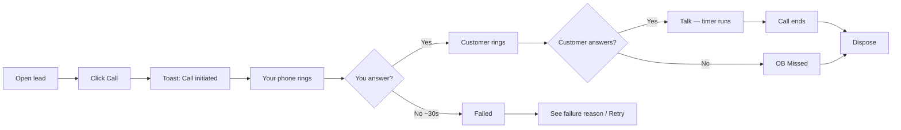

# Agent Based Dialing — Product Guide

**Feature:** Call from CRM Lead  
**Also known as (legacy):** Click-to-call, manual dial  
**Calling method:** Agent

---

## What is Agent based dialing?

**Agent based dialing** lets you call a lead directly from their **CRM Lead** page. When you click **Call**:

1. CRM starts an outbound call
2. **Your phone rings first**
3. After you answer, the **customer** is connected
4. You complete a **disposition** when the call ends

Use this when you are working a specific lead — not when running a high-volume dialer campaign.

---

## Who can use it?

**Telecallers** with calling integration enabled, when:

- The lead has a **mobile number**
- You are allowed to call this lead (assignment rules)
- You do **not** have an active **dialer session**

---

## Where to find it

| Screen | Action |
|---|---|
| **CRM Lead** (desktop) | Phone / **Call** button in the header |
| **CRM Lead** (mobile) | Call action on lead detail |
| **Call popup** (after failed connect) | **Retry** button |
| **Global callback banner** | Call back from scheduled callback |

---

## Step-by-step

1. Open the lead and click **Call**.
2. Wait for **“Call initiated”** (or an error toast).
3. **Answer your phone** when it rings.
4. When the customer connects, use the **call popup** for lead context (source, IB/OB, timer).
5. When the call ends, fill **disposition** (status, remarks, callback/visit if needed).
6. Confirm the call appears under **Activities → Calls** on the lead.

---

## What you see in the call popup

While the call is active (vendor-dependent — see Smartflo vs Callmatic below):

| Information | Purpose |
|---|---|
| Lead ID | Quick link back to lead |
| IB/OB | Incoming vs outgoing |
| Lead source | Campaign/source context |
| DP name | Preferred scheme when set |
| Line status | Connecting / connected / ended |
| Timer | Talk time when connected |

If the call fails before connect, the popup shows the **reason** and may show **Retry**.

---

## After the call — lead timeline

Under **Activities → Calls** you will see:

- **Outgoing** call with final status
- **Duration** (when the call connected)
- Icon hints: missed (red), failed/declined, normal direction arrow

Open **Call session** detail for disposition, hangup reason, and failure reason.

---

## Agent based vs Dialer based

| | Agent based | Dialer based |
|---|---|---|
| Start | Call on one lead | Start campaign session |
| Who picks the number | You (from lead page) | Platform (next in queue) |
| While dialer session on | **Blocked** | N/A |
| Best for | Follow-ups, callbacks, single lead | Campaign blasting |

---

## Vendor experience

Your role determines Smartflo vs Callmatic:

| | [Smartflo](./smartflo.md) | [Callmatic](./callmatic.md) |
|---|---|---|
| Live popup stages | Yes — initiated → agent → customer | No — result after call ends |
| Answer first | Smartflo softphone or phone | Your mobile (Callmatic calls you) |
| Typical failure | Did not answer softphone in time | DID not configured, agent unreachable |

---

## Common messages

| Message | Meaning |
|---|---|
| **Call initiated** | Vendor accepted the call request |
| **End session to use agent calling** | End dialer session before using Call on lead |
| **Please wait before calling again** | Short cooldown between attempts |
| **Only Dial, If none TC is assigned…** | You cannot call this lead (assignment) |
| **Login smartflo softphone…** | Open Smartflo and accept the call (Smartflo) |
| **DID isn't configured…** | Admin must set caller ID for your hub (Callmatic) |

---

## Tips

- Keep **Smartflo softphone** logged in when your role uses Smartflo Agent calling.
- For **Callmatic**, ensure your profile phone number is correct — that is the number Callmatic rings.
- Always **dispose** after a connected call so lead status and callbacks stay accurate.
- Use **Retry** only when the failure was on your side (e.g. did not pick up).

---

## Related

- [Calling overview](../README.md)
- [Dialer based dialing](../dialer-based/README.md)
- [Technical — Agent based](../../technical/calling/agent-based/README.md)
