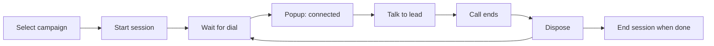

# Dialer Based Dialing — Product Guide

**Feature:** Campaign auto-dial session  
**Calling method:** Dialer  
**Vendor:** Smartflo (today)

---

## What is Dialer based dialing?

**Dialer based dialing** is for **campaign calling at scale**. Instead of clicking Call on each lead:

1. You **start a dialer session** for a campaign
2. Smartflo **automatically dials** the next lead or callback
3. When someone connects, the **call popup** appears
4. You **dispose** the call (status, remarks, callback)
5. The dialer moves to the **next call** until you **end the session**

---

## Who is it for?

Telecallers running **outbound or inbound campaign queues** — e.g. fresh leads, callbacks, re-dials.

Not for one-off calls to a single lead — use **[Agent based dialing](../agent-based/README.md)** instead.

---

## Agent based vs Dialer based

| | Agent based | Dialer based |
|---|---|---|
| Start | Call button on lead | Start dialer session |
| Next number | You choose the lead | Platform chooses |
| Session | No session | Active until you end |
| Blocks other mode | Yes — dialer blocks Agent call | Agent call blocked while session on |

---

## Step-by-step

1. Open dialer / telephony area in CRM.
2. Choose **campaign** (if prompted).
3. Click **Start session** — wait until session is active.
4. When a call connects, the **Auto Dialing** popup opens with lead details.
5. After hangup, complete the **disposition form** (required before next dial in most flows).
6. Repeat until queue is done.
7. **End session** and provide an **end reason** when leaving the dialer.

---

## What you see during a dialer call

The same **call popup** as Agent based dialing, showing:

- Lead ID (link to record)
- **Incoming** or **Outgoing** (campaign direction)
- Lead source, DP name
- Line status and **timer** when connected

For **inbound** dialer calls, CRM may create or match a lead from the caller ID automatically.

---

## Disposition

After each call you typically must **dispose**:

| Field | Purpose |
|---|---|
| Primary / sub disposition | Lead status outcome |
| Remarks | Notes |
| Callback datetime | Schedule follow-up call |
| Visit date | Schedule hub visit |

If disposition is synced from Smartflo, CRM may pre-fill some fields.

**Auto-dispose:** In some cases CRM auto-disposes undisposed disconnects — you may see a notification toast.

---

## After the call — lead timeline

Every dialer call creates a **Call Session** on the lead:

- Visible under **Activities → Calls**
- Status: Connected → Disconnected / OB Missed / IB Missed → Disposed
- Detail modal: agent, disposition, duration, hangup info

---

## Ending your session

When you finish campaigning:

1. Click **End session**
2. Enter **reason** (required)
3. Confirm session is no longer active

You can then use **Agent based dialing** from individual leads again.

---

## Breaks

Use **dialer break** (when available in UI) to pause receiving new dials without fully ending the session — exact behavior depends on your CRM telephony setup.

---

## Common issues

| Problem | What to do |
|---|---|
| Cannot start session | Check Smartflo login / campaign access |
| No calls coming | Confirm campaign has leads; check break status |
| Popup didn't appear | Check browser socket connection; refresh if stuck |
| Must dispose before next call | Complete disposition form |
| Cannot call from lead page | End dialer session first |

---

## Vendor details

Smartflo-specific behaviour: [Dialer based — Smartflo](./smartflo.md)

---

## Related

- [Calling overview](../README.md)
- [Agent based dialing](../agent-based/README.md)
- [Technical — Dialer based](../../technical/calling/dialer-based/README.md)
