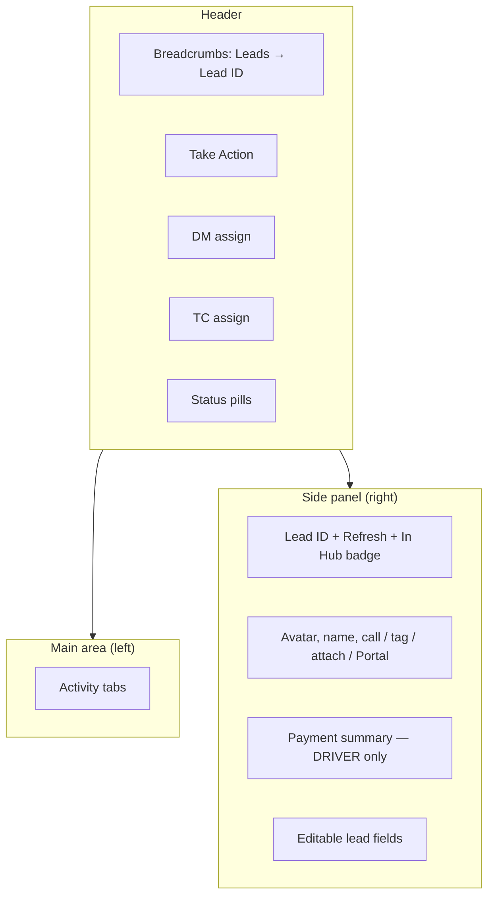
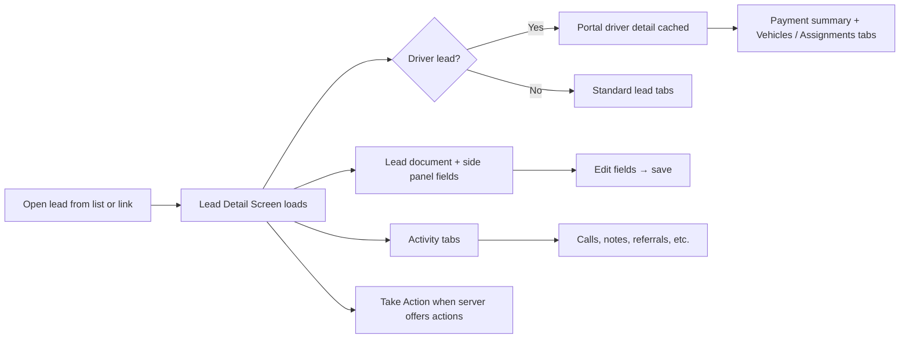

# Lead Detail Screen — Product Guide

**Feature:** CRM Lead workspace  
**Status:** Live  
**Route:** `/leads/:leadId`  
**Technical docs:** [../technical/lead_detail_screen.md](../technical/lead_detail_screen.md)

---

## What is the Lead Detail Screen?

The **Lead Detail Screen** is the single-record workspace for a **CRM Lead**. It is where agents view and update lead information, make calls, record walk-in dispositions, manage driver onboarding workflows, and review the full activity history for a prospect or driver.

Each lead has a display ID (for example `AAAA0001`) shown at the top of the screen. The layout adapts automatically: desktop users see a resizable side panel; mobile users get a dedicated **Details** tab with the same fields.

---

## Who is this for?

| Role | Typical use |
|---|---|
| **Telecaller** | Call the lead, dispose calls, update status and notes |
| **Telecaller Lead** | Assign or reassign telecallers; run Take Action workflows (walk-in) |
| **Onboarding** | Hub walk-in disposition, DM assignment, driver onboarding tabs |
| **Hub Manager / Admin** | DM assignment (mobile), mobile number edits, masked mobile override |
| **Driver Manager / Senior DM** | Referral tab, driver assignments, vehicle workflows |

**Access:** Open any lead from **Leads**, **Drivers**, **Hub Visit**, **Scheduled Walk-In**, or direct link `/leads/<leadId>`.

---

## Screen layout

### Desktop

### Mobile

On viewports under 768px, the app loads **Mobile Lead**. The first tab is **Details**, which combines header actions, avatar, payment summary, and side-panel fields. All other tabs appear below in the tab bar.

---

## How it works

1. Agent navigates to a lead (from list, search, or notification).
2. CRM loads the lead document, side-panel field layout, and activity data in parallel.
3. For **DRIVER** leads, portal driver detail is fetched to power payment summary, vehicle tabs, and DM assignment display.
4. Agent works in tabs (activity timeline, calls, data fields) and the side panel (quick edits).
5. **Take Action** appears when the server returns one or more allowed actions for the lead's current state and the user's role.
6. Changes are saved immediately; the activity timeline refreshes to reflect updates.

---

## Tabs

Tab order depends on role. **Onboarding** users see **Data** earlier and driver workflow tabs grouped together. Other roles see **Comments** before **Data**.

| Tab | Purpose | When available |
|---|---|---|
| **Activity** | Timeline of calls, walk-ins, payments, status changes, audits | Always |
| **Comments** | Threaded comments on the lead | Always |
| **Data** | Full data-field layout; portal sync for drivers | Always |
| **Calls** | Call log history and disposition | Always |
| **Notes** | Internal notes | Always |
| **Attachments** | Files linked to the lead | Always |
| **WhatsApp** | WhatsApp conversation (when integration enabled) | When WhatsApp is enabled |
| **Referral** | Referrals linked to this lead | Always |
| **Agreement** | Upload / send driver agreement | **DRIVER** leads only |
| **Vehicles** | Vehicle assignment and requested cars | **DRIVER** + portal scheme configured |
| **Assignments** | Linked secondary driver leads | **DRIVER** + vendor or double-driver scheme |
| **Details** (mobile only) | Side panel + header actions | Mobile layout only |

Disabled tabs are skipped automatically — the screen opens the first enabled tab.

Your last selected tab is remembered per device (`lastLeadTab` in browser storage) and reflected in the URL hash.

---

## Header and side-panel actions

### Top header (desktop)

| Control | Who can use it | What it does |
|---|---|---|
| **Take Action** | When server returns actions | Opens modal for walk-in, merge, onboarding drop, reactivation, etc. |
| **DM** | Onboarding (desktop) | Assign a Driver Manager from hub DM list |
| **TC** | Telecaller Lead; Onboarding when TC unassigned | Assign or unassign telecaller |
| **Primary / Secondary status** | All | Read-only disposition display with color pills |

### Side panel action row

| Control | Notes |
|---|---|
| **Call** | Click-to-call via configured vendor (Callmatic / Smartflo). Plain telecallers can call only when no TC is assigned or they are the assigned TC (desktop). |
| **Tag** | Personal color tag visible only to you; ring color on lead name |
| **Attach** | Upload files; switches to Attachments tab after upload |
| **Portal** | Opens Carrum DP details in new tab (**DRIVER** only; hidden for Sourcing and Telecaller Lead) |
| **Refresh** | Reloads lead, portal cache, tabs, and payment summary (desktop) |
| **In Hub** badge | Shown when lead `hub_visit_status` is **IN_HUB** |

### Mobile header (Details tab)

Mobile includes **Take Action**, **TC**, **DM** (Onboarding, Hub Manager, Admin), and status pills inside the Details tab toolbar. DM assignment on mobile is available to more roles than on desktop.

---

## Side panel fields

The right panel (or mobile **Details** tab) shows CRM-configured fields from **CRM Fields Layout → Side Panel**.

| Behavior | Detail |
|---|---|
| **Hub / business / scheme** | Cascading selects; changing hub clears dependent fields |
| **Source** | Searchable dropdown from manual lead sources |
| **Mobile number** | Hidden for DRIVER in side panel; shown masked. Onboarding and Hub Manager can edit under the mask |
| **Telecaller** | Editable by Telecaller Lead; read-only for others |
| **Status fields** | Read-only on mobile side panel |
| **Hub fee** | Locked after first non-blank save on DRIVER leads |
| **Lost status** | Prompts for lost reason when changing to a Lost-type status |

**Payment summary** (DRIVER only): shows Total Paid, Advance Fee, and Deposit Amount from the Carrum portal, plus a **Driver Hisaab** link when available.

---

## Take Action workflows

Actions are **server-driven** — only actions valid for the lead's current status and your role appear.

| Action | Typical trigger | Roles |
|---|---|---|
| **Mark WalkIn Done** | Record hub walk-in disposition | Onboarding, Telecaller Lead, Administrator |
| **Mark Onboarding Drop** | Converted lead, not yet at vehicle assignment | Per lead status rules |
| **Remove Onboarding Drop** | Lead currently marked onboarding drop | Per lead status rules |
| **Merge Lead** | Duplicate LEAD-type record | When not merged; LEAD type only |
| **Unmerge Lead** | Lead was merged into another | When merge status applies |
| **Raise Driver Reactivation Request** | Dropped driver eligible for reactivation | DRIVER + DROP status (excludes inactive/temp/maintenance drops) |

Walk-in disposition details: [Walk-in Form — Product Guide](walkin_form.md).

---

## Driver-specific features

For leads with `lead_type = DRIVER`:

- **Payment summary** in side panel
- **Agreement** tab — upload and send agreement via WhatsApp
- **Vehicles** tab — auto-assign cars, update requested cars (when portal scheme exists)
- **Assignments** tab — link secondary driver leads (vendor or double-driver schemes)
- **DM assignment** when `custom_account_id` is set
- **Portal** button — jump to Carrum DP details edit screen
- **Masked mobile** in side panel instead of raw phone field

For **LEAD**-type records, **Merge Lead** is available when duplicates are detected.

---

## Role summary

| Capability | Roles |
|---|---|
| Assign telecaller | Telecaller Lead; Onboarding when TC empty |
| Assign DM (desktop header) | Onboarding |
| Assign DM (mobile) | Onboarding, Hub Manager, Admin, Administrator |
| Edit full mobile number | Onboarding, Hub Manager, Admin, Administrator |
| Edit masked DRIVER mobile | Onboarding, Hub Manager |
| Walk-in Take Action | Onboarding, Telecaller Lead, Administrator |
| Portal button | All except Sourcing, Telecaller Lead |
| Plain telecaller click-to-call (desktop) | Only when unassigned TC or current user is assigned TC |
| Add referral (Referral tab) | Admin, Hub Manager, AHM, SDM, Telecaller Lead, OA, Telecaller, DM |

---

## Getting started

### Open a lead

1. Go to **Leads** (or **Drivers** / **Vendors** list).
2. Click a row to open the Lead Detail Screen.
3. Use breadcrumbs to return to the list view you came from.

### Edit lead information

1. Scroll the side panel (desktop) or open **Details** (mobile).
2. Change a field — CRM saves on blur or explicit save.
3. For status changes to **Lost**, complete the lost-reason modal when prompted.

### Make a call

1. Ensure calling integration is enabled and you are not in an active dialer session.
2. Click the **phone** icon next to the lead name.
3. Complete call disposition from the **Calls** tab when the call ends.

### Record a walk-in

1. Click **Take Action** → **Mark WalkIn Done**.
2. Complete the walk-in form (source, disposition, business type, etc.).
3. Confirm on the activity timeline as **Walk-in Form Submitted**.

### Assign telecaller or DM

1. Use **TC** or **DM** dropdown in the header (desktop) or Details tab (mobile).
2. Select an agent — assignment saves immediately.
3. For DM, the lead must have a portal **Account ID** (`custom_account_id`).

---

## Troubleshooting

| Problem | Likely cause | Solution |
|---|---|---|
| **Take Action** not visible | No actions for current lead state / role | Check lead status and your role |
| **Take Action** disabled | Actions still loading or empty list | Refresh lead; verify server action rules |
| Cannot call lead | Dialer session active, cooldown, or TC assignment rule | End dialer session; wait; check TC assignment |
| **Vehicles** tab disabled | No portal scheme on driver | Complete scheme selection on lead / portal |
| **Assignments** tab disabled | Scheme is not vendor or double-driver | Expected for non-vendor schemes |
| Payment summary empty / error | Portal driver detail unavailable | Refresh lead; verify driver linked in portal |
| **Portal** button missing | Sourcing / Telecaller Lead role, or not DRIVER | Role or lead type restriction |
| DM list empty | Hub DM API returned no rows | Check hub and account ID on lead |
| Cannot edit mobile | Role lacks mobile edit permission | Contact admin for Onboarding / Hub Manager role |
| Status not updating on walk-in | Lead is Drop or Converted | Walk-in still records visit; status unchanged |

---

## Current limitations

- **Delete lead** — UI delete is disabled (`canDelete = false`).
- **Referral tab role gate** — implemented in code but currently not enforced in the tab list (tab visible to all).
- **Telecaller read-only lock** — removed; all roles can edit side-panel fields subject to field-level rules.
- **Desktop vs mobile DM roles** — desktop DM assign is Onboarding-only; mobile allows Hub Manager and Admin.
- **Portal dependency** — DRIVER payment, vehicles, and DM display require Carrum portal connectivity.

---

## FAQ

**Q: What's the difference between Leads, Drivers, and Vendors lists?**  
A: All open the same Lead Detail Screen. Lists filter by `lead_type` (LEAD, DRIVER, VENDOR).

**Q: Why do Onboarding users see tabs in a different order?**  
A: Tab order is optimized for hub walk-in and driver conversion workflows.

**Q: Can I merge two driver records?**  
A: **Merge Lead** is offered for **LEAD** type only. Drivers use other deduplication flows.

**Q: Where does walk-in history appear?**  
A: On the **Activity** tab as **Walk-in Form Submitted** entries.

**Q: How do I open DP details in the Carrum portal?**  
A: Click **Portal** in the side panel (DRIVER leads, eligible roles). CRM resolves the driver ID from portal cache.

**Q: Does the screen update in real time?**  
A: Status and lead type changes pushed from the server (e.g. webhooks) reload the document via websocket.

---

## Related documentation

| Topic | Link |
|---|---|
| Walk-in form | [walkin_form.md](walkin_form.md) |
| Lead sync source | [lead_sync_source.md](lead_sync_source.md) |
| Calling | [calling/README.md](calling/README.md) |
| Technical implementation | [../technical/lead_detail_screen.md](../technical/lead_detail_screen.md) |
| CRM Lead API | [../technical/resource/crm_lead/README.md](../technical/resource/crm_lead/README.md) |

---

## Glossary

| Term | Definition |
|---|---|
| **Lead Detail Screen** | Single CRM Lead workspace at `/leads/:leadId` |
| **Side panel** | Right-column (desktop) or Details tab (mobile) field layout |
| **Take Action** | Server-driven modal for merge, walk-in, drop, reactivation |
| **TC** | Telecaller assigned to the lead |
| **DM** | Driver Manager assigned via Carrum portal |
| **Portal driver detail** | Cached Carrum API response powering driver tabs and payment summary |
| **Hub visit status** | `NOT_IN_HUB` / `IN_HUB` / `HUB_VISITED` — drives **In Hub** badge |
| **Scheme** | Driver product scheme from portal — gates Vehicles and Assignments tabs |
