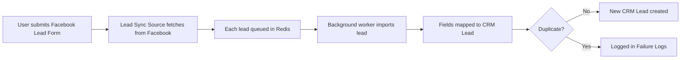

# Lead Sync Source — Product Guide

**Feature:** Lead Syncing  
**Status:** Beta  
**Supported sources:** Facebook Lead Ads

---

## What is Lead Sync Source?

Lead Sync Source lets your sales team automatically pull leads from Facebook Lead Ads into CRM — without manual CSV uploads or copy-paste.

Each **Lead Sync Source** connects one Facebook Lead Form to CRM. When someone submits that form on Facebook, their details are imported as a **CRM Lead** on a schedule you choose, or immediately when you click **Sync now**.

---

## Who is this for?

Teams that run Facebook Lead Ads and want those submissions to flow into CRM automatically — without manual imports.

Use it to set up lead sources, map form fields, monitor failures, and keep leads attributed to the correct campaign.

**Access:** Settings → Integrations → **Lead syncing** (availability is controlled via CRM tab permissions in Settings)

---

## How it works

1. A prospect fills out a Facebook Lead Ad form.
2. CRM fetches new submissions from Facebook on your chosen schedule (or when you click **Sync now**).
3. Each fetched lead is placed in a **background job queue** for import.
4. A worker processes leads one at a time — mapping form questions to CRM Lead fields (name, phone, email, etc.).
5. A new CRM Lead is created for each successful import.
6. Duplicates and errors are recorded in **Failure Logs** for review and retry.

---

## Getting started

### Prerequisites

Before setting up Lead Sync Source, ensure:

1. **Facebook Lead Ads** are running and collecting submissions on your Facebook Page.
2. A **Facebook access token** is configured on the server (contact your system administrator).
3. **Important:** A **CRM Lead Source** record for **Facebook** with purpose **Manual Selection** must exist before you proceed. Lead sync looks up this record to attribute imported leads. Without it, sync will fail.
4. The **Lead syncing** tab is enabled for your user in CRM tab permissions.

### Step 1: Create a new source

1. Go to **Settings → Integrations → Lead syncing**.
2. Click **New**.
3. Enter a **source name** (e.g. "Bengaluru Walk-in Campaign").
4. Select **Facebook** as the source type.
5. Choose a **background sync frequency** (default: Hourly).
6. Click **Create**.

On creation, CRM automatically fetches your Facebook Pages and Lead Forms from Facebook.

### Step 2: Select page and form

1. Open the source you just created.
2. Select the **Facebook Page** that owns the lead form.
3. Select the **Facebook Lead Form** you want to sync.

> **Note:** Each Facebook Lead Form can only have **one enabled** sync source at a time.

### Step 3: Map form fields to CRM

After selecting a lead form, a mapping table appears showing all Facebook form questions.

For each question, choose the matching **CRM Lead field**:

| Facebook question | Recommended CRM field |
|---|---|
| Phone number | Mobile No |
| Full name | Lead Name |
| Email | Email |

**Important:** Map the **phone number** question to **Mobile No**. Leads without a valid mobile number are not imported.

Click **Update** to save mappings.

### Step 4: Enable and sync

1. Toggle **Enabled** on.
2. Click **Update** to save.
3. Optionally click **Sync now** to fetch and queue leads immediately.

Leads are imported by background workers after fetch. Large batches may take a few minutes to fully appear in CRM even after sync starts.

Leads will also sync automatically based on your chosen frequency.

---

## Managing sources

### Source list

The Lead syncing page shows all configured sources with:

- **Name** — your label for the source
- **Source** — platform type (Facebook)
- **Enabled** — toggle to start/stop automatic syncing

### Actions per source

| Action | How |
|---|---|
| Edit | Click the source row |
| Enable / disable | Toggle switch on the list |
| Sync immediately | Open source → **Sync now** |
| Duplicate | ⋮ menu → Duplicate (creates a copy to configure) |
| Delete | ⋮ menu → Delete |

### Sync frequency options

| Frequency | Best for |
|---|---|
| Every 5 Minutes | High-volume campaigns needing near-real-time leads |
| Every 10 Minutes | Active campaigns |
| Every 15 Minutes | Moderate volume |
| Hourly | Default. Suitable for most campaigns |
| Daily | Low-volume or archival forms |
| Monthly | Rarely used forms |

---

## Failure logs

Open any source and go to the **Failure logs** tab to see leads that were not imported.

### Log types

| Type | Meaning | Action |
|---|---|---|
| **Duplicate** | A CRM Lead already exists with the same details for this form | No action needed unless data is wrong |
| **Failure** | An error occurred during import (e.g. invalid phone, missing mapping) | Review traceback, fix mapping, then **Retry sync** |
| **Synced** | Previously failed lead was successfully imported on retry | No action needed |

### Retrying a failed lead

1. Open the source → **Failure logs** tab.
2. Click a log entry to view details.
3. Review the **Lead data** and **Traceback** (if present).
4. Fix the underlying issue (e.g. map the phone field).
5. Click **Retry sync**.

---

## What gets created in CRM

Each successfully synced Facebook submission creates a **new CRM Lead** with:

| Data | Description |
|---|---|
| Mapped fields | Values from your field mapping (name, phone, email, etc.) |
| Source | Set to "Facebook" |
| Facebook lead ID | Unique identifier from Facebook |
| Facebook form ID | The form this lead came from |
| Facebook raw data | Full submission payload (visible in lead activity) |

### Duplicate handling

CRM prevents importing the same lead twice for a given form by checking:

- Mapped field values (e.g. same phone + name for the same form)
- Facebook lead ID uniqueness

Duplicates appear in Failure Logs as type **Duplicate** and are not re-imported.

### Existing leads

If a CRM Lead with the same **mobile number** or **Facebook lead ID** already exists, the import is skipped and logged as **Duplicate**. Facebook sync does not update existing CRM Leads.

---

## Troubleshooting

| Problem | Likely cause | Solution |
|---|---|---|
| Sync fails / leads not created | CRM Lead Source for Facebook (Manual Selection) not set up | Create a CRM Lead Source with source name **Facebook** and purpose **Manual Selection** before syncing |
| Cannot create source | Facebook token not configured | Contact admin to set `facebook_lead_sync_access_token` |
| No pages/forms appear | Token invalid or no pages on account | Verify Facebook token and page access |
| Leads not syncing | Source disabled or workers not running | Enable source; confirm background workers are active on `long` and `default` queues |
| All leads show as Duplicate | Leads already imported | Expected behavior for re-sync |
| Leads missing | Phone not mapped to Mobile No | Map phone question to Mobile No field |
| "Already enabled for this form" | Another source uses same form | Disable or delete the other source |
| Sync now started but leads appear slowly | Leads queued for background import | Normal for large batches; wait for workers or check Failure logs |
| Sync now does nothing | Job queued in background | Wait for worker; check Error Log in Desk |
| Lead failed after sync ran | Worker error after fetch window | Open Failure logs → **Retry sync** (failed leads are not auto re-fetched) |

---

## Current limitations (Beta)

- **Facebook only** — other platforms (Google Ads, LinkedIn, etc.) are not yet supported.
- **Server-managed token** — Facebook access token is configured by administrators, not in the UI.
- **Phone number required** — leads without a mapped and valid mobile number are skipped.
- **One source per form** — each Facebook Lead Form supports only one active sync source.
- **High-volume forms** — very large forms (100k+ leads) may need manual review; pagination is planned.
- **Async import** — sync fetches from Facebook first, then imports leads via a background queue; large batches finish over time.
- **No auto-retry** — if a queued lead fails after fetch, use Failure logs to retry manually.

---

## FAQ

**Q: How often should I sync?**  
A: Hourly works for most campaigns. Use 5–15 minute intervals for time-sensitive campaigns.

**Q: Can I sync the same Facebook form to multiple CRM instances?**  
A: Each CRM site manages its own sources independently.

**Q: What happens if I disable a source?**  
A: Automatic syncing stops. Existing CRM Leads are not deleted. You can re-enable anytime.

**Q: Can I change field mappings after leads are imported?**  
A: Yes. Future syncs use the updated mappings for **new** leads. Already-imported leads are not changed; re-importing the same Facebook submission is blocked as a duplicate.

**Q: Where do I see the original Facebook submission?**  
A: On the CRM Lead record, in the activity timeline as a Facebook form submission.

**Q: Who do I contact for Facebook token setup?**  
A: Your system administrator or @kapil.rohilla@carrum.co.in.

---

## Glossary

| Term | Definition |
|---|---|
| **Lead Sync Source** | A configured connection between an external platform and CRM |
| **Facebook Lead Form** | A lead capture form attached to a Facebook Lead Ad |
| **Field mapping** | Pairing of Facebook form questions to CRM Lead fields |
| **Failure log** | Record of a lead that was not imported, with reason |
| **Background sync** | Automatic scheduled fetch from Facebook; each lead is then imported via a background queue |
| **Sync now** | Manual fetch from Facebook; new leads since last sync are queued for import |
