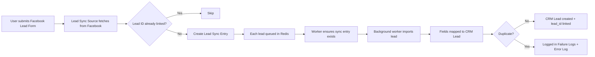

# Lead Sync Source — Product Guide

**Feature:** Lead Syncing  
**Status:** Beta  
**Supported sources:** Facebook Lead Ads, OLX Business Lead Sharing  
**Technical docs:** [../technical/lead_sync_source.md](../technical/lead_sync_source.md)

---

## What is Lead Sync Source?

Lead Sync Source lets your sales team automatically pull leads from **Facebook Lead Ads** and **OLX Business** into CRM — without manual CSV uploads or copy-paste.

Each **Lead Sync Source** connects one Facebook Lead Form or one OLX Business account to CRM. When someone submits that form on Facebook (or shares a lead on OLX), their details are imported as a **CRM Lead** on a schedule you choose, or immediately when you click **Sync now**.

---

## Who is this for?

Teams that run Facebook Lead Ads or OLX Business lead sharing and want those submissions to flow into CRM automatically — without manual imports.

Use it to set up lead sources, map form fields, monitor failures, and keep leads attributed to the correct campaign.

**Access:** Settings → Integrations → **Lead syncing** (availability is controlled via CRM tab permissions in Settings)

---

## How it works

1. A prospect fills out a Facebook Lead Ad form.
2. CRM fetches submissions from the **last 24 hours** on your chosen schedule (or when you click **Sync now**). **Force sync** fetches **all** leads (no date limit; role-gated).
3. Leads whose sync entry already has a **Lead ID** linked are skipped.
4. For every other lead, a **sync entry** is created immediately with the raw Facebook payload, then a background job is queued.
5. The worker ensures the sync entry exists, then imports into CRM.
6. A worker processes leads one at a time — mapping form questions to CRM Lead fields (name, phone, email, etc.).
7. A CRM Lead is created or updated for each successful import; the sync entry is linked via **Lead ID**.
8. Duplicates and errors are recorded in **Failure Logs** and the server **Error Log** for administrators.

---

## Getting started

### Prerequisites

Before setting up Lead Sync Source, ensure:

1. **Facebook Lead Ads** are running (Facebook sources) or you have **OLX Business** credentials (OLX sources).
2. A **CRM Lead Source** record exists for attribution — you select it on each Lead Sync Source (`source_id`). The dropdown shows **source name (purpose)**.
3. For Facebook: a **Facebook access token** is configured on the server (contact your system administrator).
4. For OLX: you will enter **username** and **password** on the Lead Sync Source form (password is masked after save; use **Test credentials** to verify).
5. The **Lead syncing** tab is enabled for your user in CRM tab permissions.

### Step 1: Create a new source

1. Go to **Settings → Integrations → Lead syncing**.
2. Click **New**.
3. Enter a **source name** (e.g. "Bengaluru Walk-in Campaign").
4. Select **Facebook** or **OLX** as the source type.
5. Select the **CRM Lead Source** that imported leads should be attributed to.
6. Choose a **background sync frequency**.
7. Click **Create**.

For **Facebook**, CRM automatically fetches your Facebook Pages and Lead Forms on creation.

For **OLX**, enter **username** and **password**, then use **Test credentials** before enabling sync.

### Step 2: Configure the source (Facebook)

1. Open the source you just created.
2. Select the **Facebook Page** that owns the lead form.
3. Select the **Facebook Lead Form** you want to sync.

> **Note:** Each Facebook Lead Form can only have **one enabled** sync source at a time.

### Step 2: Configure the source (OLX)

1. Open the OLX source.
2. Confirm **username** and **password** are saved.
3. Click **Test credentials** to verify login before enabling sync.

OLX sync fetches **today's leads only** (not a rolling 24-hour window). Re-running sync today replaces today's sync entries for that source before re-importing.

### Step 3: Map form fields to CRM (Facebook only)

After selecting a lead form, a mapping table appears showing all Facebook form questions.

For each question, choose the matching **CRM Lead field**:

| Facebook question | Recommended CRM field |
| ----------------- | --------------------- |
| Phone number      | Mobile No             |
| Full name         | Lead Name             |

**Important:** Map the **phone number** question to **Mobile No**. Leads without a valid mobile number are not imported.

Click **Update** to save mappings.

### Step 4: Enable and sync

1. Toggle **Enabled** on.
2. Click **Update** to save.
3. Optionally click **Sync now** to fetch and queue leads from the **last 24 hours** immediately.

Administrators and other configured roles also see **Force sync**, which fetches **all** leads from Facebook (no date filter). Who can force sync is controlled by Global Config key `lead_sync_force_sync_roles` (JSON array of role names, e.g. `["Administrator", "System Manager"]`). Leads that already have a linked **Lead ID** in sync entries are still skipped.

Leads are imported by background workers after fetch. Large batches may take a few minutes to fully appear in CRM even after sync starts.

Leads will also sync automatically based on your chosen frequency.

---

## Managing sources

### Source list

The Lead syncing page shows all configured sources with:

- **Name** — your label for the source
- **Source** — platform type (Facebook or OLX)
- **Enabled** — toggle to start/stop automatic syncing

### Actions per source

| Action           | How                                              |
| ---------------- | ------------------------------------------------ |
| Edit             | Click the source row                             |
| Enable / disable | Toggle switch on the list                        |
| Sync immediately | Open source → **Sync now** (last 24h)                       |
| Force sync (all) | Open source → **Force sync** (roles in Global Config `lead_sync_force_sync_roles`; no date limit) |
| Duplicate        | ⋮ menu → Duplicate (creates a copy to configure) |
| Delete           | ⋮ menu → Delete                                  |

### Sync frequency options

| Frequency        | Best for                                           |
| ---------------- | -------------------------------------------------- |
| Every 5 Minutes  | High-volume campaigns needing near-real-time leads |
| Every 10 Minutes | Active campaigns                                   |
| Every 15 Minutes | Moderate volume                                    |
| Hourly           | Default. Suitable for most campaigns               |
| Daily            | Low-volume or archival forms                       |
| Monthly          | Rarely used forms                                  |

---

## Sync entries

Open any source and go to the **Sync entries** tab to review every lead fetched from the vendor before and after CRM import.

The tab label shows the **total count** as soon as the source opens — for example **Sync entries (2517)** — without waiting for you to open the tab. CRM prefetches the first page of entries in the background so the list feels instant when you switch to it.

### List view

| Column       | Description                                         |
| ------------ | --------------------------------------------------- |
| Lead ID      | CRM Lead link once imported; **Pending** until then |
| Vendor       | Source platform (e.g. Facebook, Olx)                |
| Vendor ID    | Facebook lead ID (OLX entries leave this empty)     |
| Submitted at | When the lead was submitted on the vendor platform  |
| Created at   | When the sync entry was created in CRM              |
| Lead         | Summary from form/data (name, phone)                |

### Filters

- **Submitted date range** — filter by when the lead was submitted on the vendor platform
- **Search** — match **Vendor ID** or **Lead ID** (Vendor ID is empty for OLX)

Click **Apply** after changing filters. The tab count updates to match the filtered total. **Clear** resets filters and restores the prefetched unfiltered first page when available.

Use **Load more** to fetch the next page of results.

### Detail view

Click any row to open the full record:

| Section             | Content                                                       |
| ------------------- | ------------------------------------------------------------- |
| **Form responses**  | Mapped Facebook form answers (`field_data` — Facebook only) |
| **Additional info** | Ad, campaign, platform (Facebook Graph API enrichment)        |
| **Raw payload**     | Complete JSON stored for audit                                |

Pending entries (no Lead ID yet) usually indicate the import is still queued or failed — check **Failure logs**. Pending entries are automatically retried on the next sync run.

---

## Failure logs

Open any source and go to the **Failure logs** tab to see leads that were not imported.

### Log types

| Type          | Meaning                                                               | Action                                             |
| ------------- | --------------------------------------------------------------------- | -------------------------------------------------- |
| **Duplicate** | A CRM Lead already exists with the same details for this form         | No action needed unless data is wrong              |
| **Failure**   | An error occurred during import (e.g. invalid phone, missing mapping) | Review traceback, fix mapping, then **Retry sync** |
| **Synced**    | Previously failed lead was successfully imported on retry             | No action needed                                   |

### Retrying a failed lead

1. Open the source → **Failure logs** tab.
2. Click a log entry to view details.
3. Review the **Lead data** and **Traceback** (if present).
4. Fix the underlying issue (e.g. map the phone field).
5. Click **Retry sync**.

---

## What gets created in CRM

Each successfully synced submission creates or updates a **CRM Lead** with:

| Data              | Description                                                              |
| ----------------- | ------------------------------------------------------------------------ |
| Mapped fields     | Values from your field mapping (Facebook) or OLX payload (name, phone)   |
| Source            | From the **CRM Lead Source** you selected on the Lead Sync Source        |
| Facebook lead ID  | Unique identifier from Facebook (stored as `vendor_id` on sync entry)    |
| Facebook form ID  | The form this lead came from (Facebook)                                  |
| Facebook raw data | Full submission payload (Facebook activity + sync entry detail)          |
| OLX ad ID         | OLX ad identifier (`olx_ad_id` on CRM Lead)                              |
| OLX raw data      | Full OLX lead payload (activity timeline + sync entry detail)            |

A **sync entry** is created for every fetched lead **before** CRM import begins, linking the vendor payload to the CRM Lead once import succeeds.

### Duplicate handling

CRM prevents re-processing the same vendor submission once import succeeded:

- **`Lead ID` on sync entry** — if a sync entry already has a CRM Lead linked, the lead is not re-imported (Facebook)
- Pending Facebook sync entries (no Lead ID) are retried on the next sync
- Facebook: duplicate non-empty **Vendor ID** on sync entries is blocked at application level
- OLX: sync entries do not store Vendor ID; today's entries are refreshed on each OLX sync run
- Mapped field values and Facebook lead ID checks during CRM import
- Duplicates during import appear in Failure Logs as type **Duplicate**

### Existing leads

If a CRM Lead with the same **mobile number** already exists, Facebook sync may **update** that lead (refreshing Facebook fields) when the Facebook lead ID differs. Identical Facebook lead IDs are treated as duplicates and skipped.

---

## Troubleshooting

| Problem                                  | Likely cause                                               | Solution                                                                                                                 |
| ---------------------------------------- | ---------------------------------------------------------- | ------------------------------------------------------------------------------------------------------------------------ |
| Sync fails / leads not created           | CRM Lead Source not selected on source (`source_id`)       | Open the source and select a **CRM Lead Source** before syncing                                                          |
| Cannot create Facebook source              | Facebook token not configured                              | Contact admin to set `facebook_lead_sync_access_token`                                                                   |
| OLX Test credentials fails                 | Wrong username/password or OLX API down                    | Re-enter credentials; contact admin if `olx_base_url` is customized                                                      |
| No pages/forms appear (Facebook)           | Token invalid or no pages on account                       | Verify Facebook token and page access                                                                                    |
| Leads not syncing                        | Source disabled or workers not running                     | Enable source; confirm background workers are active on `long` and `default` queues; enable scheduler in System Settings |
| All leads show as Duplicate              | Leads already imported                                     | Expected when re-syncing leads that already have a linked Lead ID                                                        |
| Force sync button not visible            | User role not in Global Config                             | Ask admin to add your role to `lead_sync_force_sync_roles` in Global Config                                              |
| Leads missing                            | Phone not mapped to Mobile No                              | Map phone question to Mobile No field                                                                                    |
| "Already enabled for this form"          | Another source uses same form                              | Disable or delete the other source                                                                                       |
| Sync now started but leads appear slowly | Leads queued for background import                         | Normal for large batches; wait for workers or check Failure logs                                                         |
| Sync now does nothing locally            | `developer_mode` runs jobs inline                          | Check web server logs for errors; worker not required for manual sync in dev                                             |
| Lead failed after sync ran               | Worker error after fetch                                   | Open Failure logs → **Retry sync**                                                                                       |
| Date filter shows no results             | Wrong date range or timezone                               | Use **Submitted at** dates from sync entries; click Apply after selecting range                                          |
| Entry shows Pending                      | Import failed or still queued                              | Check Failure logs; retry if needed                                                                                      |
| OLX Vendor ID column empty               | Expected for OLX                                           | OLX does not store Vendor ID on sync entries                                                                               |
| OLX leads missing from yesterday         | OLX only syncs today                                       | Historical OLX backfill is not supported in current sync window                                                            |
| Tab shows Sync entries without (N)       | Prefetch still loading or source just opened               | Wait a moment; count appears after the first page loads                                                                  |

---

## Current limitations (Beta)

- **Facebook and OLX** — other platforms (Google Ads, LinkedIn, etc.) are not yet supported.
- **Facebook token** — configured by administrators in site config, not in the UI.
- **OLX credentials** — per-source username/password in the UI; optional `olx_base_url` in site config.
- **Phone number required** — Facebook leads need phone mapped to Mobile No; OLX leads need a valid phone on the payload.
- **One source per Facebook form** — each Facebook Lead Form supports only one active sync source.
- **Facebook 24-hour fetch window** — normal sync fetches leads from the last 24 hours only; use **Force sync** for full historical backfill (requires role in Global Config).
- **OLX today-only sync** — each run fetches and re-imports today's leads; re-running sync deletes today's sync entries for that source first.
- **High-volume Facebook forms** — very large forms (100k+ leads) may need manual review; pagination is planned.
- **Async import** — sync fetches from the vendor first, creates sync entries, then imports leads via a background queue; large batches finish over time.
- **Automatic retry for pending Facebook entries** — sync entries without a Lead ID are retried on the next sync; use Failure logs for manual retry after fixing mapping issues.

---

## FAQ

**Q: How often should I sync?**  
A: Hourly works for most campaigns. Use 5–15 minute intervals for time-sensitive campaigns.

**Q: Can I sync the same Facebook form to multiple CRM instances?**  
A: Each CRM site manages its own sources independently.

**Q: What happens if I disable a source?**  
A: Automatic syncing stops. Existing CRM Leads are not deleted. You can re-enable anytime.

**Q: Can I change field mappings after leads are imported?**  
A: Yes. Future syncs use the updated mappings for **new** leads. Already-imported leads are not changed; re-importing the same Facebook submission is blocked as a duplicate.

**Q: Why does the Sync entries tab show a number?**  
A: That is the **total count** of sync entries for this source. CRM loads it when you open the source so you can see volume before opening the tab.

**Q: Where do I see the original Facebook or OLX submission?**  
A: Open the source → **Sync entries** tab → click the row for form responses (Facebook), additional info, and raw JSON. The CRM Lead activity timeline also shows Facebook and OLX lead intent cards.

**Q: Why is Vendor ID empty for OLX?**  
A: OLX sync entries intentionally omit Vendor ID. Use **Lead ID**, **Submitted at**, and the raw payload to identify leads.

**Q: Why does a sync entry show Pending?**  
A: The vendor lead was fetched and recorded, but CRM import has not completed yet (queued, in progress, or failed). Check **Failure logs** if it stays pending.

**Q: Will re-running sync import the same leads again?**  
A: No, once a sync entry has a **Lead ID** linked. Pending entries (import failed or not yet run) are retried automatically on the next sync.

**Q: What is Force sync?**  
A: A manual action (visible only to roles listed in Global Config `lead_sync_force_sync_roles`) that fetches **all** Facebook leads for the form, not just the last 24 hours. Useful for initial backfill.

**Q: Who can use Force sync?**  
A: Users with at least one role configured in Global Config key `lead_sync_force_sync_roles`. Ask your administrator to configure this in **Global Config**.

**Q: Who do I contact for Facebook token setup?**  
A: Your system administrator or @[kapil.rohilla@carrum.co.in](mailto:kapil.rohilla@carrum.co.in).

---

## Glossary

| Term                   | Definition                                                                                                |
| ---------------------- | --------------------------------------------------------------------------------------------------------- |
| **Lead Sync Source**   | A configured connection between an external platform and CRM                                              |
| **Sync entry**         | Audit record (`Lead Sync Entry`) storing the raw vendor payload before CRM import                         |
| **Vendor ID**          | Unique external lead identifier (Facebook lead ID; empty for OLX sync entries)                            |
| **CRM Lead Source**    | Attribution record selected on each Lead Sync Source (`source_id`)                                        |
| **OLX Lead Intent**    | Activity card on CRM Lead showing OLX submission details (phone masked in UI)                             |
| **Facebook Lead Form** | A lead capture form attached to a Facebook Lead Ad                                                        |
| **Field mapping**      | Pairing of Facebook form questions to CRM Lead fields                                                     |
| **Failure log**        | Record of a lead that was not imported, with reason                                                       |
| **Background sync**    | Automatic scheduled fetch from Facebook (last 24h); each new lead is then imported via a background queue |
| **Sync now**           | Manual fetch from Facebook (last 24h); new leads are queued for import                                    |
| **Force sync**         | Role-gated manual fetch of **all** Facebook leads (Global Config `lead_sync_force_sync_roles`); skips entries that already have a Lead ID |
| **Error Log**          | Server-side Frappe error records with traceback for all sync failures (administrators)                                                  |

