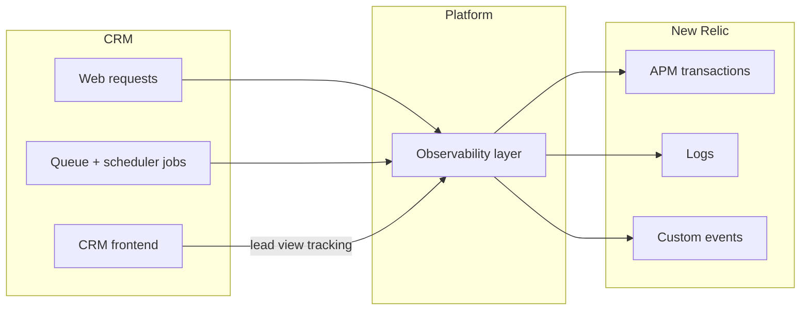

# Observability — Product Guide

**Feature:** Platform Monitoring  
**Status:** Live  
**Primary tool:** [New Relic](newrelic.md)

---

## What is observability in Carrum CRM?

Observability gives engineering and operations teams a shared view of how the CRM behaves in production: which requests are slow, which jobs fail, which users hit errors, and how agents use key screens.

The platform sends three kinds of telemetry to New Relic:

| Signal | What it answers |
|---|---|
| **APM (transactions)** | Which API calls or pages are slow or failing? |
| **Logs** | What happened around an error — full stack trace and request context? |
| **Custom events** | How are users engaging with CRM features (e.g. lead views)? |

All enrichment is automatic for HTTP traffic, background jobs, and scheduled tasks. Product teams do not need to instrument individual screens unless adding a new business event.

---

## Who is this for?

| Audience | Typical use |
|---|---|
| **Engineering** | Debug production errors, trace slow requests, correlate logs with APM traces |
| **Platform / DevOps** | Monitor uptime, job queue health, scheduler runs, release regressions |
| **Product / Analytics** | Measure feature usage via custom events (e.g. lead list vs detail views) |
| **Support / Ops** | Look up a failing request by user, site, or API method |

---

## What you can see in New Relic

### Web requests (APM)

Every inbound HTTP request appears as a **Web transaction** with Frappe context attached:

- Site (`frappe.site`)
- Logged-in user (`frappe.user`)
- HTTP method, path, status code, client IP
- Frappe API command (`frappe.cmd`) when applicable — e.g. `/api/method/crm.api.lead.get_lead`
- Redacted request body (secrets masked, large payloads truncated)

Transactions are named by API method or URL path so you can filter and alert on specific endpoints.

### Background work (APM)

Work that runs outside HTTP — **queue workers** and **scheduled jobs** — appears as separate **Non-Web transactions**:

- Queue jobs: grouped under **Task**, named by the Python method
- Scheduler jobs: grouped under **Scheduler**, named in readable form (e.g. `Scheduler Sync Facebook Leads`)

Each background transaction includes the Frappe site and job metadata.

### Application logs

When errors occur, the full exception message and stack trace are forwarded to New Relic Logs (not just the generic Frappe one-liner). Logs are **linked to the same APM trace** when the error happens during a web request, so you can jump from a slow transaction directly to the error log line.

### Custom business events

The CRM records product-level events that are not visible from HTTP metrics alone. Today:

| Event | Description |
|---|---|
| `CrmLeadViewed` | A user opened one or more leads in the list or detail view |

See [New Relic integration](newrelic.md) for how to query and dashboard these events.

---

## How it works (high level)

1. The web server runs through a New Relic–instrumented entry point so every request is traced.
2. After each response, Frappe context (site, user, path, status) is attached to the transaction.
3. Python log records and Frappe errors are normalized so New Relic receives readable, complete messages.
4. Queue and scheduler hooks wrap each job as a background transaction.
5. The frontend reports lead views via a lightweight API that emits custom events — failures never block the UI.

---

## Privacy and data handling

Observability is designed to be useful without leaking credentials:

- Request bodies are **redacted** for keys containing `password`, `token`, `secret`, `key`, etc.
- Binary uploads (images, PDFs, multipart forms) are omitted from body capture.
- Large payloads are **truncated** (default 10 KB for logs; 4 KB for APM attributes).
- Guest users are excluded from lead-view custom events.

If a new feature sends sensitive fields, confirm they are not included in custom event attributes before shipping.

---

## Common workflows

### Investigate a user-reported error

1. Open **New Relic APM** → select the CRM application (e.g. `FRAPPE_PROD`).
2. Filter transactions by `frappe.user` or `http.path`.
3. Open the slow or failing transaction → **Logs** tab to see the linked stack trace.
4. Use `frappe.site` and `frappe.cmd` to narrow to the exact API.

### Check scheduler or queue health

1. Open **APM** → **Transactions** → filter by group **Scheduler** or **Task**.
2. Sort by error rate or duration to find stuck or failing jobs.
3. Inspect attributes `scheduled_job_name`, `job_name`, and `queue`.

### Measure lead engagement

1. Open **Query your data** (NRQL).
2. Run: `SELECT count(*) FROM CrmLeadViewed FACET view_type, route_name SINCE 1 day ago`
3. Break down by user or time window for adoption reporting.

More NRQL examples are in [newrelic.md](newrelic.md).

---

## What's not covered

- **Infrastructure metrics** (CPU, memory, disk) — use New Relic Infrastructure or your cloud provider unless separately configured.
- **Real User Monitoring (browser)** — frontend page loads are not instrumented with the NR browser agent; usage signals come from custom events and API transactions.
- **Chatwoot, telephony, or third-party SaaS** — only the CRM/Frappe application process is instrumented unless those services have their own New Relic apps.

---

## Related documentation

- [New Relic integration — product guide](newrelic.md)
- [Observability — technical documentation](../../technical/observability/readme.md)
- [New Relic integration — technical documentation](../../technical/observability/newrelic.md)
