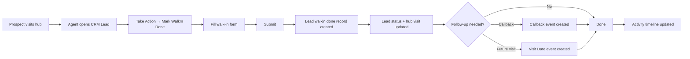

# Walk-in Form — Product Guide

**Feature:** Hub Onboarding  
**Status:** Live  
**Supported roles:** Onboarding, Telecaller Lead

---

## What is the Walk-in Form?

The **Walk-in Form** lets hub onboarding agents record what happened when a prospect physically visits a hub — their source, disposition, and any follow-up needed.

Each submission creates an audit record (**Lead walkin done**), updates the lead's onboarding status, marks the visit as complete, and optionally schedules a callback or future visit.

---

## Who is this for?

**Onboarding** and **Telecaller Lead** agents at hub locations who need to:

- Record how a visitor arrived (campaign, referral, telecaller, etc.)
- Capture onboarding disposition (interested, not interested, callback, etc.)
- Schedule follow-ups when required
- Maintain a complete visit history on the lead timeline

**Access:** Open any **CRM Lead** → **Take Action** → **Mark WalkIn Done**

Related tabs (controlled via CRM tab permissions):

- **Hub Visit** — today's in-hub leads (gate tickets + walk-in forms)
- **Scheduled Walk-In** — upcoming visit appointments

---

## How it works

1. A prospect arrives at the hub (optionally via gate ticket).
2. The agent opens the lead in CRM and clicks **Take Action**.
3. They select **Mark WalkIn Done** and fill the walk-in form.
4. CRM creates a **Lead walkin done** record and updates the lead.
5. Open **Visit Date** events for that lead are marked **Completed**.
6. If the disposition requires it, a **Callback** or **Visit Date** event is scheduled.
7. The lead timeline shows **Walk-in Form Submitted** with full details.

---

## Walk-in Form vs Hub Visit vs Scheduled Walk-In

| Feature | Purpose |
|---|---|
| **Walk-in Form** | Record disposition when a visit is completed (this guide) |
| **Hub Visit** tab | Operational view of leads currently or recently at the hub |
| **Scheduled Walk-In** tab | List of upcoming **Visit Date** appointments |
| **Gate App** | Physical entry ticket — sets lead as **In Hub** before the walk-in form |

---

## Getting started

### Prerequisites

Before agents can use the walk-in form, ensure:

1. **Roles** — Users have **Onboarding** or **Telecaller Lead** role (or Administrator).
2. **Walk-In Status** — Onboarding dispositions are configured at **CRM Settings → Walk-In Status**.
3. **Lead Sources** — Walk-in sources are configured at **CRM Settings → Lead source** with purpose **WalkIn**.
4. **Tab permissions** — Relevant users have access to lead detail and hub tabs.
5. **Hub–business type mapping** — Required if agents will select **Interested** status (business type dropdown is hub-scoped).

### Step 1: Configure walk-in statuses

1. Go to **CRM Settings → Walk-In Status**.
2. Create or edit **CRM Lead Status** rows with role **Onboarding**.
3. For each status, configure flags as needed:

| Flag | Effect on form |
|---|---|
| **Is callback** | Shows callback date/time picker |
| **Is visit date required** | Shows future visit date/time picker |
| **Is remarks required** | Makes comment mandatory |
| **Is lead name required** | Requires lead name if not already set |

4. Set **Primary status** and **Secondary status** labels agents will see.

> **Note:** Primary status **New** is displayed in the UI as **Transfer / Not Reachable**.

### Step 2: Configure walk-in sources

1. Go to **CRM Settings → Lead source**.
2. Create sources with purpose **WalkIn** (e.g. Google, Social Media, Campaign).
3. For referral flow, include a source named **referrals**.
4. For telecaller attribution, include a source named **telecaller**.

### Step 3: Submit a walk-in form

1. Open a **CRM Lead** record.
2. Click **Take Action**.
3. Select **Mark WalkIn Done**.
4. Fill in the form:

| Field | Required | Notes |
|---|---|---|
| **Source** | Yes | How the visitor arrived |
| **Primary status** | Yes | Top-level disposition |
| **Secondary status** | If multiple sub-options | Detailed disposition |
| **Comment** | If status requires remarks | Free-text notes |
| **Name** | If lead has no name and status requires it | Lead display name |
| **Business type** | If primary status is **Interested** | Hub-scoped options |
| **Callback datetime** | If status is callback | Future call time |
| **Visit datetime** | If status requires visit date | Future hub visit |
| **Telecaller agent** | If source is **telecaller** | Agent who referred the visit |
| **Referrer details** | Auto-loaded if source is **referrals** | From Carrum portal |

5. Click **Submit**.

The lead timeline will show **Walk-in Form Submitted** with source, status, remarks, and follow-up details.

---

## Special source flows

### Referral source

When **referrals** is selected as the source:

1. CRM fetches referrer details from the Carrum portal automatically.
2. **Referrer DP Id** and **Referrer Agent Name** are shown (read-only).
3. Submit is blocked until referrer details load successfully.

### Telecaller source

When **telecaller** is selected as the source:

1. A **Telecaller agent** dropdown appears.
2. Agent selection is **required** before submit.
3. The selected agent is stored on the **Lead walkin done** record.

---

## What gets updated on the lead

Each successful walk-in form submission updates the **CRM Lead**:

| Field | Change |
|---|---|
| `status` / `primary_status` / `secondary_status` | Updated to selected disposition (unless lead is Drop or Converted) |
| `source` / `source_id` | Set to selected walk-in source |
| `hub_visit_status` | Set to **HUB_VISITED** |
| `walkin_form_filled_at` | Set to submission time |
| `walkin_form_link` | Points to latest **Lead walkin done** record |
| `total_walkin_forms_filled` | Incremented by 1 |
| `hub_id` / `custom_hub_name` | Set on LEAD-type records if not already set |
| `lead_name` | Updated if provided and lead had no name |

### Repeat visits

A lead can submit multiple walk-in forms (e.g. returns to hub later). Each submission creates a new **Lead walkin done** record and increments the counter. `walkin_form_link` always points to the most recent submission.

### Drop and Converted leads

If the lead's primary status is **Drop** or **Converted**, the walk-in form still submits and the visit is recorded — but **status fields are not changed**.

---

## Gate App interaction

When a prospect enters via the **Gate App** (physical gate ticket):

1. Lead `hub_visit_status` is set to **IN_HUB**.
2. Any previous `walkin_form_filled_at` and `walkin_form_link` are **cleared**.
3. Gate ticket number and timestamp are recorded.

The agent then completes the **Walk-in Form** to record disposition, which sets `hub_visit_status` to **HUB_VISITED**.

---

## Scheduled walk-ins

If a **Visit Date** event already exists for the lead:

- Submitting the walk-in form marks open visit events as **Completed**.
- The lead appears as **Done** in the **Scheduled Walk-In** list.

If the form schedules a **new future visit**:

- A new **Visit Date** event is created.
- Older scheduled visits may show as **Override** in the list.

---

## Troubleshooting

| Problem | Likely cause | Solution |
|---|---|---|
| **Mark WalkIn Done** not visible | User lacks Onboarding / Telecaller Lead role | Assign correct role |
| No statuses in dropdown | Walk-In Status not configured | Add Onboarding statuses in CRM Settings |
| No sources in dropdown | No sources with purpose WalkIn | Create WalkIn sources in Lead source settings |
| Referral details won't load | Lead not linked to Carrum referral | Verify lead referral data in portal |
| Business type missing | Hub mapping not configured | Set up hub–business type mapping in Global Config |
| Submit blocked | Required field missing | Check status flags (remarks, callback, visit date, name) |
| Status not changing | Lead is Drop or Converted | Expected — visit still recorded, status unchanged |
| Walk-in form cleared after gate entry | Gate App reset walk-in pointers | Re-submit walk-in form after gate check-in |

---

## Current limitations

- **Role-restricted** — Only Onboarding, Telecaller Lead, and Administrator can submit.
- **No failure log** — Unlike Lead Sync Source, there is no retry queue for failed submissions.
- **Referral dependency** — Referral source requires Carrum portal connectivity.
- **Manual configuration** — WalkIn sources and Onboarding statuses must be set up before use.

---

## FAQ

**Q: Can the same lead submit the walk-in form more than once?**  
A: Yes. Each submission creates a new audit record and increments `total_walkin_forms_filled`.

**Q: What happens to scheduled visits when I submit the form?**  
A: Open Visit Date events are automatically marked Completed.

**Q: Do I need a gate ticket before submitting the walk-in form?**  
A: No. Gate tickets and walk-in forms are independent, but gate entry sets the lead as In Hub first.

**Q: Where can I see past walk-in submissions?**  
A: On the lead's **Activity** timeline as **Walk-in Form Submitted** entries.

**Q: Who configures walk-in statuses and sources?**  
A: CRM administrators via **CRM Settings**.

---

## Glossary

| Term | Definition |
|---|---|
| **Walk-in Form** | The disposition form submitted via Take Action → Mark WalkIn Done |
| **Lead walkin done** | Immutable audit record for each walk-in form submission |
| **Hub visit status** | Lead state: Not In Hub / In Hub / Hub Visited |
| **Walk-In Status** | Onboarding-specific CRM Lead Status rows used in the form |
| **WalkIn source** | CRM Lead Source with purpose WalkIn — how the visitor arrived |
| **Scheduled Walk-In** | Tab listing upcoming Visit Date events |
| **Gate App** | Physical entry system that issues gate tickets at hub entrance |
