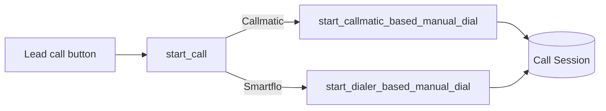
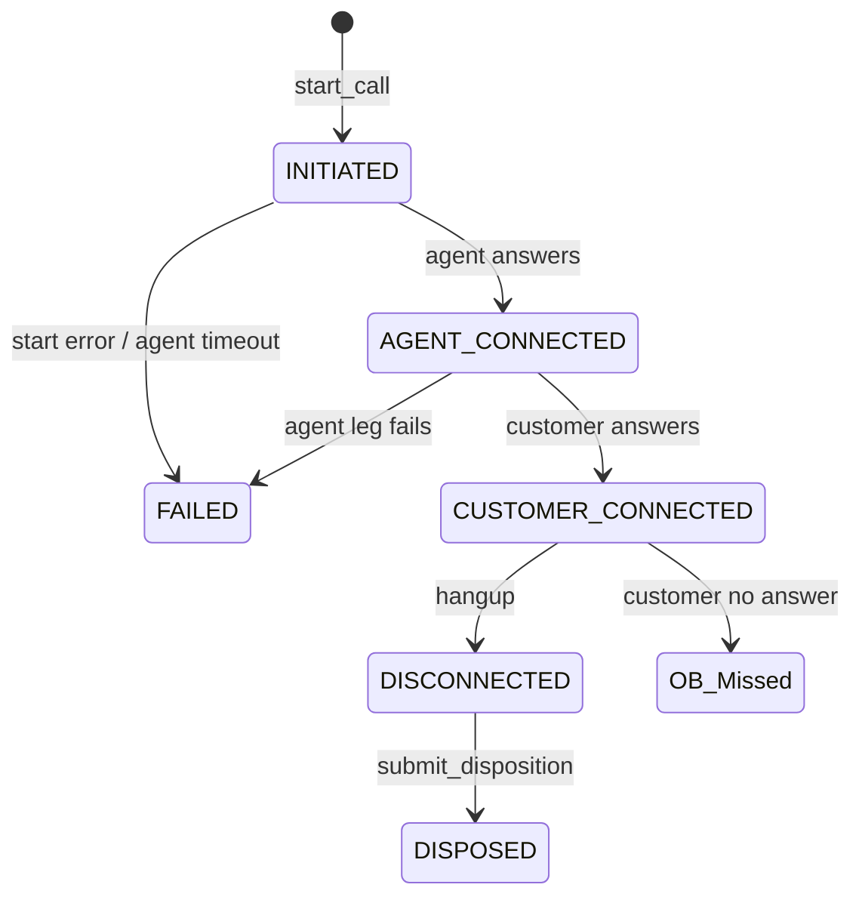

# Agent Based Dialing — Technical Documentation

**Calling method:** `Agent` (`EnumValues.CallingMethod.Agent`)  
**API:** `core.api.call.start_call` with `calling_method: "Agent"`  
**Typical trigger:** Call button on CRM Lead (desktop / mobile)

> Previously referred to in code/comments as *click-to-call*, *click2Call*, or *manual dial*. User-facing name: **Agent based dialing**.

---

## Overview

Agent based dialing lets a telecaller place an **outbound call to a lead** from the CRM Lead page. The telephony vendor rings the **agent first**; after the agent answers, the **customer** is connected.

Each attempt creates a **Call Session** with `calling_method = Agent` and `direction = OUTBOUND`.

Supported vendors:

| Vendor | Doc |
|---|---|
| Smartflo | [smartflo.md](./smartflo.md) |
| Callmatic | [callmatic.md](./callmatic.md) |

Vendor is chosen by role via Global Config `role_based_default_calling_vendor`.

---

## UI entry points

| Location | Handler |
|---|---|
| Desktop Lead | `Lead.vue` → agent based dial |
| Mobile Lead | `MobileLead.vue` → agent based dial |
| Retry after failed connect | `CustomCallUI.vue` → `retryNotConnectedCall()` |
| Global callback banner | `GlobalCallbackBanner.vue` |

### Request shape

All Agent starts go through `CORE_CALL_START` (`core.api.call.start_call`).

**Smartflo payload** (also sends legacy flag `manual_dial: 1`):

```json
{
  "calling_method": "Agent",
  "leadId": "<CRM Lead name>",
  "manual_dial": 1,
  "provider_name": "Smartflo"
}
```

**Callmatic payload:**

```json
{
  "phone_number": "<lead mobile_no>",
  "lead_id": "<CRM Lead name>",
  "provider_name": "Callmatic"
}
```

### Button rules (Lead page)

Disabled when:

- No calling integration enabled
- **Active dialer session** (must end dialer session first)
- Telecaller assignment rules block call
- Callmatic gate fails (`callmaticEnabled`)

Tooltips: *“End session to use agent calling”*, assignment messages.

On success: toast **“Call initiated”**.  
On failure: toast with `message` / `reason` from API.

---

## API routing



Note: Smartflo Agent flow reuses `start_dialer_based_manual_dial` with `calling_method=Agent` and `manual_dial=True` (sync originate).

---

## Shared lifecycle (conceptual)



Vendor-specific status transitions and webhooks are documented per vendor.

---

## Disposition

After a connected Agent call ends, the agent submits disposition via `core.api.call.submit_disposition`:

- Updates Call Session → `DISPOSED`
- Can update CRM Lead status, schedule callback, visit date
- Smartflo: may also sync disposition to vendor API

---

## Realtime UI (Smartflo only)

Smartflo Agent calls publish socket events consumed by `CustomCallUI`:

| Event | Meaning |
|---|---|
| `call_initiated` | Vendor accepted originate |
| `call_agent_connected` | Agent answered |
| `call_customer_connected` | Customer on line |
| `call_missed_by_customer` | Customer missed |
| `call_failed` | Failure / agent timeout |
| `smartflo.call_disconnected` | Hangup after connect |

Callmatic Agent calls do **not** emit intermediate socket events; final state arrives via webhook.

---

## User-visible data

### During call (CustomCallUI)

- Lead ID (link), IB/OB, lead source, DP name
- Status line and timer when connected
- Failure / disconnect message with optional retry

### After call (Activities → Calls)

- Outgoing call row with status label and duration
- Icons: missed (red), failed/declined, direction

### Detail modal

Agent, status, disposition fields, hangup by/reason, failure reason, direction, duration.

See [parent calling README](../README.md) for shared field tables.

---

## Mutual exclusion with dialer

Agent based dialing is **blocked while a dialer session is active**. User must end the dialer session before using the Lead call button.

---

## Related docs

- [Smartflo Agent based dialing](./smartflo.md)
- [Callmatic Agent based dialing](./callmatic.md)
- [Dialer based dialing](../dialer-based/README.md)
- [Calling overview](../README.md)
