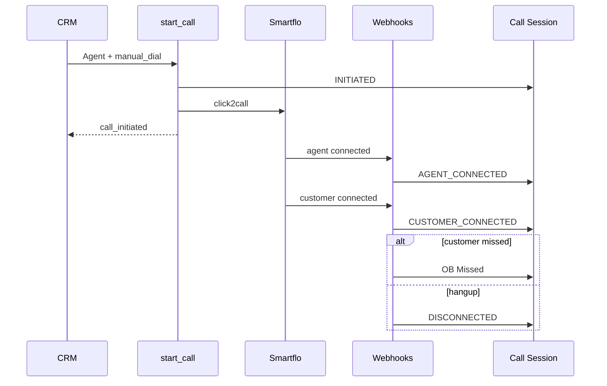

# Smartflo — Agent Based Dialing

**Vendor:** Smartflo  
**Calling method:** `Agent`  
**Backend:** `start_dialer_based_manual_dial` → `_handle_smartflo_click2call_start_logic`

---

## Flow

1. Validate: no active dialer session, lead has `mobile_no`, Smartflo pre-check (extension, calling number, campaign)
2. Insert Call Session: `status=INITIATED`, `calling_method=Agent`, `direction=OUTBOUND`
3. Login agent to Smartflo campaign session
4. Smartflo click2call API with `custom_identifier = call_session.name`
5. **`use_async = not manual_dial`** — Agent based dial sends `manual_dial: 1` → **sync** originate
6. On failure → `FAILED` + `failure_reason`
7. On success → socket event `call_initiated`

---

## Webhooks

Registered in `core.api.call` (POST, `allow_guest=True`). Match session by `custom_identifier` (Call Session name).

| Webhook | Handler | Status set |
|---|---|---|
| `handle_agent_call_connected_webhook` | `_handle_smartflo_agent_call_connected_webhook` | `AGENT_CONNECTED` |
| `handle_customer_call_connected_webhook` | `_handle_smartflo_customer_call_connected_webhook` | `CUSTOMER_CONNECTED` |
| `handle_call_missed_by_customer_webhook` | `_handle_smartflo_call_missed_by_customer` | `OB Missed` (outbound) |
| `handle_answered_call_hangup_webhook` | `_handle_smartflo_call_hangup` | `DISCONNECTED` |

---

## Status reference

| Stage | Status | Trigger |
|---|---|---|
| Call requested | `INITIATED` | `start_dialer_based_manual_dial` |
| Agent answers | `AGENT_CONNECTED` | Agent connected webhook |
| Customer answers | `CUSTOMER_CONNECTED` | Customer connected webhook |
| Customer no answer | `OB Missed` | Missed-by-customer webhook |
| Answered then ended | `DISCONNECTED` | Hangup webhook |
| Disposition saved | `DISPOSED` | `submit_disposition` |
| Agent no answer ~30s | `FAILED` | `reconcile_active_calls` — *Not answered by Agent in 30 seconds* |
| Login/originate error | `FAILED` | Immediate on start |

---

## Realtime events → CustomCallUI

| Event | UI |
|---|---|
| `call_initiated` | *CALL INITIATED TO AGENT* |
| `call_agent_connected` | Agent connected state |
| `call_customer_connected` | Live call + timer |
| `call_missed_by_customer` | *Call missed by customer* |
| `call_failed` | Failure reason + retry option |
| `smartflo.call_disconnected` | Disconnect / dispose flow |

---

## End call

`core.api.call.end_call` with `calling_method=Agent` → Smartflo click2call end API using `agent_call_id`.

---

## Configuration

- Smartflo credentials on Carrum user (`smartflowCred`): extension, calling number, default campaign
- `carrum_base_url`, `carrum_token` in site config
- Scheduler hook `reconcile_active_calls` on `"all"` interval

---

## Sequence

