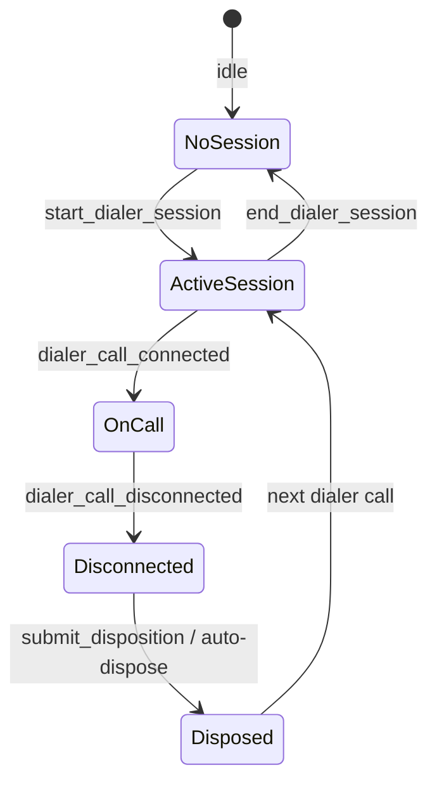

# Dialer Based Dialing — Technical Documentation

**Calling method:** `Dialer` (`EnumValues.CallingMethod.Dialer`)  
**Typical trigger:** Start dialer session in CRM, then Smartflo auto-dials from campaign

---

## Overview

Dialer based dialing is **campaign-driven outbound/inbound calling** through a Smartflo dialer session. Unlike Agent based dialing (one lead at a time from the Lead page), the dialer:

1. Agent starts a **dialer session** (campaign login)
2. Smartflo pushes calls to the agent
3. CRM creates/updates **Call Session** rows from webhooks
4. Agent disposes each call in CRM (and optionally on Smartflo)

**Vendor support today:** Smartflo only. See [smartflo.md](./smartflo.md).

---

## Session lifecycle

While a dialer session is **ACTIVE**:

- Agent based dialing from Lead page is **blocked**
- `User dialer session logs` tracks session with `campaign_id`, `campaign_name`

---

## API entry points

| Method | Purpose |
|---|---|
| `core.api.call.start_dialer_session` | Login + start Smartflo dialer session |
| `core.api.call.end_dialer_session` | End session (requires `inactive_reason`) |
| `core.api.call.toggle_dialer_break` | Break on/off |
| `core.api.call.get_dialer_break_status` | Current break state |
| `core.api.call.submit_disposition` | Dispose dialer Call Session |
| `core.api.call.dialer_call_connected_webhook` | Smartflo: call connected |
| `core.api.call.dialer_call_disconnected_webhook` | Smartflo: call ended |
| `core.api.call.dialer_call_disposed_webhook` | Smartflo: vendor disposition sync |

---

## Call Session creation

Dialer calls are typically **created on connect webhook** (`dialer_call_connected`), not at session start:

- `calling_method = Dialer`
- `status = CUSTOMER_CONNECTED` on connect
- Lead auto-created if unknown number
- Inbound DID can update lead source when configured

Disconnect webhook sets final status (`DISCONNECTED`, `OB Missed`, `IB Missed`, etc.).

---

## Disposition

Two paths:

1. **Manual:** Agent submits via `submit_disposition` in CRM → `DISPOSED`, lead updates, callbacks/visits
2. **Vendor webhook:** `dialer_call_disposed_webhook` — Smartflo disposition synced to CRM
3. **Auto-dispose:** `call_auto_disposed` socket event when system auto-disposes undisposed disconnect

---

## Realtime UI

| Event | Effect |
|---|---|
| `dialer_call_connected` | CustomCallUI popup (connected state) |
| `smartflo.call_disconnected` / dialer disconnect | Disconnect notice → dispose modal |
| `call_auto_disposed` | Toast when auto-disposed |

---

## User-visible data

### During dialer session

- Dialer session indicator in UI (active campaign)
- CustomCallUI on each connected call: lead id, source, IB/OB, timer
- Dispose modal after disconnect

### Lead Activities → Calls

Same Call Session list as Agent calls: status, duration, disposition fields in detail modal.

### Agent performance

Dialer metrics aggregated in Agent Performance (`total_dialer_attempts`, talk time, etc.) — separate from Agent based click metrics.

---

## Mutual exclusion with Agent based dialing

Starting Agent based call while dialer session active returns error: *“You have an active dialer session…”*

---

## Related docs

- [Smartflo dialer implementation](./smartflo.md)
- [Agent based dialing](../agent-based/README.md)
- [Calling overview](../README.md)
