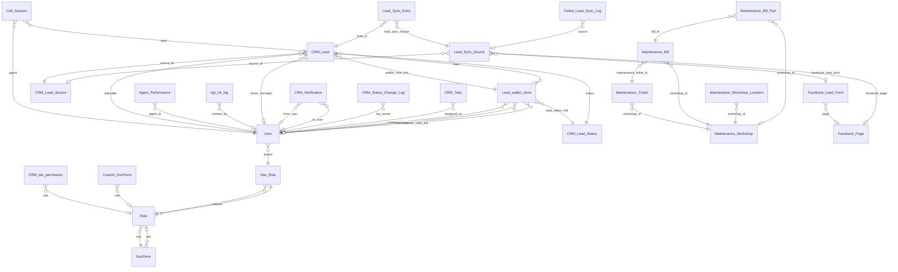

# Carrum Core / CRM MariaDB — ERD & Table Reference

**Generated:** 2026-09-07 16:56:13 IST  
**Source:** Frappe DocType JSON in `apps/core`, `apps/crm`, and Frappe RBAC DocTypes under `apps/frappe`  
**Database dialect:** MariaDB (Frappe `tab{DocType}` naming)  
**Regenerate:** `node scripts/generate-core-erd-docs.js`

This document lists **38** DocTypes with column-level detail, logical Link foreign keys, and analyst notes.

---

## Quick orientation

| Area | Primary tables | Notes |
|------|----------------|-------|
| Accounts & RBAC | `tabUser`, `tabRole`, `tabHas Role`, `tabDocPerm`, `tabCustom DocPerm`, `tabRole Profile` | Frappe auth/RBAC; **`tabUser Permission` excluded** |
| CRM Lead & meta | `tabCRM Lead`, `tabCRM Lead Status`, `tabCRM Lead Source`, `tabLead walkin done`, `tabCRM Status Change Log` | Lead funnel + walk-in |
| Lead sync | `tabLead Sync Entry`, `tabLead Sync Source`, Facebook form/page tables | Ingestion into CRM Lead |
| Maintenance | `tabMaintenance Ticket`, `tabMaintenance Bill`, `tabMaintenance Workshop`, locations, approval settings | Ticket → bill → workshop chain |
| Calling & sessions | `tabCall Session`, `tabAgent Performance`, `tabApi hit log`, `tabCore Tag` | Call sessions link to `CRM Lead` / `User` |
| Calendar bridge | `tabEvent` custom fields | `reference_call_session`, `call_at`, `callback_status` (see appendix) |

**Convention:** Physical table names are `tab{DocType Name}` (spaces preserved). Link fields are **logical** FKs (usually no DB constraint).

**Row lifecycle:** Frappe uses `docstatus` (0 draft / 1 submitted / 2 cancelled) and trash (renamed tables with a leading underscore). There is no Sequelize-style `deleted_at`. Prefer filtering cancelled/trash rows for analytics.

---

## Table index (A–Z)

- [`tabAgent Performance`](#tabagent-performance)
- [`tabApi hit log`](#tabapi-hit-log)
- [`tabCall Session`](#tabcall-session)
- [`tabCore Tag`](#tabcore-tag)
- [`tabCRM Fields Layout`](#tabcrm-fields-layout)
- [`tabCRM Lead`](#tabcrm-lead)
- [`tabCRM Lead Source`](#tabcrm-lead-source)
- [`tabCRM Lead Status`](#tabcrm-lead-status)
- [`tabCRM Notification`](#tabcrm-notification)
- [`tabCRM Status Change Log`](#tabcrm-status-change-log)
- [`tabCRM tab permission`](#tabcrm-tab-permission)
- [`tabCRM Task`](#tabcrm-task)
- [`tabCustom DocPerm`](#tabcustom-docperm)
- [`tabCustom Role`](#tabcustom-role)
- [`tabDocPerm`](#tabdocperm)
- [`tabFacebook Lead Form`](#tabfacebook-lead-form)
- [`tabFacebook Lead Form Question`](#tabfacebook-lead-form-question)
- [`tabFacebook Page`](#tabfacebook-page)
- [`tabFailed Lead Sync Log`](#tabfailed-lead-sync-log)
- [`tabFCRM Settings`](#tabfcrm-settings)
- [`tabGlobal Config`](#tabglobal-config)
- [`tabHas Role`](#tabhas-role)
- [`tabLead Sync Entry`](#tablead-sync-entry)
- [`tabLead Sync Source`](#tablead-sync-source)
- [`tabLead walkin done`](#tablead-walkin-done)
- [`tabMaintenance Auto Approval Settings`](#tabmaintenance-auto-approval-settings)
- [`tabMaintenance Bill`](#tabmaintenance-bill)
- [`tabMaintenance Bill Approval Bracket`](#tabmaintenance-bill-approval-bracket)
- [`tabMaintenance Bill Part`](#tabmaintenance-bill-part)
- [`tabMaintenance Insurance Settings`](#tabmaintenance-insurance-settings)
- [`tabMaintenance Ticket`](#tabmaintenance-ticket)
- [`tabMaintenance Workshop`](#tabmaintenance-workshop)
- [`tabMaintenance Workshop Location`](#tabmaintenance-workshop-location)
- [`tabRole`](#tabrole)
- [`tabRole Permission for Page and Report`](#tabrole-permission-for-page-and-report)
- [`tabRole Profile`](#tabrole-profile)
- [`tabUser`](#tabuser)

---

## Entity relationship (high level)



---

## 1. Accounts & RBAC

### `tabCustom DocPerm`

**DocType:** `Custom DocPerm` · **Module:** `Core (Frappe)`

| Column | Type | Description |
|--------|------|-------------|
| `name` | varchar | PK; required; unique |
| `role` | Link → Role | FK → `tabRole` (logical); required |
| `if_owner` | boolean |  |
| `permlevel` | integer |  |
| `read` | boolean |  |
| `write` | boolean |  |
| `create` | boolean |  |
| `delete` | boolean |  |
| `submit` | boolean |  |
| `cancel` | boolean |  |
| `amend` | boolean |  |
| `report` | boolean |  |
| `export` | boolean |  |
| `import` | boolean |  |
| `share` | boolean |  |
| `print` | boolean |  |
| `email` | boolean |  |
| `parent` | varchar |  |
| `select` | boolean |  |
| `creation` | datetime | std Frappe |
| `modified` | datetime | std Frappe |
| `modified_by` | varchar | std Frappe |
| `owner` | varchar | std Frappe |
| `docstatus` | integer | std Frappe |
| `idx` | integer | std Frappe |

### `tabCustom Role`

**DocType:** `Custom Role` · **Module:** `Core (Frappe)`

| Column | Type | Description |
|--------|------|-------------|
| `name` | varchar | PK; required; unique |
| `page` | Link → Page | FK → `tabPage` (logical) |
| `report` | Link → Report | FK → `tabReport` (logical) |
| `roles` | Table → Has Role | child table → `Has Role` |
| `ref_doctype` | varchar |  |
| `creation` | datetime | std Frappe |
| `modified` | datetime | std Frappe |
| `modified_by` | varchar | std Frappe |
| `owner` | varchar | std Frappe |
| `docstatus` | integer | std Frappe |
| `idx` | integer | std Frappe |

### `tabDocPerm`

**DocType:** `DocPerm` · **Module:** `Core (Frappe)` · **Child table:** yes

| Column | Type | Description |
|--------|------|-------------|
| `name` | varchar | PK; required; unique |
| `role` | Link → Role | FK → `tabRole` (logical); required |
| `if_owner` | boolean |  |
| `permlevel` | integer |  |
| `read` | boolean |  |
| `write` | boolean |  |
| `create` | boolean |  |
| `delete` | boolean |  |
| `submit` | boolean |  |
| `cancel` | boolean |  |
| `amend` | boolean |  |
| `report` | boolean |  |
| `export` | boolean |  |
| `import` | boolean |  |
| `share` | boolean |  |
| `print` | boolean |  |
| `email` | boolean |  |
| `select` | boolean |  |
| `creation` | datetime | std Frappe |
| `modified` | datetime | std Frappe |
| `modified_by` | varchar | std Frappe |
| `owner` | varchar | std Frappe |
| `docstatus` | integer | std Frappe |
| `idx` | integer | std Frappe |
| `parent` | varchar | std Frappe |
| `parenttype` | varchar | std Frappe |
| `parentfield` | varchar | std Frappe |

### `tabHas Role`

**DocType:** `Has Role` · **Module:** `Core (Frappe)` · **Child table:** yes

| Column | Type | Description |
|--------|------|-------------|
| `name` | varchar | PK; required; unique |
| `role` | Link → Role | FK → `tabRole` (logical) |
| `creation` | datetime | std Frappe |
| `modified` | datetime | std Frappe |
| `modified_by` | varchar | std Frappe |
| `owner` | varchar | std Frappe |
| `docstatus` | integer | std Frappe |
| `idx` | integer | std Frappe |
| `parent` | varchar | std Frappe |
| `parenttype` | varchar | std Frappe |
| `parentfield` | varchar | std Frappe |

### `tabRole`

**DocType:** `Role` · **Module:** `Core (Frappe)`

| Column | Type | Description |
|--------|------|-------------|
| `name` | varchar | PK; required; unique |
| `role_name` | varchar | required; unique |
| `disabled` | boolean |  |
| `desk_access` | boolean |  |
| `two_factor_auth` | boolean |  |
| `restrict_to_domain` | Link → Domain | FK → `tabDomain` (logical) |
| `home_page` | varchar |  |
| `is_custom` | boolean |  |
| `creation` | datetime | std Frappe |
| `modified` | datetime | std Frappe |
| `modified_by` | varchar | std Frappe |
| `owner` | varchar | std Frappe |
| `docstatus` | integer | std Frappe |
| `idx` | integer | std Frappe |

### `tabRole Permission for Page and Report`

**DocType:** `Role Permission for Page and Report` · **Module:** `Core (Frappe)` · **Single:** yes

| Column | Type | Description |
|--------|------|-------------|
| `name` | varchar | PK; required; unique |
| `set_role_for` | enum(Page, Report) | required |
| `page` | Link → Page | FK → `tabPage` (logical) |
| `report` | Link → Report | FK → `tabReport` (logical) |
| `roles` | Table → Has Role | child table → `Has Role` |
| `enable_prepared_report` | boolean |  |
| `creation` | datetime | std Frappe |
| `modified` | datetime | std Frappe |
| `modified_by` | varchar | std Frappe |
| `owner` | varchar | std Frappe |
| `docstatus` | integer | std Frappe |
| `idx` | integer | std Frappe |

### `tabRole Profile`

**DocType:** `Role Profile` · **Module:** `Core (Frappe)`

| Column | Type | Description |
|--------|------|-------------|
| `name` | varchar | PK; required; unique |
| `role_profile` | varchar | required; unique |
| `roles` | Table → Has Role | child table → `Has Role` |
| `creation` | datetime | std Frappe |
| `modified` | datetime | std Frappe |
| `modified_by` | varchar | std Frappe |
| `owner` | varchar | std Frappe |
| `docstatus` | integer | std Frappe |
| `idx` | integer | std Frappe |

### `tabUser`

**DocType:** `User` · **Module:** `Core (Frappe)`

| Column | Type | Description |
|--------|------|-------------|
| `name` | varchar | PK; required; unique |
| `enabled` | boolean |  |
| `email` | varchar | required |
| `first_name` | varchar | required |
| `middle_name` | varchar |  |
| `last_name` | varchar |  |
| `full_name` | varchar |  |
| `send_welcome_email` | boolean |  |
| `unsubscribed` | boolean |  |
| `username` | varchar | unique |
| `language` | Link → Language | FK → `tabLanguage` (logical) |
| `time_zone` | varchar |  |
| `user_image` | attach |  |
| `role_profile_name` | Link → Role Profile | FK → `tabRole Profile` (logical) |
| `roles` | Table → Has Role | child table → `Has Role` |
| `gender` | Link → Gender | FK → `tabGender` (logical) |
| `phone` | varchar |  |
| `mobile_no` | varchar | unique |
| `birth_date` | date |  |
| `location` | varchar |  |
| `banner_image` | attach |  |
| `interest` | text |  |
| `bio` | text |  |
| `mute_sounds` | boolean |  |
| `new_password` | password |  |
| `logout_all_sessions` | boolean |  |
| `reset_password_key` | varchar |  |
| `last_password_reset_date` | date |  |
| `redirect_url` | text |  |
| `document_follow_notify` | boolean |  |
| `document_follow_frequency` | enum(Hourly, Daily, Weekly) |  |
| `thread_notify` | boolean |  |
| `send_me_a_copy` | boolean |  |
| `allowed_in_mentions` | boolean |  |
| `email_signature` | text |  |
| `user_emails` | Table → User Email | child table → `User Email` |
| `block_modules` | Table → Block Module | child table → `Block Module` |
| `home_settings` | text |  |
| `defaults` | Table → DefaultValue | child table → `DefaultValue` |
| `simultaneous_sessions` | integer |  |
| `user_type` | Link → User Type | FK → `tabUser Type` (logical) |
| `login_after` | integer |  |
| `login_before` | integer |  |
| `restrict_ip` | text |  |
| `bypass_restrict_ip_check_if_2fa_enabled` | boolean |  |
| `last_login` | varchar (read only) |  |
| `last_ip` | varchar (read only) |  |
| `last_active` | datetime |  |
| `last_known_versions` | text |  |
| `social_logins` | Table → User Social Login | child table → `User Social Login` |
| `api_key` | varchar | unique |
| `api_secret` | password |  |
| `desk_theme` | enum(Light, Dark, Automatic) |  |
| `module_profile` | Link → Module Profile | FK → `tabModule Profile` (logical) |
| `last_reset_password_key_generated_on` | datetime |  |
| `follow_created_documents` | boolean |  |
| `follow_commented_documents` | boolean |  |
| `follow_liked_documents` | boolean |  |
| `follow_shared_documents` | boolean |  |
| `follow_assigned_documents` | boolean |  |
| `onboarding_status` | text |  |
| `default_workspace` | Link → Workspace | FK → `tabWorkspace` (logical) |
| `default_app` | select |  |
| `search_bar` | boolean |  |
| `notifications` | boolean |  |
| `list_sidebar` | boolean |  |
| `bulk_actions` | boolean |  |
| `view_switcher` | boolean |  |
| `form_sidebar` | boolean |  |
| `timeline` | boolean |  |
| `dashboard` | boolean |  |
| `creation` | datetime | std Frappe |
| `modified` | datetime | std Frappe |
| `modified_by` | varchar | std Frappe |
| `owner` | varchar | std Frappe |
| `docstatus` | integer | std Frappe |
| `idx` | integer | std Frappe |

## 2. CRM Lead & meta

### `tabCRM Fields Layout`

**DocType:** `CRM Fields Layout` · **Module:** `FCRM`

| Column | Type | Description |
|--------|------|-------------|
| `name` | varchar | PK; required; unique |
| `dt` | Link → DocType | FK → `tabDocType` (logical) |
| `type` | enum(Quick Entry, Side Panel, Data Fields, Grid Row, Required Fields) |  |
| `layout` | text |  |
| `creation` | datetime | std Frappe |
| `modified` | datetime | std Frappe |
| `modified_by` | varchar | std Frappe |
| `owner` | varchar | std Frappe |
| `docstatus` | integer | std Frappe |
| `idx` | integer | std Frappe |

### `tabCRM Lead`

**DocType:** `CRM Lead` · **Module:** `FCRM`

| Column | Type | Description |
|--------|------|-------------|
| `name` | varchar | PK; required; unique |
| `salutation` | Link → Salutation | FK → `tabSalutation` (logical) |
| `gender` | Link → Gender | FK → `tabGender` (logical) |
| `primary_status` | varchar | required |
| `status` | Link → CRM Lead Status | FK → `tabCRM Lead Status` (logical); required |
| `secondary_status` | varchar |  |
| `email` | varchar |  |
| `mobile_no` | varchar | required; unique |
| `mask_mobile_no` | varchar |  |
| `source` | varchar |  |
| `source_id` | Link → CRM Lead Source | FK → `tabCRM Lead Source` (logical) |
| `upload_source` | varchar |  |
| `last_remarks` | text |  |
| `alternate_phone` | varchar |  |
| `image` | attach |  |
| `sla` | Link → CRM Service Level Agreement | FK → `tabCRM Service Level Agreement` (logical) |
| `sla_creation` | datetime |  |
| `sla_status` | enum(First Response Due, Rolling Response Due, Failed, Fulfilled) |  |
| `response_by` | datetime |  |
| `first_response_time` | duration |  |
| `first_responded_on` | datetime |  |
| `communication_status` | Link → CRM Communication Status | FK → `tabCRM Communication Status` (logical) |
| `status_change_log` | Table → CRM Status Change Log | child table → `CRM Status Change Log` |
| `products` | Table → CRM Products | child table → `CRM Products` |
| `total` | currency |  |
| `net_total` | currency |  |
| `facebook_lead_id` | varchar | unique |
| `facebook_raw_data` | json |  |
| `facebook_form_id` | varchar |  |
| `rolling_responses` | Table → CRM Rolling Response Time | child table → `CRM Rolling Response Time` |
| `last_response_time` | duration |  |
| `last_responded_on` | datetime |  |
| `lost_reason` | Link → CRM Lost Reason | FK → `tabCRM Lost Reason` (logical) |
| `lost_notes` | text |  |
| `uber_id_status` | enum(PENDING, BLOCKED, DONE) |  |
| `aadhar_no` | varchar | unique |
| `driving_license_number` | varchar | unique |
| `driving_license_issue_date` | date |  |
| `driving_license_expiry_date` | date |  |
| `uber_rating` | varchar |  |
| `address` | text |  |
| `preferred_business_type_1` | varchar |  |
| `preferred_scheme_1` | varchar |  |
| `preferred_business_type_2` | varchar |  |
| `preferred_scheme_2` | varchar |  |
| `hub_fee` | float |  |
| `aadhaar_card_front` | attach |  |
| `aadhaar_card_back` | attach |  |
| `driving_license_front` | attach |  |
| `driving_license_back` | attach |  |
| `driver_partner_selfie` | attach |  |
| `pancard_pic` | attach |  |
| `bank_passbook_pic` | attach |  |
| `current_address_proof` | attach |  |
| `current_address_number` | text |  |
| `bank_account_number` | varchar |  |
| `bank_ifsc` | varchar |  |
| `current_address_line1` | text |  |
| `current_address_line2` | text |  |
| `current_city` | varchar |  |
| `current_state` | varchar |  |
| `current_country` | varchar |  |
| `current_pincode` | varchar |  |
| `current_landmark` | varchar |  |
| `current_address_proof_type` | enum(Gas Bill, Utility Bill, Rental Agreement, Bank Statement, PG Receipt, Other) |  |
| `hub_visit_status` | enum(NOT_IN_HUB, IN_HUB, HUB_VISITED) |  |
| `gate_ticket_no` | varchar |  |
| `custom_gate_ticket_generated_at` | datetime |  |
| `total_paid_amount` | currency |  |
| `hubvisit_category` | varchar |  |
| `hubvisit_subcategory` | varchar |  |
| `lead_type` | enum(DRIVER, LEAD, VENDOR) |  |
| `hub_id` | varchar |  |
| `custom_hub_name` | varchar |  |
| `custom_account_id` | varchar |  |
| `converted` | boolean |  |
| `preferred_lang` | enum(Assamese, Bengali, Bodo, Dogri, English, Gujarati, Hindi, Kannada, Kashmiri, Konkani, Maithili, Malayalam, …) |  |
| `telecaller` | Link → User | FK → `tabUser` (logical) |
| `driver_manager` | Link → User | FK → `tabUser` (logical) |
| `primary_lead` | Link → CRM Lead | FK → `tabCRM Lead` (logical) |
| `location_link` | varchar |  |
| `document_status` | enum(PENDING, PARTIAL, DONE) |  |
| `lead_name` | varchar |  |
| `pancard_number` | varchar | unique |
| `last_call_date` | date |  |
| `last_call_time` | time |  |
| `user_tags` | varchar |  |
| `driving_license_status` | enum(Applied, New, Older than 1 year, Expired, Lost, Confiscated, With competitor) |  |
| `merged_into_lead_id` | Link → CRM Lead | FK → `tabCRM Lead` (logical) |
| `psd_received_at` | datetime |  |
| `fsd_received_at` | datetime |  |
| `business_type_id` | varchar |  |
| `business_type_name` | varchar |  |
| `referral_scheme_id` | varchar |  |
| `car_type_id` | varchar |  |
| `scheme_id` | varchar |  |
| `lead_uploaded_at` | datetime |  |
| `scheme_name` | varchar |  |
| `redial_time` | datetime |  |
| `walkin_form_filled_at` | datetime |  |
| `walkin_form_link` | Link → Lead walkin done | FK → `tabLead walkin done` (logical) |
| `total_walkin_forms_filled` | integer |  |
| `olx_ad_id` | varchar |  |
| `olx_raw_data` | json |  |
| `creation` | datetime | std Frappe |
| `modified` | datetime | std Frappe |
| `modified_by` | varchar | std Frappe |
| `owner` | varchar | std Frappe |
| `docstatus` | integer | std Frappe |
| `idx` | integer | std Frappe |

### `tabCRM Lead Source`

**DocType:** `CRM Lead Source` · **Module:** `FCRM`

| Column | Type | Description |
|--------|------|-------------|
| `name` | varchar | PK; required; unique |
| `id` | varchar | required; unique |
| `purpose` | enum(Manual Selection, Inbound, WalkIn) | required |
| `source_name` | varchar | required |
| `category` | varchar |  |
| `business_type` | varchar |  |
| `did_number` | varchar |  |
| `campaign_name` | varchar |  |
| `city` | varchar |  |
| `hub_id` | varchar |  |
| `chatwoot_inbox_id` | varchar |  |
| `additional_details` | json |  |
| `allow_source_update_during_call` | boolean |  |
| `position` | integer |  |
| `creation` | datetime | std Frappe |
| `modified` | datetime | std Frappe |
| `modified_by` | varchar | std Frappe |
| `owner` | varchar | std Frappe |
| `docstatus` | integer | std Frappe |
| `idx` | integer | std Frappe |

### `tabCRM Lead Status`

**DocType:** `CRM Lead Status` · **Module:** `FCRM`

| Column | Type | Description |
|--------|------|-------------|
| `name` | varchar | PK; required; unique |
| `id` | varchar | required; unique |
| `custom_role` | enum(Onboarding, Telecaller) |  |
| `custom_primary_status` | enum(New, Not Eligible, Interested, Not Interested, Converted, Drop) | required |
| `color` | enum(black, gray, blue, green, red, pink, orange, amber, yellow, cyan, teal, violet, …) |  |
| `is_apply_on_psd_conversion` | boolean |  |
| `is_apply_on_fsd_conversion` | boolean |  |
| `is_apply_on_vehicle_assignment` | boolean |  |
| `lead_status` | varchar | required |
| `position` | integer |  |
| `is_support_disposition` | boolean |  |
| `custom_disposition_code` | varchar |  |
| `is_callback` | boolean |  |
| `is_visit_date_required` | boolean |  |
| `is_apply_on_driver_creation` | boolean |  |
| `is_default` | boolean |  |
| `is_permanent_drop` | boolean |  |
| `is_temp_drop` | boolean |  |
| `is_recovery_initiated` | boolean |  |
| `is_recovery_done` | boolean |  |
| `is_maintenance_drop` | boolean |  |
| `is_driver_returned` | boolean |  |
| `is_onboarding_drop` | boolean |  |
| `is_apply_on_merged_lead` | boolean |  |
| `is_inactive` | boolean |  |
| `is_remarks_required` | boolean |  |
| `is_lead_name_required` | boolean |  |
| `is_allow_tc_assignment` | boolean |  |
| `is_auto_disposition_status` | boolean |  |
| `is_only_dispose_on_dialer` | boolean |  |
| `dialer_disposition_name` | varchar |  |
| `is_allow_tc_change_during_disposition` | boolean |  |
| `creation` | datetime | std Frappe |
| `modified` | datetime | std Frappe |
| `modified_by` | varchar | std Frappe |
| `owner` | varchar | std Frappe |
| `docstatus` | integer | std Frappe |
| `idx` | integer | std Frappe |

### `tabCRM Notification`

**DocType:** `CRM Notification` · **Module:** `FCRM`

| Column | Type | Description |
|--------|------|-------------|
| `name` | varchar | PK; required; unique |
| `from_user` | Link → User | FK → `tabUser` (logical) |
| `type` | enum(Mention, Task, Assignment, WhatsApp) | required |
| `to_user` | Link → User | FK → `tabUser` (logical); required |
| `comment` | Link → Comment | FK → `tabComment` (logical) |
| `read` | boolean |  |
| `message` | text |  |
| `reference_name` | Dynamic Link |  |
| `reference_doctype` | Link → DocType | FK → `tabDocType` (logical) |
| `notification_type_doctype` | Link → DocType | FK → `tabDocType` (logical) |
| `notification_type_doc` | Dynamic Link |  |
| `notification_text` | text |  |
| `creation` | datetime | std Frappe |
| `modified` | datetime | std Frappe |
| `modified_by` | varchar | std Frappe |
| `owner` | varchar | std Frappe |
| `docstatus` | integer | std Frappe |
| `idx` | integer | std Frappe |

### `tabCRM Status Change Log`

**DocType:** `CRM Status Change Log` · **Module:** `FCRM` · **Child table:** yes

| Column | Type | Description |
|--------|------|-------------|
| `name` | varchar | PK; required; unique |
| `from` | varchar |  |
| `from_date` | datetime |  |
| `duration` | duration |  |
| `to` | varchar |  |
| `to_date` | datetime |  |
| `last_status_change_log` | Link → CRM Status Change Log | FK → `tabCRM Status Change Log` (logical) |
| `log_owner` | Link → User | FK → `tabUser` (logical) |
| `from_type` | varchar |  |
| `to_type` | varchar |  |
| `creation` | datetime | std Frappe |
| `modified` | datetime | std Frappe |
| `modified_by` | varchar | std Frappe |
| `owner` | varchar | std Frappe |
| `docstatus` | integer | std Frappe |
| `idx` | integer | std Frappe |
| `parent` | varchar | std Frappe |
| `parenttype` | varchar | std Frappe |
| `parentfield` | varchar | std Frappe |

### `tabCRM tab permission`

**DocType:** `CRM tab permission` · **Module:** `FCRM`

| Column | Type | Description |
|--------|------|-------------|
| `name` | varchar | PK; required; unique |
| `role` | Link → Role | FK → `tabRole` (logical); required |
| `tabgroupname` | varchar |  |
| `tab_name` | varchar | required |
| `creation` | datetime | std Frappe |
| `modified` | datetime | std Frappe |
| `modified_by` | varchar | std Frappe |
| `owner` | varchar | std Frappe |
| `docstatus` | integer | std Frappe |
| `idx` | integer | std Frappe |

### `tabCRM Task`

**DocType:** `CRM Task` · **Module:** `FCRM`

| Column | Type | Description |
|--------|------|-------------|
| `name` | varchar | PK; required; unique |
| `title` | varchar | required |
| `priority` | enum(Low, Medium, High) |  |
| `start_date` | date |  |
| `assigned_to` | Link → User | FK → `tabUser` (logical) |
| `status` | enum(Backlog, Todo, In Progress, Done, Canceled) |  |
| `due_date` | datetime |  |
| `description` | text |  |
| `reference_doctype` | Link → DocType | FK → `tabDocType` (logical) |
| `reference_docname` | Dynamic Link |  |
| `creation` | datetime | std Frappe |
| `modified` | datetime | std Frappe |
| `modified_by` | varchar | std Frappe |
| `owner` | varchar | std Frappe |
| `docstatus` | integer | std Frappe |
| `idx` | integer | std Frappe |

### `tabFCRM Settings`

**DocType:** `FCRM Settings` · **Module:** `FCRM` · **Single:** yes

| Column | Type | Description |
|--------|------|-------------|
| `name` | varchar | PK; required; unique |
| `dropdown_items` | Table → CRM Dropdown Item | child table → `CRM Dropdown Item` |
| `brand_logo` | attach |  |
| `brand_name` | varchar |  |
| `favicon` | attach |  |
| `enable_forecasting` | boolean |  |
| `currency` | Link → Currency | FK → `tabCurrency` (logical) |
| `service_provider` | enum(frankfurter.app, exchangerate.host) |  |
| `access_key` | varchar |  |
| `auto_update_expected_deal_value` | boolean |  |
| `event_notifications` | Table → Event Notifications | child table → `Event Notifications` |
| `all_day_event_notifications` | Table → Event Notifications | child table → `Event Notifications` |
| `default_calendar_view` | enum(Daily, Weekly, Monthly) |  |
| `creation` | datetime | std Frappe |
| `modified` | datetime | std Frappe |
| `modified_by` | varchar | std Frappe |
| `owner` | varchar | std Frappe |
| `docstatus` | integer | std Frappe |
| `idx` | integer | std Frappe |

### `tabGlobal Config`

**DocType:** `Global Config` · **Module:** `FCRM`

| Column | Type | Description |
|--------|------|-------------|
| `name` | varchar | PK; required; unique |
| `key` | varchar |  |
| `value` | json |  |
| `creation` | datetime | std Frappe |
| `modified` | datetime | std Frappe |
| `modified_by` | varchar | std Frappe |
| `owner` | varchar | std Frappe |
| `docstatus` | integer | std Frappe |
| `idx` | integer | std Frappe |

### `tabLead walkin done`

**DocType:** `Lead walkin done`

| Column | Type | Description |
|--------|------|-------------|
| `name` | varchar | PK; required; unique |
| `created_by` | Link → User | FK → `tabUser` (logical) |
| `lead` | Link → CRM Lead | FK → `tabCRM Lead` (logical) |
| `source` | varchar |  |
| `primary_status` | varchar |  |
| `secondary_status` | varchar |  |
| `lead_status_link` | Link → CRM Lead Status | FK → `tabCRM Lead Status` (logical) |
| `remarks` | text |  |
| `callback_at` | datetime |  |
| `callback_type` | enum(Callback, Visit Date) |  |
| `telecaller` | Link → User | FK → `tabUser` (logical) |
| `business_type` | varchar |  |
| `walkin_form_filled_at` | datetime |  |
| `referrer_user_link` | Link → User | FK → `tabUser` (logical) |
| `referrer_name` | varchar |  |
| `referrer_mobile_no` | varchar |  |
| `creation` | datetime | std Frappe |
| `modified` | datetime | std Frappe |
| `modified_by` | varchar | std Frappe |
| `owner` | varchar | std Frappe |
| `docstatus` | integer | std Frappe |
| `idx` | integer | std Frappe |

## 3. Lead Syncing

### `tabFacebook Lead Form`

**DocType:** `Facebook Lead Form` · **Module:** `Lead Syncing`

| Column | Type | Description |
|--------|------|-------------|
| `name` | varchar | PK; required; unique |
| `page` | Link → Facebook Page | FK → `tabFacebook Page` (logical); required |
| `id` | varchar | unique |
| `form_name` | varchar |  |
| `questions` | Table → Facebook Lead Form Question | child table → `Facebook Lead Form Question` |
| `creation` | datetime | std Frappe |
| `modified` | datetime | std Frappe |
| `modified_by` | varchar | std Frappe |
| `owner` | varchar | std Frappe |
| `docstatus` | integer | std Frappe |
| `idx` | integer | std Frappe |

### `tabFacebook Lead Form Question`

**DocType:** `Facebook Lead Form Question` · **Module:** `Lead Syncing` · **Child table:** yes

| Column | Type | Description |
|--------|------|-------------|
| `name` | varchar | PK; required; unique |
| `label` | varchar |  |
| `key` | varchar | required |
| `type` | varchar |  |
| `id` | varchar |  |
| `mapped_to_crm_field` | varchar |  |
| `creation` | datetime | std Frappe |
| `modified` | datetime | std Frappe |
| `modified_by` | varchar | std Frappe |
| `owner` | varchar | std Frappe |
| `docstatus` | integer | std Frappe |
| `idx` | integer | std Frappe |
| `parent` | varchar | std Frappe |
| `parenttype` | varchar | std Frappe |
| `parentfield` | varchar | std Frappe |

### `tabFacebook Page`

**DocType:** `Facebook Page` · **Module:** `Lead Syncing`

| Column | Type | Description |
|--------|------|-------------|
| `name` | varchar | PK; required; unique |
| `category` | varchar |  |
| `id` | varchar | unique |
| `account_id` | varchar |  |
| `access_token` | text |  |
| `page_name` | varchar |  |
| `creation` | datetime | std Frappe |
| `modified` | datetime | std Frappe |
| `modified_by` | varchar | std Frappe |
| `owner` | varchar | std Frappe |
| `docstatus` | integer | std Frappe |
| `idx` | integer | std Frappe |

### `tabFailed Lead Sync Log`

**DocType:** `Failed Lead Sync Log` · **Module:** `Lead Syncing`

| Column | Type | Description |
|--------|------|-------------|
| `name` | varchar | PK; required; unique |
| `type` | enum(Duplicate, Failure, Synced) |  |
| `lead_data` | text |  |
| `source` | Link → Lead Sync Source | FK → `tabLead Sync Source` (logical) |
| `traceback` | text |  |
| `creation` | datetime | std Frappe |
| `modified` | datetime | std Frappe |
| `modified_by` | varchar | std Frappe |
| `owner` | varchar | std Frappe |
| `docstatus` | integer | std Frappe |
| `idx` | integer | std Frappe |

### `tabLead Sync Entry`

**DocType:** `Lead Sync Entry`

| Column | Type | Description |
|--------|------|-------------|
| `name` | varchar | PK; required; unique |
| `submitted_at` | datetime |  |
| `vendor_id` | varchar |  |
| `vendor_name` | varchar |  |
| `lead_sync_source` | Link → Lead Sync Source | FK → `tabLead Sync Source` (logical) |
| `raw` | json |  |
| `lead_id` | Link → CRM Lead | FK → `tabCRM Lead` (logical) |
| `creation` | datetime | std Frappe |
| `modified` | datetime | std Frappe |
| `modified_by` | varchar | std Frappe |
| `owner` | varchar | std Frappe |
| `docstatus` | integer | std Frappe |
| `idx` | integer | std Frappe |

### `tabLead Sync Source`

**DocType:** `Lead Sync Source` · **Module:** `Lead Syncing`

| Column | Type | Description |
|--------|------|-------------|
| `name` | varchar | PK; required; unique |
| `type` | enum(Facebook, Olx) | required |
| `source_id` | Link → CRM Lead Source | FK → `tabCRM Lead Source` (logical); required |
| `last_synced_at` | datetime |  |
| `access_token` | password |  |
| `enabled` | boolean |  |
| `background_sync_frequency` | enum(Every 5 Minutes, Every 10 Minutes, Every 15 Minutes, Hourly, Daily, Monthly) | required |
| `username` | varchar |  |
| `password` | password |  |
| `facebook_page` | Link → Facebook Page | FK → `tabFacebook Page` (logical) |
| `facebook_lead_form` | Link → Facebook Lead Form | FK → `tabFacebook Lead Form` (logical); unique |
| `creation` | datetime | std Frappe |
| `modified` | datetime | std Frappe |
| `modified_by` | varchar | std Frappe |
| `owner` | varchar | std Frappe |
| `docstatus` | integer | std Frappe |
| `idx` | integer | std Frappe |

## 4. Maintenance

### `tabMaintenance Auto Approval Settings`

**DocType:** `Maintenance Auto Approval Settings` · **Module:** `Module Maintenance` · **Single:** yes

| Column | Type | Description |
|--------|------|-------------|
| `name` | varchar | PK; required; unique |
| `brackets` | Table → Maintenance Bill Approval Bracket | child table → `Maintenance Bill Approval Bracket`; required |
| `creation` | datetime | std Frappe |
| `modified` | datetime | std Frappe |
| `modified_by` | varchar | std Frappe |
| `owner` | varchar | std Frappe |
| `docstatus` | integer | std Frappe |
| `idx` | integer | std Frappe |

### `tabMaintenance Bill`

**DocType:** `Maintenance Bill` · **Module:** `Module Maintenance`

| Column | Type | Description |
|--------|------|-------------|
| `name` | varchar | PK; required; unique |
| `vendor_parser_id` | varchar |  |
| `vendor_parser_type` | varchar |  |
| `maintenance_ticket_id` | Link → Maintenance Ticket | FK → `tabMaintenance Ticket` (logical) |
| `bill_no` | varchar |  |
| `bill_issue_date` | datetime |  |
| `bill_url` | varchar |  |
| `bill_upload_type` | varchar |  |
| `vendor_parser_data` | text |  |
| `vendor_parser_ocr` | text |  |
| `labour_tds_amount` | float |  |
| `labour_tds_percent` | percent |  |
| `net_gst_amount` | float |  |
| `net_amount` | float |  |
| `net_deduction_amount` | float |  |
| `net_gross_value_amount` | float |  |
| `net_subtotal_amount` | float |  |
| `insurance_deduction_amount` | float |  |
| `hub_name` | varchar |  |
| `hub_id` | varchar |  |
| `business_type_name` | varchar |  |
| `business_type_id` | varchar |  |
| `workshop_location_name` | varchar |  |
| `workshop_id` | Link → Maintenance Workshop | FK → `tabMaintenance Workshop` (logical) |
| `workshop_location_id` | varchar |  |
| `reg_number` | varchar |  |
| `chassis_number` | varchar |  |
| `odo_reading` | float |  |
| `workshop_name` | varchar |  |
| `workshop_gst_no` | varchar |  |
| `part_discount` | float |  |
| `labour_discount` | float |  |
| `part_total` | float |  |
| `labour_total` | float |  |
| `finance_approval_status` | enum(Reconcile Pending, Pending, Approved, Rejected) |  |
| `bill_service_type` | varchar |  |
| `bill_status` | enum(Ops Pending, Pending, Approved, Rejected, FE Approved, FE Rejected, MM Approved, MM Rejected, FGM Approved, FGM Rejected, SGM Approved, SGM Rejected, …) |  |
| `bill_type` | varchar |  |
| `parts_sgst_rate` | float |  |
| `parts_igst_rate` | float |  |
| `parts_cgst_rate` | float |  |
| `parts_sgst_amount` | float |  |
| `parts_igst_amount` | float |  |
| `parts_cgst_amount` | float |  |
| `labour_sgst_rate` | float |  |
| `labour_igst_rate` | float |  |
| `labour_cgst_rate` | float |  |
| `labour_sgst_amount` | float |  |
| `labour_igst_amount` | float |  |
| `labour_cgst_amount` | float |  |
| `payment_status` | enum(Initiated, Synced, Paid) |  |
| `labour_tds_ledger` | varchar |  |
| `gst_ledger_parts` | varchar |  |
| `gst_ledger_labour` | varchar |  |
| `narration` | text |  |
| `finance_approved_date` | date |  |
| `default_icon` | json |  |
| `creation` | datetime | std Frappe |
| `modified` | datetime | std Frappe |
| `modified_by` | varchar | std Frappe |
| `owner` | varchar | std Frappe |
| `docstatus` | integer | std Frappe |
| `idx` | integer | std Frappe |

### `tabMaintenance Bill Approval Bracket`

**DocType:** `Maintenance Bill Approval Bracket` · **Module:** `Module Maintenance` · **Child table:** yes

| Column | Type | Description |
|--------|------|-------------|
| `name` | varchar | PK; required; unique |
| `bill_status` | enum(FE Approved, MM Approved, FGM Approved, SGM Approved) | required |
| `max_net_amount` | currency | required |
| `creation` | datetime | std Frappe |
| `modified` | datetime | std Frappe |
| `modified_by` | varchar | std Frappe |
| `owner` | varchar | std Frappe |
| `docstatus` | integer | std Frappe |
| `idx` | integer | std Frappe |
| `parent` | varchar | std Frappe |
| `parenttype` | varchar | std Frappe |
| `parentfield` | varchar | std Frappe |

### `tabMaintenance Bill Part`

**DocType:** `Maintenance Bill Part` · **Module:** `Module Maintenance`

| Column | Type | Description |
|--------|------|-------------|
| `name` | varchar | PK; required; unique |
| `bill_id` | Link → Maintenance Bill | FK → `tabMaintenance Bill` (logical); required |
| `item_type` | enum(Parts, Labour) | required |
| `item_name_description` | text |  |
| `quantity` | float |  |
| `item_rate` | float |  |
| `item_number` | varchar |  |
| `hsn_sac_code` | varchar |  |
| `item_amount` | float |  |
| `item_discount_amount` | float |  |
| `item_status` | enum(Pending, Approved) |  |
| `bill_no` | varchar |  |
| `reg_number` | varchar |  |
| `odometer_reading` | varchar |  |
| `workshop_name` | varchar |  |
| `workshop_location_name` | varchar |  |
| `workshop_id` | Link → Maintenance Workshop | FK → `tabMaintenance Workshop` (logical) |
| `workshop_location_id` | varchar |  |
| `cgst_rate` | float |  |
| `sgst_rate` | float |  |
| `igst_rate` | float |  |
| `creation` | datetime | std Frappe |
| `modified` | datetime | std Frappe |
| `modified_by` | varchar | std Frappe |
| `owner` | varchar | std Frappe |
| `docstatus` | integer | std Frappe |
| `idx` | integer | std Frappe |

### `tabMaintenance Insurance Settings`

**DocType:** `Maintenance Insurance Settings` · **Module:** `Module Maintenance` · **Single:** yes

| Column | Type | Description |
|--------|------|-------------|
| `name` | varchar | PK; required; unique |
| `max_followup_extend_days` | integer | required |
| `creation` | datetime | std Frappe |
| `modified` | datetime | std Frappe |
| `modified_by` | varchar | std Frappe |
| `owner` | varchar | std Frappe |
| `docstatus` | integer | std Frappe |
| `idx` | integer | std Frappe |

### `tabMaintenance Ticket`

**DocType:** `Maintenance Ticket` · **Module:** `Module Maintenance`

| Column | Type | Description |
|--------|------|-------------|
| `name` | varchar | PK; required; unique |
| `service_type` | varchar |  |
| `ticket_id` | varchar |  |
| `bill_status` | enum(FE Pending, MM Pending, FGM Pending, SGM Pending, Admin Pending, FE Pending (TI), Finance Pending, Reconcile Pending, Finance Approved, Closed) |  |
| `reg_number` | varchar | required |
| `carrum_id` | varchar |  |
| `carrum_uuid` | varchar |  |
| `driver_name` | varchar |  |
| `model_name` | varchar |  |
| `driver_phone` | varchar |  |
| `hub_id` | varchar |  |
| `hub_name` | varchar |  |
| `last_followup_date` | date |  |
| `business_type_name` | varchar |  |
| `business_type_id` | varchar |  |
| `ticket_agent_name` | varchar |  |
| `ticket_agent_id` | varchar |  |
| `default_agent_id` | varchar |  |
| `created_by_agent_id` | varchar |  |
| `created_by_agent_name` | varchar |  |
| `ticket_source_requested` | varchar |  |
| `last_followup_type` | varchar |  |
| `followup_status` | enum(Followup Pending, Followup Scheduled, Closed) |  |
| `workshop_status` | enum(WS Pending, WS Not Required, WS Reached, WS Ready, Maintenance, Maintainance, maintenance, Closed, Temp Closed) |  |
| `portal_vehicle_status` | varchar |  |
| `current_odo` | integer |  |
| `pms_odo_reading` | integer |  |
| `dm_name` | varchar |  |
| `dm_id` | varchar |  |
| `workshop_advisory_name` | varchar |  |
| `workshop_advisory_contact` | varchar |  |
| `last_followup_remarks` | varchar |  |
| `workshop_id` | Link → Maintenance Workshop | FK → `tabMaintenance Workshop` (logical) |
| `workshop_name` | varchar |  |
| `workshop_location_name` | varchar |  |
| `workshop_location_id` | varchar |  |
| `workshop_reached_at` | datetime |  |
| `workshop_ready_at` | datetime |  |
| `workshop_exited_at` | datetime |  |
| `insurance_status` | enum(Not Required, DO Pending, DO Closed, Rejected) |  |
| `insurance_followups` | json |  |
| `insurance_remarks` | json |  |
| `insurance_metadata` | json |  |
| `insurance_repair_orders` | json |  |
| `insurance_delivery_orders` | json |  |
| `document` | attach |  |
| `amended_from` | Link → Maintenance Ticket | FK → `tabMaintenance Ticket` (logical) |
| `creation` | datetime | std Frappe |
| `modified` | datetime | std Frappe |
| `modified_by` | varchar | std Frappe |
| `owner` | varchar | std Frappe |
| `docstatus` | integer | std Frappe |
| `idx` | integer | std Frappe |

### `tabMaintenance Workshop`

**DocType:** `Maintenance Workshop` · **Module:** `Module Maintenance`

| Column | Type | Description |
|--------|------|-------------|
| `name` | varchar | PK; required; unique |
| `workshop_name` | varchar | required |
| `vendor_id` | varchar |  |
| `vendor_type` | varchar |  |
| `gstin` | varchar |  |
| `pan_number` | varchar |  |
| `status` | enum(Active, Inactive) |  |
| `type` | enum(Internal, External) |  |
| `created_by_agent_id` | varchar |  |
| `created_by_agent_name` | varchar |  |
| `address` | json |  |
| `is_msme_registered` | enum(Yes, No) |  |
| `owner_name` | varchar |  |
| `owner_email` | varchar |  |
| `owner_phone_number` | varchar |  |
| `bank_account_number` | varchar |  |
| `bank_ifsc_code` | varchar |  |
| `bank_name` | varchar |  |
| `creation` | datetime | std Frappe |
| `modified` | datetime | std Frappe |
| `modified_by` | varchar | std Frappe |
| `owner` | varchar | std Frappe |
| `docstatus` | integer | std Frappe |
| `idx` | integer | std Frappe |

### `tabMaintenance Workshop Location`

**DocType:** `Maintenance Workshop Location` · **Module:** `Module Maintenance`

| Column | Type | Description |
|--------|------|-------------|
| `name` | varchar | PK; required; unique |
| `workshop_id` | Link → Maintenance Workshop | FK → `tabMaintenance Workshop` (logical); required |
| `workshop_gstin` | varchar |  |
| `location_name` | varchar | required |
| `hub_name` | varchar |  |
| `hub_id` | varchar |  |
| `status` | enum(Active, Inactive) |  |
| `poc_name` | varchar |  |
| `poc_email` | varchar |  |
| `poc_contact` | varchar |  |
| `service_advisor_name` | varchar |  |
| `service_advisor_contact` | varchar |  |
| `created_by_agent_id` | varchar |  |
| `created_by_agent_name` | varchar |  |
| `creation` | datetime | std Frappe |
| `modified` | datetime | std Frappe |
| `modified_by` | varchar | std Frappe |
| `owner` | varchar | std Frappe |
| `docstatus` | integer | std Frappe |
| `idx` | integer | std Frappe |

## 5. Calling & sessions

### `tabAgent Performance`

**DocType:** `Agent Performance`

| Column | Type | Description |
|--------|------|-------------|
| `name` | varchar | PK; required; unique |
| `agent_id` | Link → User | FK → `tabUser` (logical); required |
| `agent_name` | varchar | required |
| `date` | date | required |
| `login_duration` | duration |  |
| `last_heartbeat_time` | datetime |  |
| `dialer_session_duration` | duration |  |
| `dialer_session_idle_time` | duration |  |
| `dialer_talktime_duration` | duration |  |
| `break_duration` | duration |  |
| `click2call_talktime_duration` | duration |  |
| `dispose_duration` | duration |  |
| `click2call_ring_time` | duration |  |
| `total_dialer_connects` | integer |  |
| `total_click2call_attempts` | integer |  |
| `total_click2call_connects` | integer |  |
| `psd_count` | integer |  |
| `fsd_count` | integer |  |
| `walkin_count` | integer |  |
| `hubId` | varchar |  |
| `hubName` | varchar |  |
| `schedules_followup` | integer |  |
| `scheduled_followup` | integer |  |
| `completed_scheduled_followup` | integer |  |
| `new_walkin_schedules` | integer |  |
| `scheduled_walkin` | integer |  |
| `completed_scheduled_walkin` | integer |  |
| `dialer_session_count` | integer |  |
| `break_count` | integer |  |
| `total_unique_attempts` | integer |  |
| `total_unique_connects` | integer |  |
| `total_unique_interests` | integer |  |
| `unique_schedules_walkin` | integer |  |
| `agent_dialer_status` | enum(READY, ON_CALL, ON_AGENT_CALL, ON_DISPOSITION, ON_BREAK, NOT_CONNECTED) |  |
| `agent_dialer_status_changed_at` | datetime |  |
| `creation` | datetime | std Frappe |
| `modified` | datetime | std Frappe |
| `modified_by` | varchar | std Frappe |
| `owner` | varchar | std Frappe |
| `docstatus` | integer | std Frappe |
| `idx` | integer | std Frappe |

### `tabApi hit log`

**DocType:** `Api hit log`

| Column | Type | Description |
|--------|------|-------------|
| `name` | varchar | PK; required; unique |
| `api_name` | varchar |  |
| `end_point` | varchar |  |
| `headers` | json |  |
| `method` | varchar |  |
| `request_payload` | json |  |
| `response` | json |  |
| `status_code` | integer |  |
| `error_message` | varchar |  |
| `execution_time` | float |  |
| `created_by` | Link → User | FK → `tabUser` (logical) |
| `creation` | datetime | std Frappe |
| `modified` | datetime | std Frappe |
| `modified_by` | varchar | std Frappe |
| `owner` | varchar | std Frappe |
| `docstatus` | integer | std Frappe |
| `idx` | integer | std Frappe |

### `tabCall Session`

**DocType:** `Call Session`

| Column | Type | Description |
|--------|------|-------------|
| `name` | varchar | PK; required; unique |
| `calling_method` | enum(Dialer, Agent) | required |
| `direction` | enum(INBOUND, OUTBOUND) | required |
| `lead` | Link → CRM Lead | FK → `tabCRM Lead` (logical); required |
| `lead_phone` | varchar | required |
| `agent` | Link → User | FK → `tabUser` (logical) |
| `vendor_agent_id` | varchar |  |
| `agent_call_id` | varchar | unique |
| `status` | enum(INITIATED, FAILED, AGENT_CONNECTED, CUSTOMER_CONNECTED, OB Missed, IB Missed, DISCONNECTED, DISPOSED) | required |
| `agent_answered_at` | datetime |  |
| `agent_answer_webhook_arrived_at` | datetime |  |
| `vendor_agent_answered_at` | datetime |  |
| `disposed_at` | datetime |  |
| `vendor_dispose_webhook_arrived_at` | datetime |  |
| `disposition_raw` | json |  |
| `disposition_event_id` | varchar |  |
| `disposition_status` | varchar |  |
| `disposition_remarks` | text |  |
| `disposition_timing` | enum(IMMEDIATE, LATE) |  |
| `duration` | duration |  |
| `hangup_by` | enum(LEAD, AGENT, SYSTEM) |  |
| `hangup_reason` | varchar |  |
| `hangup_at` | datetime |  |
| `hangup_webhook_arrived_at` | datetime |  |
| `vendor_hangup_at` | datetime |  |
| `agent_answer_event_id` | varchar |  |
| `agent_answer_event_log` | json |  |
| `lead_answer_event_id` | varchar |  |
| `lead_answer_event_log` | json |  |
| `hangup_event_id` | varchar |  |
| `hangup_event_log` | json |  |
| `vendor_name` | enum(Smartflo, Girnar, Callmatic) | required |
| `failure_reason` | text |  |
| `lead_answered_at` | datetime |  |
| `lead_answer_webhook_arrived_at` | datetime |  |
| `vendor_lead_answered_at` | datetime |  |
| `sub_disposition_status` | varchar |  |
| `is_visit_scheduled` | boolean |  |
| `scheduled_visit_date` | datetime |  |
| `lead_source_during_call` | varchar |  |
| `recording_url` | text |  |
| `campaign_name` | varchar |  |
| `campaign_id` | varchar |  |
| `lead_callback_datetime` | datetime |  |
| `ring_duration` | duration |  |
| `vendor_disposition_code` | varchar |  |
| `redial_time` | datetime |  |
| `is_auto_disposed` | boolean |  |
| `did_number` | varchar |  |
| `creation` | datetime | std Frappe |
| `modified` | datetime | std Frappe |
| `modified_by` | varchar | std Frappe |
| `owner` | varchar | std Frappe |
| `docstatus` | integer | std Frappe |
| `idx` | integer | std Frappe |

### `tabCore Tag`

**DocType:** `Core Tag`

| Column | Type | Description |
|--------|------|-------------|
| `name` | varchar | PK; required; unique |
| `label` | varchar |  |
| `color` | varchar |  |
| `description` | text |  |
| `creation` | datetime | std Frappe |
| `modified` | datetime | std Frappe |
| `modified_by` | varchar | std Frappe |
| `owner` | varchar | std Frappe |
| `docstatus` | integer | std Frappe |
| `idx` | integer | std Frappe |

---

## Frappe Event custom fields (core patches)

`Event` is a Frappe framework DocType. Core patches add CRM/callback columns on `tabEvent` (not present in app DocType JSON):

| Column | Type | Description |
|--------|------|-------------|
| `reference_call_session` | Link | FK → `tabCall Session` (logical) |
| `call_at` | Datetime | Scheduled / callback datetime |
| `callback_status` | enum(Scheduled, Triggered, Missed, Completed, Override, Done) | Callback lifecycle |

Sources: `apps/core/core/patches/v1_0/add_event_callback_fields.py`, `ensure_event_callback_custom_fields.py`.

---

## Recommended join paths for analytics

**User with roles:**

```sql
SELECT
  u.name AS user,
  u.full_name,
  u.email,
  hr.role
FROM `tabUser` u
JOIN `tabHas Role` hr ON hr.parent = u.name AND hr.parenttype = 'User'
WHERE u.enabled = 1;
```

**Call Session → CRM Lead → User (agent):**

```sql
SELECT
  cs.name AS call_session,
  cs.status,
  cs.lead_phone,
  l.name AS lead,
  l.lead_name,
  cs.agent
FROM `tabCall Session` cs
JOIN `tabCRM Lead` l ON l.name = cs.lead
WHERE cs.docstatus < 2;
```

**Lead Sync Entry → Lead Sync Source + CRM Lead:**

```sql
SELECT
  e.name AS sync_entry,
  e.lead_id,
  s.name AS sync_source,
  l.lead_name
FROM `tabLead Sync Entry` e
LEFT JOIN `tabLead Sync Source` s ON s.name = e.lead_sync_source
LEFT JOIN `tabCRM Lead` l ON l.name = e.lead_id;
```

**Lead walkin done → CRM Lead:**

```sql
SELECT
  w.name AS walkin,
  w.creation,
  l.name AS lead,
  l.lead_name,
  w.lead_status_link
FROM `tabLead walkin done` w
JOIN `tabCRM Lead` l ON l.name = w.lead;
```

**Maintenance ticket with bill and workshop:**

```sql
SELECT
  t.name AS ticket,
  b.name AS bill,
  w.workshop_name
FROM `tabMaintenance Ticket` t
LEFT JOIN `tabMaintenance Bill` b ON b.maintenance_ticket_id = t.name
LEFT JOIN `tabMaintenance Workshop` w ON w.name = t.workshop_id;
```

---

## Privacy & security notes for analysts

- Do **not** export `tabUser.password`, API keys, OTP-like secrets, or raw webhook/token payloads from settings DocTypes.
- `tabCRM Lead`, `tabCall Session`, and `tabLead walkin done` contain PII (phone, name).
- Prefer business keys already on the lead (e.g. Carrum / Uber ids when present) over raw phone exports.
- `tabUser Permission` is intentionally omitted from this reference.

---

*End of reference. 38 DocTypes documented.*
