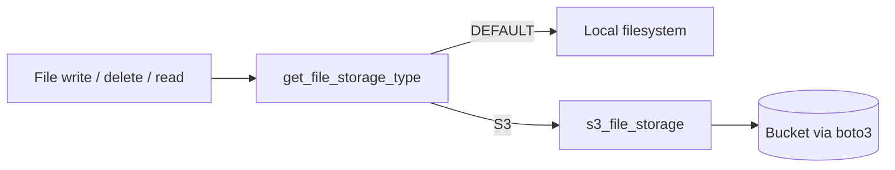

# File storage (technical)

Core selects exactly one file-storage backend per site via `frappe.conf.file_storage_type`:

| Value | Backend |
|---|---|
| `DEFAULT` (or omitted) | Local filesystem |
| `S3` | Object storage via `boto3` (Amazon S3 **or** any S3-compatible endpoint, including GCS) |

The legacy boolean `s3_file_storage_enabled` is removed from runtime selection and env validation. Sites that previously used S3 must set `file_storage_type: "S3"` before deploying this code.

`file_storage_type: "GCS"` is **not supported**. Cut over to Google Cloud Storage by keeping `S3` and setting `s3_endpoint_url` to the GCS S3-compatible endpoint (see [AWS → GCS cutover](#aws--gcs-cutover)).

This document covers architecture, configuration, the AWS→GCS endpoint swap, S3 flag migration, failure behavior, and verification.

## Architecture



| Module | Role |
|---|---|
| `core/file_storage.py` | `FileStorageType` enum + strict `get_file_storage_type()` |
| `core/s3_file_storage.py` | boto3 client (honors `s3_endpoint_url`), keys, URLs, get/put/head/delete |
| `core/s3_file_hooks.py` | Write/delete hooks: DEFAULT vs S3 only |
| `core/override/file.py` | Read / exists dispatch for S3 |
| `core/api/utils.py` `EnvConfig` | Startup/schema validation |
| `core/tests/test_file_storage.py` | Selector, schema, hooks, endpoint, File override tests |

There is **no** separate `gcs_file_storage.py` and **no** `gcs_*` site keys for cutover.

### Request flow

1. **Write**
   - `DEFAULT` → Frappe filesystem
   - `S3` → unique safe filename, build `{site}/private/files/{name}` or `{site}/files/{name}`, put bytes via boto3, set `file_url`
2. **Read / exists / validate** — File override routes to S3 helpers only when S3 is selected and the URL matches the S3 layout.
3. **Delete** — same exclusive dispatch as write.

## Configuration

### Selector

```json
"file_storage_type": "DEFAULT"
```

Accepted values (exact uppercase): `DEFAULT`, `S3`.

If `file_storage_type` is set to `GCS`, Core throws a migration error pointing operators to `S3` + `s3_endpoint_url`.

### S3 keys (when `file_storage_type` is `S3`)

| Key | Required | Notes |
|---|---|---|
| `s3_bucket` | Yes | Bucket name (Amazon S3 or GCS bucket name) |
| `s3_bucket_prefix` | No | Optional public URL / CDN base |
| `s3_region` | No | Defaults to `us-east-1` for the boto3 client; GCS ignores region for bucket location |
| `s3_endpoint_url` | No | Omit for Amazon S3. For GCS set `https://storage.googleapis.com` |
| `aws_access_key_id` / `aws_secret_access_key` | Pair* | AWS keys **or** GCS HMAC keys |

\* Both must be set or both omitted (IAM/instance role may apply on Amazon; GCS HMAC requires both).

### Not used / retired

- `gcs_bucket`, `gcs_bucket_prefix`, `gcs_endpoint_url`, `gcs_hmac_*`
- `file_storage_type: "GCS"`
- Dedicated GCS module / Application Default Credentials for file storage

### Example: Amazon S3

```json
{
  "file_storage_type": "S3",
  "s3_bucket": "carrum-erp-prod-files",
  "s3_bucket_prefix": "https://files.example.com",
  "s3_region": "ap-south-1",
  "aws_access_key_id": "<AWS_ACCESS_KEY>",
  "aws_secret_access_key": "<AWS_SECRET>"
}
```

### Example: GCS via S3-compatible endpoint

```json
{
  "file_storage_type": "S3",
  "s3_bucket": "carrum-erp-prod-files",
  "s3_bucket_prefix": "https://files.example.com",
  "s3_endpoint_url": "https://storage.googleapis.com",
  "aws_access_key_id": "<GCS_HMAC_ACCESS_KEY>",
  "aws_secret_access_key": "<GCS_HMAC_SECRET>"
}
```

Keep `file_storage_type` as `"S3"`. Only endpoint, credentials, and bucket values change.

### Authentication (GCS cutover)

Use the GCS **S3-compatible XML API** with **HMAC credentials** via existing `s3_client()` / boto3:

1. Create the GCS bucket.
2. Create a service account with object permissions on that bucket.
3. Create HMAC keys for that service account.
4. Put the HMAC access key / secret in `aws_access_key_id` / `aws_secret_access_key`.
5. Set `s3_endpoint_url` to `https://storage.googleapis.com`.

Application Default Credentials / `GOOGLE_APPLICATION_CREDENTIALS` are **not** the supported auth path.

## Object keys and `file_url`

Cloud storage (Amazon or GCS) uses the same key shape:

```
{site}/private/files/{safe_name}
{site}/files/{safe_name}
```

| Case | Stored `file_url` |
|---|---|
| Public + `s3_bucket_prefix` | `{prefix}/{key}` |
| Private (or no prefix) | `/private/files/...` or `/files/...` |

## Legacy S3 flag migration

1. Replace `"s3_file_storage_enabled": 1` with `"file_storage_type": "S3"`.
2. Keep existing `s3_bucket`, credentials, and prefix.
3. Restart web/workers.
4. Smoke-test upload, open, delete.

`s3_file_storage_enabled` alone does **not** enable S3.

## AWS → GCS cutover

Changing endpoint/credentials/bucket does **not** copy objects. Treat data movement as a separate ops job.

```text
Amazon S3  --(ops copy, same keys)-->  GCS bucket
site_config: same file_storage_type "S3"
  + s3_endpoint_url = https://storage.googleapis.com
  + aws_* = GCS HMAC
  + s3_bucket = GCS bucket name
```

### Steps

1. Create the GCS bucket in the desired location.
2. Create service account + HMAC keys.
3. Copy objects into GCS using the **same key layout** if the site must keep reading historical Files.
4. For public Files that used an S3/CDN prefix, update `s3_bucket_prefix` / rewrite `file_url` as needed.
5. Update site config (still `"file_storage_type": "S3"`):

```json
"s3_endpoint_url": "https://storage.googleapis.com",
"s3_bucket": "<gcs-bucket>",
"s3_bucket_prefix": "<optional-public-base>",
"aws_access_key_id": "<HMAC_ACCESS_KEY>",
"aws_secret_access_key": "<HMAC_SECRET>"
```

6. Restart web/workers.
7. Smoke-test (see checklist below).

### Rollback

Restore previous `s3_endpoint_url` (or remove it), AWS keys, and bucket values **only if** those objects still exist.

### Sites that used retired `file_storage_type: GCS`

Set `"file_storage_type": "S3"`, map former `gcs_bucket` → `s3_bucket`, HMAC → `aws_*`, and set `s3_endpoint_url` to `https://storage.googleapis.com`. Remove `gcs_*` keys.

## EnvConfig validation

- Defaults `file_storage_type` to `DEFAULT`.
- Requires `s3_bucket` when type is `S3`.
- Accepts optional `s3_endpoint_url` for `S3`.
- Requires a complete AWS-named credential pair when either half is set.
- Does not accept or require `gcs_*` fields.

## Failure behavior

- Invalid or lowercase selector → validation error (no silent fallback).
- `GCS` selector → migration error naming `S3` + `s3_endpoint_url`.
- Missing `s3_bucket` when `S3` is selected → validation error; no filesystem fallback.
- Upload/delete failures on S3 → error; no dual-write to disk.

## Tests

```bash
bench --site <site> run-tests --app core --module core.tests.test_file_storage
```

Coverage includes selector parsing, GCS migration rejection, legacy-flag ignore, env schema (including optional endpoint), hook dispatch (DEFAULT vs S3 only), boto3 client `endpoint_url`, URL/key resolution, and File override routing.

## Checklists

### Deploy

- [ ] S3 sites use `file_storage_type: "S3"` (not the legacy boolean)
- [ ] No site relies on `file_storage_type: "GCS"` or `gcs_*` keys
- [ ] GCS cutover sites have `s3_endpoint_url`, HMAC in `aws_*`, and `s3_bucket`

### Smoke-test checklist (`file_storage_type: "S3"` + GCS endpoint)

Against a real GCS bucket with HMAC and `s3_endpoint_url: "https://storage.googleapis.com"`:

- [ ] Upload a private File → object appears under `{site}/private/files/...`
- [ ] Open / download the File in Desk → content matches
- [ ] Delete the File → object removed from the GCS bucket
- [ ] (Optional) Public file with `s3_bucket_prefix` resolves to the expected public URL

## Out of scope

- Automatic copy of objects between Amazon S3 and GCS
- Native Google Cloud Storage SDK / ADC
- Dual-write or dual-read across backends
