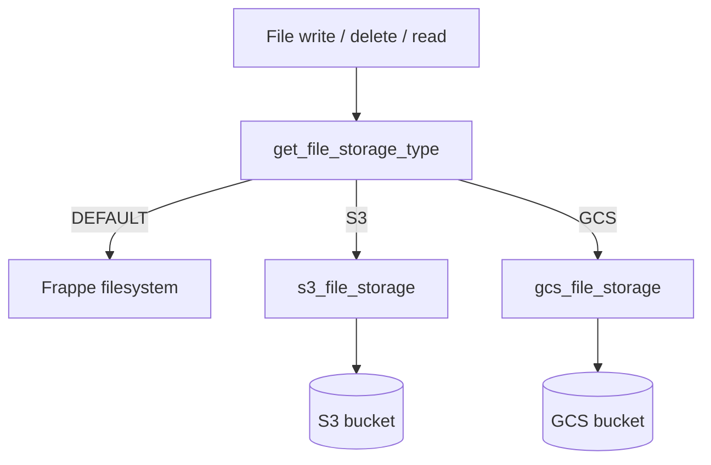

# File Storage — Technical Documentation

**Module:** Core (`apps/core`)  
**Status:** Available  
**Product guide:** [../product/file_storage.md](../product/file_storage.md)

---

## Overview

Core selects exactly one file-storage backend per site via `frappe.conf.file_storage_type`:

| Value | Backend |
|---|---|
| `DEFAULT` or absent | Frappe local filesystem |
| `S3` | Direct Core S3 (`boto3`) |
| `GCS` | Direct Core GCS (`google-cloud-storage`) |

The legacy boolean `s3_file_storage_enabled` is removed from runtime selection and env validation. Sites that previously used S3 must set `file_storage_type: "S3"` before deploying this code.

This document covers architecture, configuration, GCS cutover, S3 flag migration, failure behavior, and verification.

---

## Architecture



### Code layout

| Path | Purpose |
|---|---|
| `core/file_storage.py` | `FileStorageType` enum + strict `get_file_storage_type()` |
| `core/s3_file_storage.py` | S3 client, keys, URLs, get/put/head/delete |
| `core/gcs_file_storage.py` | GCS client (ADC), keys, URLs, get/put/head/delete |
| `core/s3_file_hooks.py` | Frappe `write_file` / `delete_file_data_content` dispatch |
| `core/override/file.py` | File override: validate / exists / `get_content` dispatch |
| `core/api/utils.py` | `EnvConfig` provider-aware validation |
| `core/hooks.py` | Registers write/delete hooks + File override |
| `core/tests/test_file_storage.py` | Selector, schema, hooks, GCS, File override tests |
| `crm/api/maintenance_helpers.py` | Invoice reads via `File.get_content()` |
| `crm/api/maintenance_api.py` | `proxy_s3_file` uses `File.get_content()` |

### Request lifecycle

1. **Write** — `write_file` reads the selector.
   - `DEFAULT` → `save_file_on_filesystem()`
   - `S3` / `GCS` → unique safe filename, build `{site}/private/files/{name}` or `{site}/files/{name}`, put bytes to the selected backend, set `file_url`
2. **Read / exists / validate** — File override routes to S3 or GCS helpers only when that backend is selected and the URL matches its layout.
3. **Delete** — Selected cloud backend deletes the object when the File URL resolves to that backend. Local filesystem delete is used for `DEFAULT` and thumbnails.

Only one backend processes each operation. Missing required cloud config raises; Core does not fall back to local disk.

---

## Configuration

### Selector

```json
"file_storage_type": "DEFAULT"
```

Accepted values (exact uppercase): `DEFAULT`, `S3`, `GCS`.

| Input | Result |
|---|---|
| Key absent or empty | `DEFAULT` |
| Valid enum value | That backend |
| Anything else (`gcs`, `LOCAL`, `1`, …) | Validation error |
| Only `s3_file_storage_enabled: 1` present | `DEFAULT` (legacy flag ignored) |

### S3 keys (when `file_storage_type` is `S3`)

| Key | Required | Notes |
|---|---|---|
| `s3_bucket` | Yes | Bucket name |
| `s3_bucket_prefix` | No | Public URL base |
| `s3_region` | No | Defaults in client if unset |
| `aws_access_key_id` / `aws_secret_access_key` | Pair | Both set or both omitted |

### GCS keys (when `file_storage_type` is `GCS`)

| Key | Required | Notes |
|---|---|---|
| `gcs_bucket` | Yes | One bucket for private + public paths |
| `gcs_bucket_prefix` | No | Optional public URL / CDN base |

Not in `site_config.json`:

- Service-account JSON (use Application Default Credentials)
- GCS region (bucket location is a GCP bucket property)

### Example: GCS site

```json
{
  "file_storage_type": "GCS",
  "gcs_bucket": "carrum-erp-prod-files",
  "gcs_bucket_prefix": "https://files.example.com"
}
```

### Authentication (GCS)

`storage.Client()` uses Application Default Credentials, for example:

- Workload identity / attached service account on GCE / GKE / Cloud Run
- Local or VM: `GOOGLE_APPLICATION_CREDENTIALS` pointing at a key file (ops-managed; not stored in site config)

Required IAM on the bucket typically includes object create, get, delete, and list as needed for smoke tests and deletes.

---

## Object layout and URLs

Both S3 and GCS use the same key shape:

| Privacy | Object key |
|---|---|
| Private | `{site}/private/files/{safe_name}` |
| Public | `{site}/files/{safe_name}` |

Filenames embed a content-hash (or random) suffix so cloud-only writes do not overwrite objects when the local path is missing.

### GCS `file_url` rules

| Case | Stored `file_url` |
|---|---|
| Private | `/private/files/{safe_name}` |
| Public + `gcs_bucket_prefix` | `{prefix}/{key}` |
| Public without prefix | `https://storage.googleapis.com/{bucket}/{key}` |

Private URLs stay Frappe-style so Desk/CRM attachments keep working through Core’s File override and `get_content()`.

---

## Breaking change: remove `s3_file_storage_enabled`

### S3 sites (config migration only)

Before restarting workers/web after deploying this code:

1. Replace `"s3_file_storage_enabled": 1` with `"file_storage_type": "S3"`.
2. Keep `s3_bucket`, `s3_bucket_prefix`, `s3_region`, and AWS credentials as-is.
3. Restart / reload site config.
4. Smoke-test upload, open, delete against S3.

If the new code boots while only the legacy flag is set, the site behaves as `DEFAULT` and new files land on local disk.

### Rollback (S3)

Rollback requires:

1. Restoring code that still understands `s3_file_storage_enabled`.
2. Restoring that flag for S3 sites.

Selector-only rollback does not move objects.

---

## GCS migration runbook

Changing `file_storage_type` to `GCS` does **not** copy objects from S3 or local disk. Treat data movement as a separate ops job.

### Phase 1 — Prerequisites

1. Create the GCS bucket in the desired location.
2. Grant the runtime identity permission to read/write/delete objects.
3. Confirm ADC works from the Frappe process environment (`storage.Client()` succeeds).
4. Decide public access:
   - Bucket/IAM policy for `https://storage.googleapis.com/...`, or
   - CDN / custom host via `gcs_bucket_prefix`.
5. Install dependency if needed: `google-cloud-storage` (declared in `apps/core/pyproject.toml`).

### Phase 2 — Site config (before flip)

```json
"gcs_bucket": "<bucket>",
"gcs_bucket_prefix": "<optional-public-base>"
```

Do **not** set `"file_storage_type": "GCS"` until objects the site must still read are available in GCS (or the site is greenfield).

### Phase 3 — Optional object migration

If existing Files must remain readable after cutover:

1. Copy objects into GCS using the **same key layout** (`{site}/private/files/...`, `{site}/files/...`).
2. For public Files that used an S3/CDN prefix, rewrite `file_url` to the GCS public URL or `gcs_bucket_prefix` form as needed.
3. Private Frappe-style URLs (`/private/files/...`) can remain if keys match under the new bucket.

Core does not ship an automated S3→GCS object migrator.

### Phase 4 — Cutover

1. Set `"file_storage_type": "GCS"`.
2. Remove obsolete S3 enablement flags if present.
3. Restart web/workers so `frappe.conf` reloads.
4. Smoke-test:
   - Upload private file → URL `/private/files/...` → open succeeds
   - Upload public file → prefix or `storage.googleapis.com` URL → open succeeds
   - Delete File → object removed from GCS
   - Confirm no new writes appear in the inactive S3/local paths for that site

### Phase 5 — Rollback

1. Set `file_storage_type` back to `S3` or `DEFAULT` **only if** those backends still hold the needed objects.
2. Restart processes.
3. Remember: files written to GCS while the selector was `GCS` remain in GCS.

---

## Env validation

`EnvConfig` in `core/api/utils.py`:

- Defaults `file_storage_type` to `DEFAULT`.
- Requires `s3_bucket` when type is `S3`.
- Requires `gcs_bucket` when type is `GCS`.
- Requires AWS access/secret as a pair when either is set under S3.
- Does not require S3 fields for `DEFAULT` / `GCS`.

---

## CRM consumers

Maintenance invoice helpers and `proxy_s3_file` no longer hard-code S3. They resolve a `File` doc and call `get_content()`, so reads follow the selected Core backend.

---

## Tests and verification

```bash
bench --site <site> run-tests --module core.tests.test_file_storage
bench --site <site> run-tests --module crm.api.test_maintenance_file_storage
```

Coverage includes selector parsing, legacy-flag ignore, env schema, hook dispatch (exactly one backend), GCS client ADC construction, URL/key resolution, File override routing, and CRM reader dispatch.

### Operator checklist

- [ ] S3 sites updated to `file_storage_type: "S3"` before deploy
- [ ] GCS sites have `gcs_bucket` + working ADC
- [ ] Object migration done if historical files must remain readable
- [ ] Upload / read / delete smoke tests on the selected backend
- [ ] Inactive backends show no new writes

---

## Non-goals

- Automatic copy of objects between local, S3, and GCS
- Restoring MultiCloud Storage or Azure as a site selector value
- Dual-backend reads for one File after selector change
- Local-only extension exclusion lists while a cloud backend is selected

---

## Related docs

- Product / migration outcomes: [../product/file_storage.md](../product/file_storage.md)
- OpenSpec change: `openspec/changes/replace-s3-storage-flag-with-type/`
