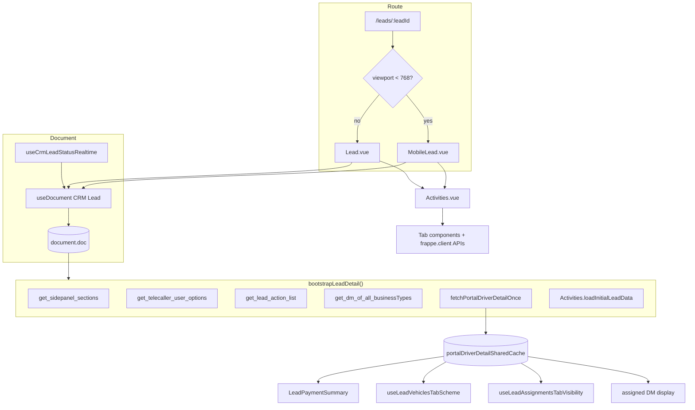

# Lead Detail Screen — Technical Documentation

**DocType:** `CRM Lead`  
**Module:** FCRM (`crm` app) + Platform (`core` app)  
**Route:** `/leads/:leadId` (`Lead` router name)  
**Status:** Live

---

## Overview

The Lead Detail Screen is the primary SPA workspace for a single `CRM Lead` record. It composes:

1. Document loading and saves (`useDocument`)
2. A tabbed activity shell (`Activities.vue`)
3. A configurable side panel (`SidePanelLayout`)
4. Driver portal integration (`portalDriverDetailSharedCache`)
5. Server-driven Take Action workflows (`get_lead_action_list` / `take_lead_actions`)

Desktop renders `Lead.vue` with a resizable right panel. Mobile (`< 768px`) renders `MobileLead.vue` with a **Details** tab that inlines side-panel content.

---

## Architecture



### Code layout

| Path | Purpose |
|---|---|
| `crm/frontend/src/pages/Lead.vue` | Desktop lead detail page |
| `crm/frontend/src/pages/MobileLead.vue` | Mobile lead detail page |
| `crm/frontend/src/router.js` | Route + mobile viewport switch + tab hash restore |
| `crm/frontend/src/components/Activities/Activities.vue` | Tab shell, activity loading, tab routing |
| `crm/frontend/src/components/Activities/ActivityHeader.vue` | Per-tab header actions |
| `crm/frontend/src/components/Activities/DataFields.vue` | Data tab layout |
| `crm/frontend/src/components/Activities/LeadReferralTab.vue` | Referral tab |
| `crm/frontend/src/components/Activities/LeadVehiclesArea.vue` | Vehicles tab |
| `crm/frontend/src/components/Activities/LeadAssignmentsArea.vue` | Assignments tab |
| `crm/frontend/src/components/Activities/AgreementArea.vue` | Agreement tab |
| `crm/frontend/src/components/SidePanelLayout.vue` | Side panel field rendering and saves |
| `crm/frontend/src/components/LeadPaymentSummary.vue` | DRIVER payment summary from portal cache |
| `crm/frontend/src/components/Modals/LeadTakeActionModal.vue` | Take Action modal |
| `crm/frontend/src/data/document.js` | Document CRUD, setValue, save, permissions |
| `crm/frontend/src/composables/useLeadTakeAction.js` | Take Action fetch + visibility |
| `crm/frontend/src/composables/useTelecallerLeadViewLock.js` | View lock (currently always false) |
| `crm/frontend/src/composables/useLeadAssignmentsTabVisibility.js` | Assignments tab gating |
| `crm/frontend/src/composables/useLeadVehiclesTabScheme.js` | Vehicles tab gating |
| `crm/frontend/src/composables/useActiveTabManager.js` | Tab index, URL hash, localStorage |
| `crm/frontend/src/composables/portalDriverDetailSharedCache.js` | Portal driver detail cache |
| `crm/frontend/src/composables/useCrmLeadStatusRealtime.js` | Socket reload on status change |
| `crm/fcrm/doctype/crm_lead/crm_lead.py` | Take Action handlers, validations |
| `crm/api/lead.py` | Whitelisted lead detail APIs |
| `crm/fcrm/doctype/crm_fields_layout/` | Side panel + Data tab layouts |
| `core/api/carrum_drivers.py` | Portal driver detail, agreement APIs |

---

## Routing and responsive layout

```javascript
// router.js
const handleMobileView = (componentName) => {
  return window.innerWidth < 768 ? `Mobile${componentName}` : componentName
}

{ path: '/leads/:leadId', name: 'Lead', component: () => import(`@/pages/${handleMobileView('Lead')}.vue`) }
```

**Tab persistence:**

- Storage key: `lastLeadTab`
- URL hash synced by `useActiveTabManager`
- Router restores hash on navigation when no hash present

**View tracking:** `trackLeadViews([leadId], { viewType: 'detail', routeName: 'Lead' })` on document load.

---

## Document layer

`useDocument('CRM Lead', leadId)` provides:

| Export | Usage on lead detail |
|---|---|
| `document.doc` | Reactive lead fields |
| `document.save` / `document.setValue` | Field persistence |
| `document.reload()` | Full document refresh |
| `permissions` | DocType permissions (delete UI hardcoded off) |
| `scripts` | Server customization scripts → `CustomActions` |

**Realtime:** `useCrmLeadStatusRealtime` subscribes to socket event `crm_lead_status_changed` on the lead doc room and triggers `document.reload()` when `status` or `lead_type` changes server-side.

**Duplicate identity:** Saves with `exc_type === DUPLICATE_CRM_LEAD_IDENTITY_EXC` open `CrmLeadDuplicateIdentityModal` instead of a generic error toast.

---

## Bootstrap sequence

`bootstrapLeadDetail({ force })` runs when `document.doc.name` is set (and on manual refresh):

```javascript
await Promise.allSettled([
  sections.fetch(),                    // side panel layout
  fetchTelecallerUsers({ force }),
  fetchLeadActions({ force }),
  isDriver ? fetchDms({ force }) : Promise.resolve(),
  activities.value?.loadInitialLeadData?.({ force }),
  isDriver ? fetchPortalDriverDetailOnce(leadId) : Promise.resolve(),
])
syncAssignedDmFromCache()
```

`refreshLeadDetailScreen()` additionally invalidates core tags, reloads document, sync-refreshes portal detail for DRIVER leads, reloads current activity tab, and reloads payment summary.

---

## Tabs configuration

Tabs are computed in `Lead.vue` / `MobileLead.vue` from role + lead state.

### Onboarding tab order

Activity → Data → WhatsApp* → Notes → Comments → Calls → Referral → Vehicles† → Agreement‡ → Attachments → Assignments§

### Default tab order

Activity → Comments → Data → Calls → Notes → Attachments → WhatsApp* → Referral → Agreement‡ → Vehicles† → Assignments§

\* `condition: () => whatsappEnabled.value`  
‡ `disabled: lead_type !== 'DRIVER'`  
† `disabled: lead_type !== 'DRIVER' || !vehiclesSchemeSelected`  
§ `disabled: lead_type !== 'DRIVER' || !assignmentsTabEnabled`

### Mobile-only tab

**Details** — prepended when `isMobileView`; embeds header actions, avatar row, payment summary, and `SidePanelLayout`.

### Tab gating composables

**`useLeadVehiclesTabScheme(doc)`**

- Watches DRIVER + portal cache bump counter
- `vehiclesSchemeSelected` = portal has `scheme_id` or `scheme_alias_detail.name`

**`useLeadAssignmentsTabVisibility(doc)`**

- Enables when scheme name/alias contains `"vendor"` or `"double driver"` (case-insensitive)

Disabled tabs trigger redirect to first enabled tab via watcher on `[tabIndex, tabs]`.

---

## Side panel

### Layout API

**Endpoint:** `crm.fcrm.doctype.crm_fields_layout.crm_fields_layout.get_sidepanel_sections`

| Parameter | Value |
|---|---|
| `doctype` | `CRM Lead` |

Cached key: `['sidePanelSections', 'CRM Lead', 'hubBusinessPreferenceV2']`.

**Transform:** `salutation` field filtered out in `Lead.vue`.

**Reload trigger:** `lead_type` change → `sections.reload()`.

### Read-only rules

| Prop | Source |
|---|---|
| `all-fields-read-only` | `telecallerLeadViewLocked` (always `false`) |
| `read-only-fieldnames` (desktop) | `telecaller` if !canEditTelecallerAssignment; `mobile_no` if !userCanEditCrmLeadMobileNo |
| `read-only-fieldnames` (mobile) | Above + `status`, `primary_status`, `secondary_status` |

### Save path

Side panel emits `beforeFieldChange` → `beforeStatusChange()`:

- Lost status → `LostReasonModal` or direct save
- Otherwise → `document.setValue.submit(data)` with `mergeDocAfterPartialSetValue` on success
- View lock check (inactive) still present in handler

---

## Header actions — implementation

### Take Action

**Composable:** `useLeadTakeAction({ leadId, telecallerLeadViewLocked })`

```javascript
const r = await call('crm.api.lead.get_lead_action_list', { lead_id: id })
leadActions.value = Array.isArray(r) ? r : r?.actions ?? []
leadActionConfig.value = r?.config ?? null  // from Global Config take_lead_action_modal_config
```

**Visibility:** `showTakeActionForLead` = not locked AND (loading OR actions.length > 0).

**Submit:** `LeadTakeActionModal` → `crm.api.lead.take_lead_actions` → `document.reload()` + activity reload.

### Telecaller assignment

| Rule | Implementation |
|---|---|
| Can edit | Telecaller Lead; OR Onboarding when `telecaller` empty |
| Options API | `crm.api.lead.get_telecaller_user_options` |
| Save | Direct `document.save` on `telecaller` field change |
| Post-save | Portal refresh + DM sync for DRIVER leads |

### DM assignment

| Rule | Implementation |
|---|---|
| Visible | `lead_type === 'DRIVER'` AND `custom_account_id` set |
| Desktop DM button | Onboarding role only (`hasOnboardingRole`) |
| Mobile DM button | `canAssignDm` = Onboarding, Hub Manager, Admin, Administrator |
| List API | `crm.api.lead.get_dm_of_all_businessTypes` `{ leadId }` |
| Assign API | `crm.api.lead.assign_dm` `{ custom_account_id, dmId }` |
| Assigned display | Parsed from portal driver detail cache (`parseAssignedDmsFromPortal`) |

### Status pills

Resolved from linked `CRM Lead Status` doc via `statusesStore.getLeadStatus()` and `pillFromLeadStatusDoc()`.

Primary label: `custom_primary_status` or `primary_status`. Secondary: `lead_status` or `secondary_status`.

### Click-to-call

**Desktop gating (`callButtonDisabled`):**

- `!callEnabled`
- `click2CallCooldownActive`
- `activeDialerSession` (Smartflo)
- `!telecallerCanCallLead` — plain Telecaller role: disabled unless no TC assigned OR current user is assigned TC
- `!callmaticEnabled`

**Payload:** `CORE_CALL_START` with vendor-specific body (Callmatic vs Smartflo Agent manual dial).

### User tags

| API | Parameters |
|---|---|
| `crm.api.lead.get_core_tags` | — (palette) |
| `crm.api.lead.apply_lead_user_tag` | `lead_id`, `color`, `label` OR `remove: 1` |

Stored in `user_tags` JSON on lead; per-user colored ring on name.

### Portal navigation

- Base URL: `getCarrumPortalBaseUrl()` + `/driver-details-edit`
- Driver ID: from `portalDriverDetailSharedCache` via `getPortalDriverIdFromResults`
- Hidden when role is Sourcing or Telecaller Lead
- `fetchPortalDriverDetailOnce` on demand if cache miss

---

## Activities shell

`Activities.vue` receives `doctype`, `docname`, `tabs`, `reload`, `tabIndex`, `vehiclesActionsEnabled`, `viewLocked`.

### Initial load

`loadInitialLeadData({ force })`:

- `crm.api.activities.get_activities` `{ name: leadId }`
- Data tab: `get_fields_layout` for type **Data Fields**

### Tab → component mapping

| Tab | Component | Key APIs |
|---|---|---|
| Activity | Timeline in Activities | `get_activities` |
| Data | `DataFields.vue` | `get_fields_layout`, portal sync, EMI |
| Calls | Call list area | activities `calls` resource |
| Referral | `LeadReferralTab.vue` | `crm.api.referral.get_lead_referrals_dummy` |
| Vehicles | `LeadVehiclesArea.vue` | `lead_vehicle_auto_assign`, `lead_vehicle_update_requested`, `lead_vehicle_cancel_request` |
| Agreement | `AgreementArea.vue` | `core.api.carrum_drivers.upload_agreement`, `send_agreement` |
| Assignments | `LeadAssignmentsArea.vue` | `frappe.client.get_list` filtered by `primary_lead` |
| WhatsApp | `WhatsAppArea` | `crm.api.whatsapp.get_whatsapp_messages` |

`ActivityHeader.vue` renders tab-specific create/upload actions when `!viewLocked`.

---

## Portal driver detail cache

**Shared module:** `portalDriverDetailSharedCache.js`

| Function | Purpose |
|---|---|
| `fetchPortalDriverDetailOnce(leadId)` | Deduped fetch |
| `refreshPortalDriverDetailForLead(leadId, { sync })` | Force refresh |
| `getCachedPortalDriverDetailResponse(leadId)` | Read cache |
| `portalDriverDetailBumpByLeadId` | Reactive bump counter for watchers |

**API:** `core.api.carrum_drivers.get_portal_driver_detail` `{ name: leadId, sync?: 0|1 }`

**Consumers:**

- `LeadPaymentSummary` — wallet totals, Driver Hisaab URL
- `useLeadVehiclesTabScheme` — scheme presence
- `useLeadAssignmentsTabVisibility` — vendor / double-driver detection
- DM button label — assigned DM from portal mappings

---

## Take Action — server logic

Implemented on `CRM Lead` document class in `crm_lead.py`.

### `get_lead_action_list()`

| Action slug | Condition |
|---|---|
| `mark_onboarding_drop` | `primary_status == CONVERTED` AND status row `is_apply_on_vehicle_assignment == 0` |
| `mark_walk_in_done` | Administrator, Onboarding, or Telecaller Lead role |
| `remove_onboarding_drop` | Current status `is_onboarding_drop` |
| `unmerge_lead` | Current status `is_apply_on_merged_lead` |
| `merge_lead` | `lead_type == LEAD` (and not in unmerge/onboarding-drop branches) |
| `raise_driver_reactivation_request` | `lead_type == DRIVER`, `primary_status == DROP`, excludes inactive/returned/temp/maintenance drop statuses |

Returns array of action descriptors with flags: `walkin_form_required`, `onboarding_drop_status_required`, `merged_into_lead_id_required`, `requires_remarks`.

Modal UI config optionally returned from Global Config key `take_lead_action_modal_config`.

### `take_lead_actions(action, payload)`

Dispatches to:

- `mark_walk_in_done` → see [walkin_form.md](walkin_form.md)
- `merge_lead` / `unmerge_lead`
- `mark_onboarding_drop` / `remove_onboarding_drop`
- `raise_driver_reactivation_request`

---

## API reference — lead detail endpoints

Full CRM Lead REST docs: **[CRM Lead — Resource API](resource/crm_lead/README.md)**

### Lead detail method APIs

| Method | HTTP | Parameters | Description |
|---|---|---|---|
| `crm.api.lead.get_lead_action_list` | POST | `lead_id` | Available Take Action list + optional config |
| `crm.api.lead.take_lead_actions` | POST | `lead_id`, `action`, payload fields | Execute Take Action |
| `crm.api.lead.get_telecaller_user_options` | GET/POST | — | TC dropdown options |
| `crm.api.lead.get_dm_of_all_businessTypes` | GET/POST | `leadId` | Hub DM list |
| `crm.api.lead.assign_dm` | POST | `custom_account_id`, `dmId` | Assign DM via portal API |
| `crm.api.lead.apply_lead_user_tag` | POST | `lead_id`, `color`, `label` or `remove=1` | Per-user tag |
| `crm.api.lead.get_core_tags` | GET/POST | — | Tag palette |
| `crm.api.lead.get_possible_onboarding_drop_statuses` | GET/POST | — | Onboarding drop statuses for Take Action |
| `crm.api.lead.lead_vehicle_auto_assign` | POST | `lead_id`, `vendor_count_details[]` | Fleet auto-assign |
| `crm.api.lead.lead_vehicle_update_requested` | POST | `lead_id`, `requested_cars_list[]` | Update requested cars |
| `crm.api.lead.lead_vehicle_cancel_request` | POST | `request_id` | Cancel car request |
| `crm.api.lead.submit_cheque` | POST | `lead_id`, `account_id`, `bank_account_number`, `cheque_image` | Cheque submission |
| `crm.api.lead.get_emis` | GET/POST | `scheme_car_type_id` | EMI plans (Data tab) |
| `crm.api.lead.redirect_to_lead_detail` | GET | `phone` (guest) | Find/create lead → redirect `#data` |

### Layout and activity APIs

| Method | Parameters |
|---|---|
| `crm.fcrm.doctype.crm_fields_layout.crm_fields_layout.get_sidepanel_sections` | `{ doctype: 'CRM Lead' }` |
| `crm.fcrm.doctype.crm_fields_layout.crm_fields_layout.get_fields_layout` | Data tab params |
| `crm.api.activities.get_activities` | `{ name: leadId }` |

### Portal / driver APIs

| Method | Parameters |
|---|---|
| `core.api.carrum_drivers.get_portal_driver_detail` | `{ name: leadId, sync?: 0\|1 }` |
| `core.api.carrum_drivers.upload_agreement` | Agreement upload payload |
| `core.api.carrum_drivers.send_agreement` | Send agreement payload |

### Example — load Take Action list

```bash
curl -b cookies.txt -X POST 'https://<your-site>/api/method/crm.api.lead.get_lead_action_list' \
  -H 'Content-Type: application/json' \
  -H 'X-Frappe-CSRF-Token: <csrf_token>' \
  -d '{"lead_id": "AAAA0001"}'
```

### Example — assign telecaller (via document save)

Telecaller changes use standard document save:

```bash
curl -b cookies.txt -X PUT 'https://<your-site>/api/resource/CRM%20Lead/AAAA0001' \
  -H 'Content-Type: application/json' \
  -H 'X-Frappe-CSRF-Token: <csrf_token>' \
  -d '{"telecaller": "agent@example.com"}'
```

### Example — assign DM

```bash
curl -b cookies.txt -X POST 'https://<your-site>/api/method/crm.api.lead.assign_dm' \
  -H 'Content-Type: application/json' \
  -H 'X-Frappe-CSRF-Token: <csrf_token>' \
  -d '{"custom_account_id": "<account-uuid>", "dmId": "<dm-id>"}'
```

### Example — apply user tag

```bash
curl -b cookies.txt -X POST 'https://<your-site>/api/method/crm.api.lead.apply_lead_user_tag' \
  -H 'Content-Type: application/json' \
  -H 'X-Frappe-CSRF-Token: <csrf_token>' \
  -d '{"lead_id": "AAAA0001", "color": "blue", "label": "Follow up"}'
```

### Example — portal driver detail

```bash
curl -b cookies.txt -G 'https://<your-site>/api/method/core.api.carrum_drivers.get_portal_driver_detail' \
  --data-urlencode 'name=AAAA0001' \
  --data-urlencode 'sync=1'
```

---

## Role and permission matrix

| Capability | Roles / condition |
|---|---|
| Edit TC | Telecaller Lead; Onboarding if TC empty |
| DM assign desktop | Onboarding |
| DM assign mobile | Onboarding, Hub Manager, Admin, Administrator |
| Edit `mobile_no` | Onboarding, Hub Manager, Admin, Administrator (`crmLeadMobileNoAccess.js`) |
| Walk-in Take Action | Onboarding, Telecaller Lead, Administrator |
| Portal button | Hidden: Sourcing, Telecaller Lead |
| Plain TC call gate | Desktop only; see click-to-call section |
| Side panel read-only | `telecallerLeadViewLocked` — **always false** |
| Referral tab disable | `canAccessReferralTab` computed but **commented out** in tabs array |
| Delete lead UI | Hardcoded `canDelete = false` |

**View lock composable:**

```javascript
// useTelecallerLeadViewLock.js
export function useTelecallerLeadViewLock(docRef) {
  return computed(() => false)  // Lock removed
}
```

Infrastructure (`viewLocked`, `allFieldsReadOnly`) remains wired for future use.

---

## Configuration

| Key / DocType | Purpose |
|---|---|
| `CRM Fields Layout` (Side Panel) | Side panel field sections |
| `CRM Fields Layout` (Data Fields) | Data tab layout |
| Global Config `take_lead_action_modal_config` | Take Action modal UI |
| Global Config `pref_business_and_scheme` | Preferred business/scheme side panel fields |
| `CRM Lead Status` | Status pills, Take Action eligibility flags |
| `composables/settings` | `whatsappEnabled`, `callEnabled`, `callmaticEnabled`, `defaultCallingVendor` |
| `constants/roleMapping.js` | `PORTAL_ROLE_MAP` role name mapping |
| `constants/crmLeadMobileNoAccess.js` | Mobile number edit roles |

---

## Data model — lead detail relevant fields

| Field | Usage on screen |
|---|---|
| `name` | Display ID, route param |
| `lead_name` | Header title |
| `lead_type` | `LEAD` / `DRIVER` / `VENDOR` — tab gating |
| `status`, `primary_status`, `secondary_status` | Status pills, Take Action eligibility |
| `telecaller` | TC assignment |
| `mobile_no`, `mask_mobile_no` | Call, side panel (masked for DRIVER) |
| `custom_account_id` | DM assign row visibility |
| `hub_visit_status` | **In Hub** badge |
| `user_tags` | Per-user color tags |
| `image` | Avatar |
| `sla_status` | SLA section |
| `source`, `source_id` | Side panel source picker |
| `primary_lead` | Secondary driver — disables vehicle auto-assign |
| `walkin_form_link`, `walkin_form_filled_at` | Activity timeline (walk-in) |

Full schema: [resource/crm_lead/fields.md](resource/crm_lead/fields.md)

---

## Known limitations

1. **Telecaller view lock removed** — composable returns `false`; dead code paths remain
2. **Referral tab role gate commented out** — tab visible regardless of `canAccessReferralTab`
3. **Delete disabled in UI** — `canDelete = false` regardless of permissions
4. **Desktop vs mobile DM roles differ** — Onboarding-only on desktop header
5. **Portal cache is in-memory** — lost on full page reload; refetched on bootstrap
6. **Mobile viewport chosen at route load** — resizing across 768px does not hot-swap component without navigation
7. **Guest redirect** — `redirect_to_lead_detail` creates/finds by phone; lands on `#data` hash

---

## File reference

```
apps/crm/frontend/src/
├── pages/
│   ├── Lead.vue
│   └── MobileLead.vue
├── router.js
├── data/document.js
├── components/
│   ├── Activities/
│   │   ├── Activities.vue
│   │   ├── ActivityHeader.vue
│   │   ├── DataFields.vue
│   │   ├── LeadReferralTab.vue
│   │   ├── LeadVehiclesArea.vue
│   │   ├── LeadAssignmentsArea.vue
│   │   └── AgreementArea.vue
│   ├── SidePanelLayout.vue
│   ├── LeadPaymentSummary.vue
│   └── Modals/
│       ├── LeadTakeActionModal.vue
│       └── CrmLeadDuplicateIdentityModal.vue
├── composables/
│   ├── useLeadTakeAction.js
│   ├── useTelecallerLeadViewLock.js
│   ├── useLeadAssignmentsTabVisibility.js
│   ├── useLeadVehiclesTabScheme.js
│   ├── useActiveTabManager.js
│   ├── useCrmLeadStatusRealtime.js
│   └── portalDriverDetailSharedCache.js
└── constants/
    ├── roleMapping.js
    └── crmLeadMobileNoAccess.js

apps/crm/crm/
├── api/lead.py
├── api/activities.py
├── api/referral.py
└── fcrm/doctype/crm_lead/crm_lead.py

apps/core/core/
├── api/carrum_drivers.py
└── constants/enums.py          # LEAD_ACTION_SLUG, LeadType, LeadStatus
```

---

## Related documentation

| Topic | Link |
|---|---|
| Product guide | [../product/lead_detail_screen.md](../product/lead_detail_screen.md) |
| Walk-in form | [walkin_form.md](walkin_form.md) |
| CRM Lead API | [resource/crm_lead/README.md](resource/crm_lead/README.md) |
| Calling | [calling/README.md](calling/README.md) |
