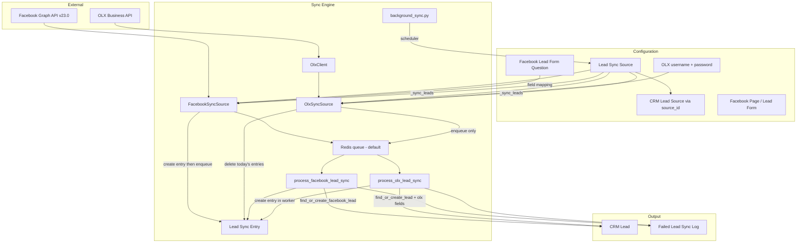
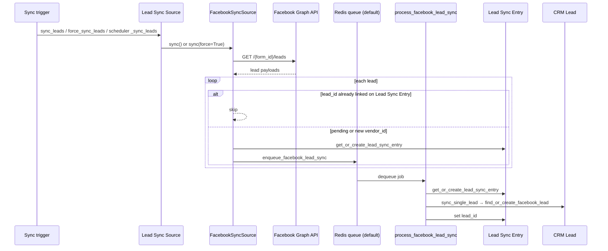
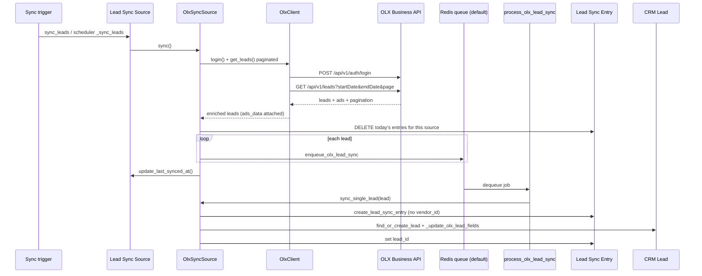

# Lead Sync Source — Technical Documentation

**DocType:** `Lead Sync Source`  
**Module:** Lead Syncing (`crm` app)  
**Status:** Beta  
**Product guide:** [../product/lead_sync_source.md](../product/lead_sync_source.md)

---

## Overview

Lead Sync Source is the configuration and orchestration layer for automatically importing leads from external platforms into `CRM Lead`. It supports **Facebook Lead Ads** and **OLX Business Lead Sharing**.

Each record represents one integration endpoint — a Facebook Lead Form or an OLX Business account — with its own sync schedule, field mappings (Facebook), and failure logs.

---

## Architecture



### Code layout

| Path | Purpose |
|---|---|
| `crm/lead_syncing/doctype/lead_sync_source/lead_sync_source.py` | DocType controller, validation, sync entry points |
| `crm/lead_syncing/doctype/lead_sync_source/facebook.py` | Facebook Graph API client, fetch/enqueue, per-lead worker |
| `crm/lead_syncing/doctype/lead_sync_source/olx.py` | OLX fetch/enqueue, per-lead worker, CRM import |
| `crm/lead_syncing/doctype/lead_sync_source/sync_utils.py` | CRM Lead Source resolution, `last_synced_at` helper |
| `core/integrations/olx/client.py` | OLX Business API HTTP client (login, paginated leads) |
| `crm/lead_syncing/background_sync.py` | Scheduler-driven batch sync |
| `crm/lead_syncing/doctype/facebook_page/` | Cached Facebook pages |
| `crm/lead_syncing/doctype/facebook_lead_form/` | Cached lead gen forms and question metadata |
| `crm/lead_syncing/doctype/failed_lead_sync_log/` | Failure/duplicate logs and retry |
| `core/platform/doctype/lead_sync_entry/` | Audit trail: raw vendor payload before CRM import |
| `core/services/crm_lead/lead_service.py` | Lead creation (`find_or_create_facebook_lead`, `find_or_create_lead`) |
| `crm/api/activities.py` | Activity timeline grouping for OLX lead intent |
| `crm/api/crm_lead_source.py` | CRM Lead Source search for `source_id` dropdown |
| `crm/lead_syncing/config.py` | Global Config helpers for force sync role gating |

---

## Data model

### Entity relationships

| Parent | Child | Link field | Cardinality |
|---|---|---|---|
| `Lead Sync Source` | `Failed Lead Sync Log` | `source` | 1:N |
| `Lead Sync Source` | `Lead Sync Entry` | `lead_sync_source` | 1:N |
| `Facebook Page` | `Facebook Lead Form` | `page` | 1:N |
| `Facebook Lead Form` | `Facebook Lead Form Question` | `parent` (child table) | 1:N |
| `Lead Sync Source` | `Facebook Page` | `facebook_page` | N:1 |
| `Lead Sync Source` | `Facebook Lead Form` | `facebook_lead_form` | N:1 (unique) |

### `Lead Sync Source`

| Field | Type | Required | Notes |
|---|---|---|---|
| `type` | Select (`Facebook`, `Olx`) | Yes | |
| `source_id` | Link → `CRM Lead Source` | Yes | Sets `source` / `source_id` on imported CRM Leads |
| `access_token` | Password | No | Hidden. Populated from site config (Facebook) |
| `enabled` | Check | No | Default: `1` |
| `background_sync_frequency` | Select | Yes | Every 5/10/15 min, Hourly, Daily, Monthly |
| `last_synced_at` | Datetime | No | Read-only; updated after OLX sync completes |
| `username` | Data | OLX only | OLX Business login |
| `password` | Password | OLX only | OLX Business password |
| `facebook_page` | Link → `Facebook Page` | Facebook only | |
| `facebook_lead_form` | Link → `Facebook Lead Form` | Facebook only | Unique across all sources |

### `Facebook Page`

Autoname: `id` (Facebook page ID)

| Field | Type |
|---|---|
| `page_name` | Data |
| `category` | Data |
| `account_id` | Data |
| `access_token` | Small Text |

### `Facebook Lead Form`

Autoname: `id` (Facebook form ID)

| Field | Type |
|---|---|
| `form_name` | Data |
| `page` | Link → `Facebook Page` |
| `questions` | Table → `Facebook Lead Form Question` |

### `Facebook Lead Form Question` (child table)

| Field | Type | Notes |
|---|---|---|
| `label` | Data | Display label |
| `key` | Data | Required. Facebook `field_data` key |
| `type` | Data | Facebook question type |
| `id` | Data | Facebook question ID |
| `mapped_to_crm_field` | Autocomplete | CRM Lead fieldname |

### `Failed Lead Sync Log`

| Field | Type | Options |
|---|---|---|
| `type` | Select | Duplicate, Failure, Synced |
| `source` | Link → `Lead Sync Source` | |
| `lead_data` | Code (JSON) | Raw vendor lead payload (Facebook or OLX) |
| `traceback` | Code | Stack trace for failures |

### `Lead Sync Entry`

DocType name: `Lead Sync Entry` (module: Platform, `core` app)

Every fetched vendor lead is recorded in **`Lead Sync Entry` before CRM import**. Facebook uses `vendor_id` (Facebook lead ID) as the idempotency key with **application-level duplicate validation** in `LeadSyncEntry.validate_unique_vendor_id()`. OLX entries intentionally **omit `vendor_id`** on the row (insert uses `ignore_mandatory=True` when a Property Setter marks the field required).

| Field | Type | Notes |
|---|---|---|
| `vendor_id` | Data | **Facebook:** required in practice; Facebook lead ID. **OLX:** left empty |
| `vendor_name` | Data | Vendor label (e.g. `Facebook`, `Olx`) |
| `lead_sync_source` | Link → `Lead Sync Source` | Parent source |
| `lead_id` | Link → `CRM Lead` | Set after successful import; empty while pending |
| `raw` | JSON | Full vendor payload (see [Raw payload format](#raw-payload-format)) |
| `submitted_at` | Datetime | Vendor submission time (`created_time` for Facebook; OLX lead date) |

### `CRM Lead` fields written by sync

| Field | Type | Notes |
|---|---|---|
| `facebook_lead_id` | Data | Unique |
| `facebook_form_id` | Data | Campaign-scoped duplicate check |
| `facebook_raw_data` | JSON | Full Facebook response |
| `mobile_no` | Data | Required for upsert |
| `source` / `source_id` | Link | From selected `CRM Lead Source` on the Lead Sync Source (`source_id` field) |
| `olx_ad_id` | Data | OLX ad ID (OLX sync only) |
| `olx_raw_data` | JSON | Full OLX lead payload (OLX sync only) |

---

## Configuration

### Site config — Facebook access token

```json
{
  "facebook_lead_sync_access_token": "<token>"
}
```

Set via `sites/<site>/site_config.json` or `bench set-config facebook_lead_sync_access_token <token>`.

`LeadSyncSource.validate()` throws if the token is missing when `type=Facebook`. `get_facebook_access_token()` reads from `frappe.conf` first, then falls back to the password field.

### Site config — OLX API (optional)

```json
{
  "olx_base_url": "https://business.olx.in"
}
```

Defaults to `https://business.olx.in` when omitted. OLX credentials are stored per **Lead Sync Source** (`username` / `password`).

### Global Config — force sync roles

Create a **Global Config** record:

| Field | Value |
|---|---|
| `key` | `lead_sync_force_sync_roles` |
| `value` | JSON array of Frappe role names, e.g. `["Administrator", "System Manager"]` |

Users with at least one listed role can see **Force sync** in CRM Settings and call `force_sync_leads`. If the config is missing or empty, force sync is disabled for everyone.

Helper module: `crm/lead_syncing/config.py` (`get_force_sync_roles`, `user_can_force_sync_leads`, `ensure_user_can_force_sync_leads`).

### Prerequisites

1. **CRM Lead Source (required):** Each Lead Sync Source must link a **CRM Lead Source** via `source_id`. Imported leads receive that record's `source_name` and UUID. The UI dropdown shows `source_name (purpose)`.
2. **Facebook access token** in site config when using Facebook sources
3. **OLX username/password** on the Lead Sync Source when using OLX sources
4. **Scheduler and workers** running for background sync (`long` queue for orchestration, `default` queue for per-lead import jobs)
5. **Tab permission** `LEAD_SYNCING` for users accessing Settings UI

### Permissions

| Role | Access |
|---|---|
| System Manager | Full CRUD on all Lead Syncing DocTypes |
| Sales Manager | Full CRUD on all Lead Syncing DocTypes |

---

## Sync flow

Both vendors use the same high-level stages — **orchestration** (fetch + enqueue on `long` queue), **per-lead worker** (`default` queue), and **CRM import** — but the details differ materially:

| Stage | Facebook | OLX |
|---|---|---|
| Fetch window | Last 24h (normal) or all leads (`force=True`) | **Today only** (`00:00:00`–`23:59:59`, site timezone); `force` ignored |
| When `Lead Sync Entry` is created | During orchestration (`get_or_create_lead_sync_entry`) **before** enqueue | During worker (`sync_single_lead` → `create_lead_sync_entry`) **after** enqueue |
| Pre-enqueue dedup | Skip when entry exists with `lead_id` set | None — deletes today's entries for this source, then enqueues all fetched leads |
| `vendor_id` on entry | Facebook lead ID (required for dedup) | Left empty (`ignore_mandatory=True` on insert) |
| CRM import helper | `find_or_create_facebook_lead` | `find_or_create_lead` + `_update_olx_lead_fields` |
| `last_synced_at` | Not updated | Updated after orchestration via `update_last_synced_at()` |

### Facebook sync



### 1. Facebook source creation (`before_insert`)

```
validate() → check token, duplicate form constraint
before_insert() → fetch_and_store_pages_from_facebook(token)
  → GET /me (validate token)
  → GET /me/accounts (list pages)
  → create Facebook Page records
  → GET /{page_id}/leadgen_forms (per page)
  → create Facebook Lead Form + questions
```

### 2. Facebook lead fetch

Facebook leads are fetched for the **last 24 hours** (`now - 1 day`) during normal sync and scheduled sync. Sync does **not** use `Lead Sync Source.last_synced_at`. Each Graph API call writes an **`Api hit log`** record with the full JSON response (stored in MariaDB `LONGTEXT`), redacted request params, status code, and duration.

```
GET https://graph.facebook.com/v23.0/{form_id}/leads
  ?access_token=...
  &fields=id,created_time,field_data
  &limit=100000
  &filtering=[{"field":"time_created","operator":"GREATER_THAN","value":<yesterday_unix_timestamp>}]
```

**Force sync** (`force_sync_leads`) calls the same endpoint **without** the `filtering` parameter, returning all leads available for the form. Access is controlled by Global Config key `lead_sync_force_sync_roles` (JSON array of Frappe role names). Vendor deduplication via `Lead Sync Entry.vendor_id` still applies — only leads not yet recorded are enqueued.

Before enqueueing, `FacebookSyncSource.is_vendor_fully_synced(vendor_id)` skips only when a `Lead Sync Entry` exists **and** `lead_id` is already set. Pending entries (no `lead_id`) are re-enqueued on the next sync so failed imports can be retried automatically.

### 3. Facebook enqueue per lead

`FacebookSyncSource.sync()` fetches from Facebook. For each lead that is not fully synced, it **creates the `Lead Sync Entry` first**, then calls `enqueue_facebook_lead_sync()`:

```python
# facebook.py
LEAD_SYNC_QUEUE = "default"

frappe.enqueue(
    process_facebook_lead_sync,
    queue=LEAD_SYNC_QUEUE,
    lead=lead,
    form_id=form_id,
    source_name=source_name,
    job_id=f"facebook_lead_sync:{source_name}:{lead_id}",
    deduplicate=True,
    now=bool(frappe.conf.developer_mode),
)
```

| Behavior | Detail |
|---|---|
| Queue | `default` (Frappe RQ / Redis) |
| Job ID | `facebook_lead_sync:{source_name}:{facebook_lead_id}` |
| Deduplication | Skips enqueue if the same job is already `QUEUED` or `STARTED` |
| Vendor dedup | Skips only when `Lead Sync Entry.lead_id` is set; pending entries are retried |
| Developer mode | `now=True` — processes each lead inline without a worker |

### 4. Facebook queue worker — `process_facebook_lead_sync`

Each worker job:

1. Loads `Lead Sync Source` by `source_name`
2. Resolves the Facebook access token via `get_facebook_access_token()`
3. Instantiates `FacebookSyncSource` and calls `sync_single_lead(lead)`

Manual retry from **Failure logs** bypasses the queue and calls `sync_single_lead(..., raise_exception=True)` directly.

### 5. Facebook `Lead Sync Entry` then CRM import

`sync_single_lead` always ensures the audit record exists **before** CRM import:

```python
# facebook.py — sync_single_lead (simplified)
vendor_id = lead["id"]

lead_entry_doc = get_or_create_lead_sync_entry(
    vendor_id=vendor_id,
    fb_raw_data=build_facebook_raw_data(lead),
    submitted_at=lead.get("created_time"),
)

if lead_entry_doc.lead_id:
    return  # already processed

crm_lead_doc = lead_service.find_or_create_facebook_lead(...)
frappe.db.set_value("Lead Sync Entry", lead_entry_doc.name, "lead_id", crm_lead_doc.name)
```

| Step | Behavior |
|---|---|
| Entry exists with `lead_id` | Stop — already processed |
| Entry exists without `lead_id` | Reuse entry and retry CRM import |
| No entry | Insert new `Lead Sync Entry`, then import |
| `UniqueValidationError` on insert | Fetch existing row by `vendor_id` and continue |

`submitted_at` is stored using `frappe.utils.get_datetime_str()` so Facebook timezone-aware timestamps are MySQL-compatible.

#### Facebook raw payload format

Stored in `Lead Sync Entry.raw`:

```json
{
  "id": "1422324429744028",
  "created_time": "2026-07-23T09:33:38+0000",
  "field_data": [
    { "name": "full_name", "values": ["Akash Akash"] },
    { "name": "phone_number", "values": ["+917090169161"] }
  ],
  "additional_info": {
    "ad_id": "120249932100780770",
    "ad_name": "LAL BLR UG Inf (16 July) ad video",
    "campaign_name": "BLR UG Inf (23June) Campaign",
    "form_id": "1468972281940698",
    "platform": "ig",
    "is_organic": false
  }
}
```

- `field_data` keys vary per Facebook Lead Form.
- `additional_info` is populated by `fetch_fb_lead_info()` when the Graph API call succeeds.

### 6. Facebook lead transformation

```python
# facebook.py — sync_single_lead
lead_data = {item["name"]: item["values"][0] for item in lead["field_data"]}
crm_lead_data = {mapping[k]: v for k, v in lead_data.items() if k in mapping}
crm_lead_data["facebook_lead_id"] = lead["id"]
crm_lead_data["facebook_form_id"] = self.form_id
fb_raw_data = self.build_facebook_raw_data(lead)

source_name, source_id = resolve_crm_lead_source(self.crm_source_id)
lead_service.find_or_create_facebook_lead(
    mobile_no=crm_lead_data["mobile_no"],
    source=source_name,
    source_id=source_id,
    facebook_raw_data=fb_raw_data,
    other_info=crm_lead_data,
)
```

`build_facebook_raw_data` calls `fetch_fb_lead_info(fb_lead_id)` (Graph API `GET /{lead-id}`) and nests the response under `facebook_raw_data.additional_info`. If that call fails, sync still proceeds with the list-sync payload only; the error is logged via `frappe.log_error`.

### 7. Facebook lead upsert (`lead_service.find_or_create_facebook_lead`)

| Condition | Action |
|---|---|
| No `mobile_no` | Throws validation error → logged as Failure |
| Invalid phone | Throws validation error → logged as Failure |
| No existing lead for `mobile_no`, new `facebook_lead_id` | Insert `CRM Lead`, apply mapped fields + `facebook_raw_data` (with `additional_info` when available) |
| Existing lead, saved `facebook_lead_id` == incoming | Raises `DuplicateLeadError` → logged as Duplicate |
| Existing lead, saved `facebook_lead_id` empty or different from incoming | Update existing lead: refresh Facebook fields and `facebook_raw_data`; **preserve `lead_name`** if already set; source updated via `resolve_crm_lead_source()` |
| Incoming `facebook_lead_id` already on a **different** lead | Raises `DuplicateLeadError` → logged as Duplicate |

Facebook sync **creates or updates** leads matched by `mobile_no` based on `facebook_lead_id` comparison; identical `facebook_lead_id` on the same lead is treated as a duplicate retry.

### OLX sync

OLX integration lives in `OlxSyncSource` (`olx.py`) and `OlxClient` (`core/integrations/olx/client.py`). There is no Facebook-style page/form cache and no field-mapping grid — lead fields are mapped directly from the OLX API payload in code.



#### OLX: source setup and validation

| Check | When | Behavior |
|---|---|---|
| `source_id` required | Save (`validate_source_id`) | Must link a valid **CRM Lead Source** |
| `username` / `password` required | Sync (`_sync_leads`) | Throws if missing before `OlxSyncSource.sync()` |
| Facebook token | Save | Not required for `type=Olx` |
| `before_insert` | Create | Facebook only — OLX has no auto-fetch on insert |

Credential APIs (whitelisted):

| Method | Purpose |
|---|---|
| `test_olx_credentials(username, password?, source?)` | Validate login; accepts stored password via `source` when UI sends mask `********` |
| `has_stored_olx_password(source)` | Whether a saved password exists (for masked field UX) |
| `Lead Sync Source.test_credentials(password?)` | Doc method wrapper for OLX sources |

`test_credentials()` clears the Redis auth cache and calls `OlxClient.login()`. Failures return `{ is_valid: false, reason: "..." }` from `get_olx_error_message()`.

#### OLX: authentication (`OlxClient.login`)

```
POST {olx_base_url}/api/v1/auth/login
Headers: Content-Type: text/plain, client-language: en-IN, Api-Version: 134
Body: { "login": "<username>", "password": "<password>" }
Response: { "access_token", "user_id" }
```

| Detail | Value |
|---|---|
| Base URL | `frappe.conf.olx_base_url` or `https://business.olx.in` |
| Auth cache | Redis key `olx_auth:{username}`, TTL 14 minutes |
| 403 on login | Clears cache and surfaces `OlxApiError` |

#### OLX: lead fetch (`OlxSyncSource.sync`)

1. Compute today's window via `get_olx_sync_date_range()` (server date, `00:00:00`–`23:59:59`).
2. Call `fetch_all_olx_leads()` which paginates `OlxClient.get_leads()` (page size 100, reads `pagination.totalPages`).
3. Collect `ads` from each page into `ads_by_id`; attach matching ad as `ads_data` on each lead via `_attach_olx_ads_data()`.
4. **Delete** all `Lead Sync Entry` rows where `lead_sync_source = source` and `submitted_at` is between today's start/end (committed before enqueue).
5. Enqueue one job per lead via `enqueue_olx_lead_sync()`.
6. Call `update_last_synced_at(source_name)`.

API request (one page):

```
GET {olx_base_url}/api/v1/leads
Headers: Authorization: Bearer <token>, Client-Language: en-in, Api-Version: 134
Params:
  startDate=yyyy-MM-dd
  endDate=yyyy-MM-dd
  userId=<from login>
  page=1
  pageSize=100
```

Date params are formatted as **`yyyy-MM-dd` only** (`_format_api_date()` strips any time component). A 404 response returns an empty leads list rather than failing.

**Important:** OLX orchestration does **not** create sync entries or skip by `lead_id`. Re-running sync today is **destructive** for today's audit rows (they are deleted and recreated by workers).

#### OLX: enqueue per lead

```python
# olx.py
frappe.enqueue(
    process_olx_lead_sync,
    queue="default",
    lead=lead,
    source_name=source_name,
    job_id=f"olx_lead_sync:{source_name}:{vendor_id}",
    now=bool(frappe.conf.developer_mode),
)
```

| Behavior | Detail |
|---|---|
| Job ID | `olx_lead_sync:{source_name}:{adId\|phoneNumber\|date}` via `olx_lead_vendor_id()` |
| Skip enqueue | When composite id cannot be built (missing `adId` or `phoneNumber`) |
| Deduplication | **No** `deduplicate=True` (unlike Facebook) |
| Developer mode | `now=True` — inline worker |

#### OLX: worker — `process_olx_lead_sync`

1. Load `Lead Sync Source`; verify `type == "Olx"`.
2. Instantiate `OlxSyncSource` with `username`, `password`, `source_name`, `crm_source_id` (`source_id` field).
3. Call `sync_single_lead(lead)`.
4. On any exception, log `OLX lead sync worker failed` (does not re-raise).

#### OLX: `sync_single_lead` — entry + CRM import

```python
# olx.py — sync_single_lead (simplified)
vendor_id = olx_lead_vendor_id(lead)  # logging/enqueue only; NOT stored on Lead Sync Entry
lead_entry_doc = create_lead_sync_entry(raw_data=lead, submitted_at=parse_olx_lead_date(lead["date"]))

crm_source_name, crm_source_id = resolve_crm_lead_source(self.crm_source_id)
crm_lead_doc = lead_service.find_or_create_lead(
    mobile_no=phone,
    source=crm_source_name,
    source_id=crm_source_id,
    allow_source_update=False,
    other_info={"lead_name": ..., "email": ...},
)
_update_olx_lead_fields(crm_lead_doc, raw_data, ad_id)  # olx_ad_id, olx_raw_data
frappe.db.set_value("Lead Sync Entry", lead_entry_doc.name, "lead_id", crm_lead_doc.name)
```

| Lead payload field | Used for |
|---|---|
| `adId` / `ad_id` | Composite vendor id, `olx_ad_id` on CRM Lead |
| `phoneNumber` / `phone_number` | Composite vendor id, `mobile_no` (required) |
| `date` | Composite vendor id, `submitted_at` on sync entry (`dd/mm/yy` or `dd/mm/YYYY`) |
| `name` | CRM Lead `lead_name` (when creating / via `other_info`) |
| `emailId` / `email_id` | CRM Lead `email` |
| `ads_data` | Attached during fetch; stored inside `olx_raw_data` / `Lead Sync Entry.raw` |

`create_lead_sync_entry()` always **inserts a new row** (no `get_or_create`). `vendor_id` is omitted; insert uses `ignore_mandatory=True` to bypass a Property Setter that may mark the field required.

#### OLX: lead upsert (`find_or_create_lead`)

| Condition | Action |
|---|---|
| Invalid / empty phone | Returns `None` → worker throws validation error → **Failure** log |
| No existing lead for `mobile_no` | Insert CRM Lead with `source`, `source_id`, `lead_name`, `email` |
| Existing lead for `mobile_no` | Returns existing doc; **does not** change `source`/`source_id` (`allow_source_update=False`) |
| After upsert | `_update_olx_lead_fields` sets/updates `olx_ad_id` and `olx_raw_data` when ad or payload differs |

OLX does **not** use `find_or_create_facebook_lead` or Facebook duplicate checks (`facebook_lead_id`). Failures and duplicates are logged via `create_failure_log()` → **Failed Lead Sync Log**.

#### OLX: raw payload format

Stored in `Lead Sync Entry.raw` (and mirrored on CRM Lead as `olx_raw_data`):

```json
{
  "adId": "123456789",
  "phoneNumber": "+919876543210",
  "name": "Rahul Sharma",
  "emailId": "rahul@example.com",
  "date": "05/08/26",
  "ads_data": {
    "id": "123456789",
    "title": "2019 Honda City VX CVT",
    "price": "850000"
  }
}
```

Field names may appear as `ad_id`, `phone_number`, or `email_id` — code accepts both camelCase and snake_case.

#### OLX: activity timeline

When `olx_raw_data` or `olx_ad_id` changes on a CRM Lead, `activities.py` groups version rows into an **OLX Lead Intent** activity (`activity_type: olx_lead_intent`). Frontend: `OlxLeadIntent.vue` renders the card; `phoneNumber` is stripped from the payload shown in the UI.

---

## Background jobs and queues

| Stage | Entry point | Queue | Worker method |
|---|---|---|---|
| Orchestration (Facebook) | `_sync_leads` → `FacebookSyncSource.sync()` | `long` | `_sync_leads` |
| Orchestration (OLX) | `_sync_leads` → `OlxSyncSource.sync()` | `long` | `_sync_leads` |
| Per-lead import (Facebook) | `enqueue_facebook_lead_sync()` | `default` | `process_facebook_lead_sync` |
| Per-lead import (OLX) | `enqueue_olx_lead_sync()` | `default` | `process_olx_lead_sync` |

Production requires Frappe background workers listening on both queues (typically via `bench start` or dedicated `bench worker` processes).

In `developer_mode`, `sync_leads` runs `_sync_leads` synchronously and each per-lead job runs with `now=True` (no worker required for local testing).

---

## Validation rules

| Rule | Location | Behavior |
|---|---|---|
| CRM Lead Source required | `validate_source_id()` | Blocks save when `source_id` empty or missing |
| Access token required | `validate()` | Blocks save for `type=Facebook` only |
| One enabled source per form | `validate_same_fb_form_active()` | Facebook only |
| Lead form required for sync | `_sync_leads()` | Facebook: throws if `facebook_lead_form` empty |
| OLX credentials required for sync | `_sync_leads()` | OLX: throws if `username` or `password` empty |
| Duplicate by mapped fields + form | `validate_duplicate_lead()` | Facebook: logs as Duplicate |
| Duplicate by `facebook_lead_id` | DB unique constraint | Facebook: logs as Duplicate |
| Duplicate by `vendor_id` (Facebook) | `LeadSyncEntry.validate_unique_vendor_id()` | Rejects duplicate non-empty `vendor_id` on insert |
| OLX sync entry | No `vendor_id` stored | No entry-level dedup; today's rows deleted on each orchestration run |

---

## Scheduling

Registered in `crm/hooks.py` → `scheduler_events`:

| `background_sync_frequency` | Hook | Trigger |
|---|---|---|
| Every 5 Minutes | `sync_leads_from_sources_5_minutes` | `*/5 * * * *` |
| Every 10 Minutes | `sync_leads_from_sources_10_minutes` | `*/10 * * * *` |
| Every 15 Minutes | `sync_leads_from_sources_15_minutes` | `*/15 * * * *` |
| Hourly | `sync_leads_from_sources_hourly` | `hourly_long` |
| Daily | `sync_leads_from_sources_daily` | `daily_long` |
| Monthly | `sync_leads_from_sources_monthly` | `monthly_long` |

`background_sync.sync_leads_from_all_enabled_sources(frequency)` loads all sources where `enabled=1` and matching frequency, then calls `_sync_leads()` per source. Per-source errors are logged via `frappe.log_error` without stopping the batch.

---

## Manual sync

| Entry point | Behavior |
|---|---|
| `Lead Sync Source.sync_leads` (whitelisted) | Enqueues `_sync_leads` on `long` queue |
| `_sync_leads` → vendor `sync()` | Facebook: last 24h; OLX: today only (paginated) |
| `_force_sync_leads` → vendor `sync(force=True)` | Facebook: all leads; OLX: same as normal sync (`force` ignored) |
| `Lead Sync Source.force_sync_leads` (whitelisted) | Role-gated via Global Config; OLX force sync still fetches today only |
| `developer_mode` | Runs orchestration and per-lead jobs synchronously |
| Desk custom button | Calls `sync_leads` via `lead_sync_source.js` |
| CRM Settings "Sync now" | Calls `sync_leads` via `useDocument` |
| CRM Settings "Force sync" | Visible when `can_force_sync_leads` is true; calls `force_sync_leads` via `useDocument` |

---

## API reference

| Method | Module | Description |
|---|---|---|
| `Lead Sync Source.sync_leads` | `lead_sync_source.py` | Trigger sync (last 24h; enqueue or inline) |
| `Lead Sync Source.force_sync_leads` | `lead_sync_source.py` | Force full historical sync (no datetime filter); role-gated via Global Config |
| `Lead Sync Source.can_force_sync_leads` | `lead_sync_source.py` | Returns whether the current user may force sync |
| `get_force_sync_roles` / `user_can_force_sync_leads` | `lead_syncing/config.py` | Read `lead_sync_force_sync_roles` from Global Config |
| `FacebookSyncSource.sync` | `facebook.py` | Fetch leads from Facebook and enqueue import jobs |
| `FacebookSyncSource.fetch_leads` | `facebook.py` | `force=False` (default): last 24h via `time_created` filter; `force=True`: all leads |
| `enqueue_facebook_lead_sync` | `facebook.py` | Push one lead payload onto Redis (`default` queue) |
| `process_facebook_lead_sync` | `facebook.py` | Worker: import a single queued Facebook lead |
| `FacebookSyncSource.sync_single_lead` | `facebook.py` | Map fields and call `find_or_create_facebook_lead` |
| `OlxSyncSource.sync` | `olx.py` | Fetch today's OLX leads (paginated), delete today's sync entries, enqueue jobs |
| `enqueue_olx_lead_sync` / `process_olx_lead_sync` | `olx.py` | Queue worker for a single OLX lead |
| `OlxSyncSource.sync_single_lead` | `olx.py` | Create sync entry (no `vendor_id`), import CRM Lead, set `olx_ad_id` / `olx_raw_data` |
| `test_olx_credentials` | `lead_sync_source.py` | Whitelisted OLX login test |
| `has_stored_olx_password` | `lead_sync_source.py` | Whether saved OLX password exists |
| `Lead Sync Source.test_credentials` | `lead_sync_source.py` | Doc method for OLX credential test |
| `resolve_crm_lead_source` | `sync_utils.py` | Resolve `source_id` → `(source_name, docname)` |
| `update_last_synced_at` | `sync_utils.py` | Set `last_synced_at` after OLX orchestration |
| `find_lead_sync_entry_name_by_vendor_id` | `lead_sync_entry.py` | Facebook application-level vendor dedup helper |
| `fetch_and_store_pages_from_facebook` | `facebook.py` | Fetch and cache pages/forms |
| `get_pages_with_forms` | `facebook.py` | Return cached pages with forms |
| `get_lead_sync_entries` | `lead_sync_source.py` | List sync entries with date range + search filters |
| `get_lead_sync_entry` | `lead_sync_source.py` | Single entry detail including `raw` JSON |
| `Failed Lead Sync Log.retry_sync` | `failed_lead_sync_log.py` | Retry single failed lead (direct, not queued) |

#### `get_lead_sync_entries` parameters

| Param | Type | Description |
|---|---|---|
| `source` | string | Lead Sync Source name |
| `from_date` | date (optional) | Filter `submitted_at >= from_date 00:00:00` |
| `to_date` | date (optional) | Filter `submitted_at <= to_date 23:59:59` |
| `search` | string (optional) | `LIKE` match on `vendor_id` OR `lead_id` |
| `start` | int | Pagination offset |
| `page_length` | int | Page size (default 20) |

#### `get_lead_sync_entries` response

```json
{
  "entries": [ /* Lead Sync Entry rows including raw */ ],
  "total_count": 2517,
  "has_next_page": true
}
```

| Field | Type | Description |
|---|---|---|
| `entries` | list | Page of sync entry rows (`name`, `vendor_id`, `vendor_name`, `lead_id`, `submitted_at`, `creation`, `raw`) |
| `total_count` | int | Total matching rows for the current filters (used by UI tab badge) |
| `has_next_page` | bool | `start + page_length < total_count` |

### Facebook Graph API

| Endpoint | Purpose |
|---|---|
| `GET /me` | Validate token, get account ID |
| `GET /me/accounts` | List pages |
| `GET /{page_id}/leadgen_forms` | List forms and questions |
| `GET /{form_id}/leads` | Fetch leads (optional `filtering` on `time_created` for last 24h) |

Base: `https://graph.facebook.com/v23.0`

### OLX Business API

| Endpoint | Method | Purpose |
|---|---|---|
| `/api/v1/auth/login` | POST | Obtain `access_token` and `user_id` |
| `/api/v1/leads` | GET | Paginated leads for `startDate`–`endDate` (date-only `yyyy-MM-dd`) |

Base: `frappe.conf.olx_base_url` (default `https://business.olx.in`). API version header: `134`.

Response shape (normalized by `OlxClient`):

```json
{
  "leads": [ /* lead objects */ ],
  "ads": [ /* ad metadata */ ],
  "pagination": { "page": 1, "pageSize": 100, "totalPages": 3, "totalRecords": 250 }
}
```

---

## Error handling and retry

All sync failures are recorded in two places:

1. **`Failed Lead Sync Log`** — user-facing duplicate/failure records with retry in CRM Settings
2. **Frappe Error Log** (`frappe.log_error`) — server-side diagnostics with traceback for every error path

| Stage | Error log title (examples) | User-visible log |
|---|---|---|
| Facebook fetch | `Facebook lead sync fetch failed` | — |
| Facebook orchestration (per lead) | `Facebook lead sync orchestration failed` | — |
| Facebook worker | `Facebook lead sync worker failed` | — |
| Facebook CRM import | `Facebook lead sync import failed` | Failure |
| Facebook duplicate | `Facebook lead sync duplicate` | Duplicate |
| Facebook `additional_info` | `Facebook lead additional_info fetch failed` | — (sync continues) |
| OLX fetch | `OLX lead sync fetch failed` | — |
| OLX enqueue skip | `OLX lead sync enqueue skipped — missing vendor id` | — |
| OLX enqueue failure | `OLX lead sync enqueue failed` | — |
| OLX worker | `OLX lead sync worker failed` | — |
| OLX CRM import | `OLX lead sync import failed` | Failure |
| OLX duplicate | `OLX lead sync duplicate` | Duplicate |
| OLX import skip | `OLX lead sync import skipped — missing vendor id` | — |
| Scheduled / manual sync | `Scheduled lead sync failed for source {name}` / `Lead sync failed for source {name}` | — |
| Force sync | `Lead force sync failed for source {name}` | — |

| Error | Log type | Per-lead behavior |
|---|---|---|
| `DuplicateLeadError` | Duplicate + Error Log | Skip, worker completes |
| `UniqueValidationError` | Duplicate + Error Log | Skip, worker completes |
| Other exception | Failure + Error Log | Skip with traceback, worker completes |

Queue worker failures are isolated per lead — one bad lead does not block others in the batch.

Pending **Facebook** sync entries (no `lead_id`) are automatically picked up on the next scheduled or manual sync. **OLX** does not retry pending entries — re-running sync deletes and recreates today's entries.

`FailedLeadSyncLog.retry_sync`:
1. Loads parent `Lead Sync Source`
2. **Facebook:** calls `FacebookSyncSource.sync_single_lead(lead_data, raise_exception=True)` directly (bypasses queue)
3. **OLX:** calls `OlxSyncSource.sync_single_lead(lead_data, raise_exception=True)` with `username` / `password` from the source
4. Sets log `type` to `Synced` on success

---

## Frontend

| Component | Role |
|---|---|
| `LeadSyncSourcePage.vue` | List ↔ form navigation |
| `LeadSyncSources.vue` | Source list, enable/disable, delete |
| `LeadSyncSourceForm.vue` | Create/edit; **CRM Lead Source** (`source_id`) for Facebook and OLX; Facebook page/form + field mapping; OLX username/password + **Test credentials**; sync now / force sync |
| `LeadSyncEntries.vue` | Sync entries list (columns: Lead ID, Vendor, Vendor ID, Submitted at, Created at, Lead); OLX rows have empty Vendor ID |
| `OlxLeadIntent.vue` | OLX lead intent card on CRM Lead activity timeline |
| `leadSyncEntryUtils.js` | Parse `raw` JSON into form responses + additional info rows |
| `FailureLogs.vue` | Failure log viewer with retry |
| `leadSyncSourceConfig.js` | Supported source types |

Settings path: **Settings → Integrations → Lead syncing**

Each source form has three tabs (when editing):

| Tab | Purpose |
|---|---|
| **Details** | Facebook: page/form + field mapping. OLX: username/password + test credentials. Both: CRM Lead Source, **Sync now**, **Force sync** (Facebook only; role-gated) |
| **Sync entries (`N`)** | Paginated `Lead Sync Entry` list with date range and search |
| **Failure logs** | Failed/duplicate imports with retry (Facebook and OLX) |

### Sync entries prefetch

Opening an existing source (not create mode) triggers an early `get_lead_sync_entries` call from `LeadSyncSourceForm.vue`:

| Behavior | Detail |
|---|---|
| When | As soon as the source name is known (`watch` on `[isLocal, syncSource.name]`) |
| Request | `source`, `start=0`, `page_length=20` (no date/search filters) |
| Tab label | `Sync entries (total_count)` once the response returns |
| Tab open | `LeadSyncEntries.vue` reuses the prefetched first page — no duplicate fetch unless filters / load-more / clear require a refresh |
| Count updates | Child emits `update:totalCount` after filtered fetches so the tab badge stays in sync |

Field mapping grid (Facebook only) loads `Facebook Lead Form.questions` and populates `mapped_to_crm_field` from `CRM Lead` field metadata. CRM Lead Source options use the standard Link search query (`crm.api.crm_lead_source.crm_lead_source_link_search_query`); UI label format is `source_name (purpose)`.

**Product guide:** [../product/lead_sync_source.md](../product/lead_sync_source.md)

---

## Known limitations

1. Facebook lead fetch has no pagination on Graph API (`limit: 100000`)
2. Facebook and OLX source types are implemented; other platforms require extension
3. `mobile_no` mapping is mandatory for Facebook lead creation; OLX requires a valid phone on the lead payload
4. Facebook access token is global (site config), not per-source; OLX credentials are per-source
5. Mandatory CRM field mapping validation is disabled (Facebook)
6. Beta feature in UI
7. Facebook fetch window is fixed at last 24 hours for normal/scheduled sync — use **Force sync** for full historical backfill (role-gated via Global Config)
8. OLX sync always re-fetches **today only** and deletes today's sync entries before re-import (destructive for that window)
9. OLX `force=True` is ignored
10. Pending Facebook sync entries (no `lead_id`) are retried automatically on the next sync run
11. Per-lead jobs require a worker on the `default` queue (in addition to `long` for orchestration)
12. In `developer_mode`, manual sync runs inline in the web process (no RQ worker required for testing)
13. No OLX unit tests yet

---

## Extending for new source types

1. Add type to `Lead Sync Source.type` options
2. Create sync class (follow `FacebookSyncSource` pattern):
   - `sync()` — fetch from external API (last 24h window) and enqueue one job per new `vendor_id`
   - `sync_single_lead()` — create `Lead Sync Entry`, transform, write to CRM, set `lead_id`
   - `enqueue_*` / `process_*` worker entry points for Redis queue consumption
3. Wire into `_sync_leads()` and `before_insert()`
4. Add conditional fields in DocType JSON
5. Register in `leadSyncSourceConfig.js`
6. Add UI in `LeadSyncSourceForm.vue`
7. Implement `retry_sync` for the new type (direct processing, not queued)

---

## Tests

Run the lead syncing test suite:

```bash
bench --site <site> run-tests --module crm.lead_syncing.test_config
bench --site <site> run-tests --module crm.lead_syncing.test_facebook_sync
bench --site <site> run-tests --module crm.lead_syncing.doctype.lead_sync_source.test_lead_sync_source
```

| Module | Coverage |
|---|---|
| `test_config.py` | Global Config force-sync roles, permission helpers |
| `test_facebook_sync.py` | Sync entry creation, orchestration, worker, error logging, fetch filters, duplicates |
| `test_lead_sync_source.py` | APIs (`get_lead_sync_entries`, `can_force_sync_leads`), sync/force_sync orchestration |

Shared fixtures live in `test_lead_syncing_utils.py`.

---

## File reference

```
apps/crm/crm/lead_syncing/
├── background_sync.py
├── config.py
├── test_config.py
├── test_facebook_sync.py
├── test_lead_syncing_utils.py
└── doctype/
    ├── lead_sync_source/
    │   ├── lead_sync_source.py
    │   ├── test_lead_sync_source.py
    │   ├── lead_sync_source.json
    │   ├── lead_sync_source.js
    │   ├── facebook.py
    │   ├── olx.py
    │   └── sync_utils.py
    ├── facebook_page/
    ├── facebook_lead_form/
    ├── facebook_lead_form_question/
    └── failed_lead_sync_log/

apps/core/core/integrations/olx/client.py
apps/core/core/platform/doctype/lead_sync_entry/

apps/crm/crm/api/activities.py
apps/crm/frontend/src/components/Activities/OlxLeadIntent.vue

apps/crm/frontend/src/components/Settings/LeadSyncing/
├── LeadSyncSourcePage.vue
├── LeadSyncSources.vue
├── LeadSyncSourceForm.vue
├── LeadSyncSourceListItem.vue
├── LeadSyncEntries.vue
├── leadSyncEntryUtils.js
├── FailureLogs.vue
├── leadSyncFailureLogUtils.js
└── leadSyncSourceConfig.js

apps/core/core/services/crm_lead/lead_service.py
```
