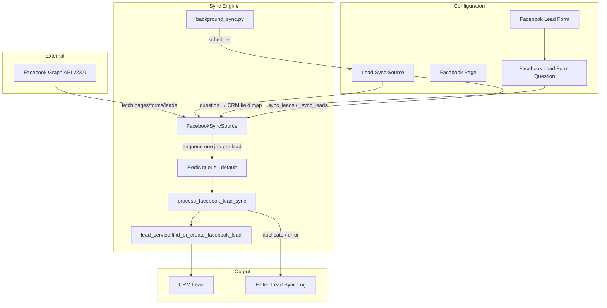
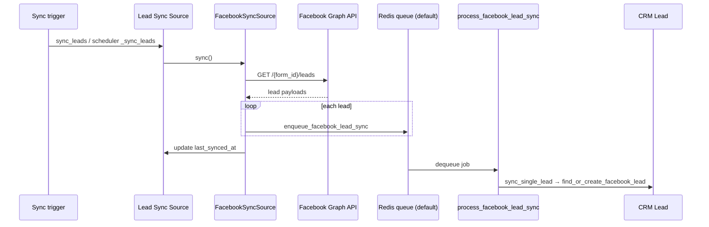

# Lead Sync Source — Technical Documentation

**DocType:** `Lead Sync Source`  
**Module:** Lead Syncing (`crm` app)  
**Status:** Beta

---

## Overview

Lead Sync Source is the configuration and orchestration layer for automatically importing leads from external platforms into `CRM Lead`. It currently supports **Facebook Lead Ads** and is designed to be extended for additional source types.

Each record represents one integration endpoint — typically one Facebook Lead Form — with its own sync schedule, field mappings, and failure logs.

---

## Architecture



### Code layout

| Path | Purpose |
|---|---|
| `crm/lead_syncing/doctype/lead_sync_source/lead_sync_source.py` | DocType controller, validation, sync entry points |
| `crm/lead_syncing/doctype/lead_sync_source/facebook.py` | Facebook Graph API client, fetch/enqueue, per-lead worker |
| `crm/lead_syncing/background_sync.py` | Scheduler-driven batch sync |
| `crm/lead_syncing/doctype/facebook_page/` | Cached Facebook pages |
| `crm/lead_syncing/doctype/facebook_lead_form/` | Cached lead gen forms and question metadata |
| `crm/lead_syncing/doctype/failed_lead_sync_log/` | Failure/duplicate logs and retry |
| `core/services/crm_lead/lead_service.py` | Lead creation logic (`find_or_create_facebook_lead`) |
| `frontend/src/components/Settings/LeadSyncing/` | CRM Settings UI |

---

## Data model

### Entity relationships

| Parent | Child | Link field | Cardinality |
|---|---|---|---|
| `Lead Sync Source` | `Failed Lead Sync Log` | `source` | 1:N |
| `Facebook Page` | `Facebook Lead Form` | `page` | 1:N |
| `Facebook Lead Form` | `Facebook Lead Form Question` | `parent` (child table) | 1:N |
| `Lead Sync Source` | `Facebook Page` | `facebook_page` | N:1 |
| `Lead Sync Source` | `Facebook Lead Form` | `facebook_lead_form` | N:1 (unique) |

### `Lead Sync Source`

| Field | Type | Required | Notes |
|---|---|---|---|
| `type` | Select (`Facebook`) | Yes | Default: `Facebook` |
| `access_token` | Password | No | Hidden. Populated from site config |
| `enabled` | Check | No | Default: `1` |
| `background_sync_frequency` | Select | Yes | Every 5/10/15 min, Hourly, Daily, Monthly |
| `last_synced_at` | Datetime | No | Read-only. Updated after Facebook fetch + enqueue |
| `facebook_page` | Link → `Facebook Page` | No | |
| `facebook_lead_form` | Link → `Facebook Lead Form` | No | Unique across all sources |

### `Facebook Page`

Autoname: `id` (Facebook page ID)

| Field | Type |
|---|---|
| `page_name` | Data |
| `category` | Data |
| `account_id` | Data |
| `access_token` | Small Text |

### `Facebook Lead Form`

Autoname: `id` (Facebook form ID)

| Field | Type |
|---|---|
| `form_name` | Data |
| `page` | Link → `Facebook Page` |
| `questions` | Table → `Facebook Lead Form Question` |

### `Facebook Lead Form Question` (child table)

| Field | Type | Notes |
|---|---|---|
| `label` | Data | Display label |
| `key` | Data | Required. Facebook `field_data` key |
| `type` | Data | Facebook question type |
| `id` | Data | Facebook question ID |
| `mapped_to_crm_field` | Autocomplete | CRM Lead fieldname |

### `Failed Lead Sync Log`

| Field | Type | Options |
|---|---|---|
| `type` | Select | Duplicate, Failure, Synced |
| `source` | Link → `Lead Sync Source` | |
| `lead_data` | Code (JSON) | Raw Facebook lead payload |
| `traceback` | Code | Stack trace for failures |

### `CRM Lead` fields written by sync

| Field | Type | Notes |
|---|---|---|
| `facebook_lead_id` | Data | Unique |
| `facebook_form_id` | Data | Campaign-scoped duplicate check |
| `facebook_raw_data` | JSON | Full Facebook response |
| `mobile_no` | Data | Required for upsert |
| `source` / `source_id` | Link | From `CRM Lead Source` (Facebook) |

---

## Configuration

### Site config — Facebook access token

```json
{
  "facebook_lead_sync_access_token": "<token>"
}
```

Set via `sites/<site>/site_config.json` or `bench set-config facebook_lead_sync_access_token <token>`.

`LeadSyncSource.validate()` throws if the token is missing. `get_facebook_access_token()` reads from `frappe.conf` first, then falls back to the password field.

### Prerequisites

1. **CRM Lead Source (required):** A record with `source_name = "Facebook"` and `purpose = Manual Selection` must exist before sync can run. `FacebookSyncSource.sync_single_lead` looks up this record to set `source` and `source_id` on imported leads. Sync fails if it is missing.
2. **Facebook access token** in site config (`facebook_lead_sync_access_token`)
3. **Scheduler and workers** running for background sync (`long` queue for orchestration, `default` queue for per-lead import jobs)
4. **Tab permission** `LEAD_SYNCING` for users accessing Settings UI

### Permissions

| Role | Access |
|---|---|
| System Manager | Full CRUD on all Lead Syncing DocTypes |
| Sales Manager | Full CRUD on all Lead Syncing DocTypes |

---

## Sync flow

Sync is a **two-stage, queue-based pipeline**:

1. **Orchestration** — fetch all new leads from Facebook and enqueue one Redis job per lead.
2. **Consumption** — background workers process each queued lead independently.



### 1. Source creation (`before_insert`)

```
validate() → check token, duplicate form constraint
before_insert() → fetch_and_store_pages_from_facebook(token)
  → GET /me (validate token)
  → GET /me/accounts (list pages)
  → create Facebook Page records
  → GET /{page_id}/leadgen_forms (per page)
  → create Facebook Lead Form + questions
```

### 2. Lead fetch

```
GET https://graph.facebook.com/v23.0/{form_id}/leads
  ?access_token=...
  &fields=id,created_time,field_data
  &limit=100000
  &filtering=[{"field":"time_created","operator":"GREATER_THAN","value":<timestamp>}]
```

Incremental sync filters by `last_synced_at`. First sync fetches all leads.

### 3. Enqueue per lead

`FacebookSyncSource.sync()` only fetches from Facebook. For each lead returned, it calls `enqueue_facebook_lead_sync()`:

```python
# facebook.py
LEAD_SYNC_QUEUE = "default"

frappe.enqueue(
    process_facebook_lead_sync,
    queue=LEAD_SYNC_QUEUE,
    lead=lead,
    form_id=form_id,
    source_name=source_name,
    job_id=f"facebook_lead_sync:{source_name}:{lead_id}",
    deduplicate=True,
    now=bool(frappe.conf.developer_mode),
)
```

| Behavior | Detail |
|---|---|
| Queue | `default` (Frappe RQ / Redis) |
| Job ID | `facebook_lead_sync:{source_name}:{facebook_lead_id}` |
| Deduplication | Skips enqueue if the same job is already `QUEUED` or `STARTED` |
| Developer mode | `now=True` — processes each lead inline without a worker |

After all leads are enqueued, `last_synced_at` is updated immediately (before workers finish).

### 4. Queue worker — `process_facebook_lead_sync`

Each worker job:

1. Loads `Lead Sync Source` by `source_name`
2. Resolves the Facebook access token via `get_facebook_access_token()`
3. Instantiates `FacebookSyncSource` and calls `sync_single_lead(lead)`

Manual retry from **Failure logs** bypasses the queue and calls `sync_single_lead(..., raise_exception=True)` directly.

### 5. Lead transformation

```python
# facebook.py — sync_single_lead
lead_data = {item["name"]: item["values"][0] for item in lead["field_data"]}
crm_lead_data = {mapping[k]: v for k, v in lead_data.items() if k in mapping}
crm_lead_data["facebook_lead_id"] = lead["id"]
crm_lead_data["facebook_form_id"] = self.form_id
fb_raw_data = self.build_facebook_raw_data(lead)  # includes additional_info when Graph API succeeds

lead_service.find_or_create_facebook_lead(
    mobile_no=crm_lead_data["mobile_no"],
    source=source_name,
    source_id=source_id,
    facebook_raw_data=fb_raw_data,
    other_info=crm_lead_data,
)
```

`build_facebook_raw_data` calls `fetch_fb_lead_info(fb_lead_id)` (Graph API `GET /{lead-id}`) and nests the response under `facebook_raw_data.additional_info`. If that call fails, sync still proceeds with the list-sync payload only; the error is logged via `frappe.log_error`.

### 6. Lead upsert (`lead_service.find_or_create_facebook_lead`)

| Condition | Action |
|---|---|
| No `mobile_no` | Throws validation error → logged as Failure |
| Invalid phone | Throws validation error → logged as Failure |
| No existing lead for `mobile_no`, new `facebook_lead_id` | Insert `CRM Lead`, apply mapped fields + `facebook_raw_data` (with `additional_info` when available) |
| Existing lead, saved `facebook_lead_id` == incoming | Raises `DuplicateLeadError` → logged as Duplicate |
| Existing lead, saved `facebook_lead_id` empty or different from incoming | Update existing lead: set `source`/`source_id` to Facebook, refresh Facebook fields and `facebook_raw_data`; **preserve `lead_name`** if already set |
| Incoming `facebook_lead_id` already on a **different** lead | Raises `DuplicateLeadError` → logged as Duplicate |

Facebook sync **creates or updates** leads matched by `mobile_no` based on `facebook_lead_id` comparison; identical `facebook_lead_id` on the same lead is treated as a duplicate retry.

### 7. Post-fetch timestamp

`last_synced_at` is set to `frappe.utils.now()` on the Lead Sync Source **after fetch and enqueue complete**, not after all queue workers finish. A worker failure after this timestamp will not cause the lead to be re-fetched on the next incremental sync; use **Failure logs → Retry sync** instead.

---

## Background jobs and queues

| Stage | Entry point | Queue | Worker method |
|---|---|---|---|
| Orchestration | `Lead Sync Source.sync_leads` → `_sync_leads` → `FacebookSyncSource.sync()` | `long` | `_sync_leads` |
| Per-lead import | `enqueue_facebook_lead_sync()` | `default` | `process_facebook_lead_sync` |

Production requires Frappe background workers listening on both queues (typically via `bench start` or dedicated `bench worker` processes).

In `developer_mode`, `sync_leads` runs `_sync_leads` synchronously and each per-lead job runs with `now=True` (no worker required for local testing).

---

## Validation rules

| Rule | Location | Behavior |
|---|---|---|
| Access token required | `validate()` | Blocks save |
| One enabled source per form | `validate_same_fb_form_active()` | Blocks save if another enabled source uses same `facebook_lead_form` |
| Lead form required for sync | `_sync_leads()` | Throws on manual/scheduled sync |
| Duplicate by mapped fields + form | `validate_duplicate_lead()` | Logs as Duplicate, skips lead |
| Duplicate by `facebook_lead_id` | DB unique constraint | Logs as Duplicate, skips lead |

---

## Scheduling

Registered in `crm/hooks.py` → `scheduler_events`:

| `background_sync_frequency` | Hook | Trigger |
|---|---|---|
| Every 5 Minutes | `sync_leads_from_sources_5_minutes` | `*/5 * * * *` |
| Every 10 Minutes | `sync_leads_from_sources_10_minutes` | `*/10 * * * *` |
| Every 15 Minutes | `sync_leads_from_sources_15_minutes` | `*/15 * * * *` |
| Hourly | `sync_leads_from_sources_hourly` | `hourly_long` |
| Daily | `sync_leads_from_sources_daily` | `daily_long` |
| Monthly | `sync_leads_from_sources_monthly` | `monthly_long` |

`background_sync.sync_leads_from_all_enabled_sources(frequency)` loads all sources where `enabled=1` and matching frequency, then calls `_sync_leads()` per source. Per-source errors are logged via `frappe.log_error` without stopping the batch.

---

## Manual sync

| Entry point | Behavior |
|---|---|
| `Lead Sync Source.sync_leads` (whitelisted) | Enqueues `_sync_leads` on `long` queue |
| `_sync_leads` → `FacebookSyncSource.sync()` | Fetches from Facebook, enqueues one job per lead on `default` queue |
| `developer_mode` | Runs orchestration and per-lead jobs synchronously |
| Desk custom button | Calls `sync_leads` via `lead_sync_source.js` |
| CRM Settings "Sync now" | Calls `sync_leads` via `useDocument` |

---

## API reference

| Method | Module | Description |
|---|---|---|
| `Lead Sync Source.sync_leads` | `lead_sync_source.py` | Trigger sync (enqueue or inline) |
| `FacebookSyncSource.sync` | `facebook.py` | Fetch leads from Facebook and enqueue import jobs |
| `enqueue_facebook_lead_sync` | `facebook.py` | Push one lead payload onto Redis (`default` queue) |
| `process_facebook_lead_sync` | `facebook.py` | Worker: import a single queued Facebook lead |
| `FacebookSyncSource.sync_single_lead` | `facebook.py` | Map fields and call `find_or_create_facebook_lead` |
| `fetch_and_store_pages_from_facebook` | `facebook.py` | Fetch and cache pages/forms |
| `get_pages_with_forms` | `facebook.py` | Return cached pages with forms |
| `Failed Lead Sync Log.retry_sync` | `failed_lead_sync_log.py` | Retry single failed lead (direct, not queued) |

### Facebook Graph API

| Endpoint | Purpose |
|---|---|
| `GET /me` | Validate token, get account ID |
| `GET /me/accounts` | List pages |
| `GET /{page_id}/leadgen_forms` | List forms and questions |
| `GET /{form_id}/leads` | Fetch leads |

Base: `https://graph.facebook.com/v23.0`

---

## Error handling and retry

| Error | Log type | Per-lead behavior |
|---|---|---|
| `DuplicateLeadError` | Duplicate | Skip, worker completes |
| `UniqueValidationError` | Duplicate | Skip, worker completes |
| Other exception | Failure | Skip with traceback, worker completes |

Queue worker failures are isolated per lead — one bad lead does not block others in the batch.

`FailedLeadSyncLog.retry_sync`:
1. Loads parent `Lead Sync Source`
2. Calls `FacebookSyncSource.sync_single_lead(lead_data, raise_exception=True)` **directly** (bypasses queue)
3. Sets log `type` to `Synced` on success

---

## Frontend

| Component | Role |
|---|---|
| `LeadSyncSourcePage.vue` | List ↔ form navigation |
| `LeadSyncSources.vue` | Source list, enable/disable, delete |
| `LeadSyncSourceForm.vue` | Create/edit, mapping grid, sync now |
| `FailureLogs.vue` | Failure log viewer with retry |
| `leadSyncSourceConfig.js` | Supported source types |

Settings path: **Settings → Integrations → Lead syncing**

Field mapping grid loads `Facebook Lead Form.questions` and populates `mapped_to_crm_field` from `CRM Lead` field metadata.

---

## Known limitations

1. No pagination on lead fetch (`limit: 100000`)
2. Only Facebook source type implemented
3. `mobile_no` mapping is mandatory for lead creation
4. Access token is global (site config), not per-source
5. Mandatory CRM field mapping validation is disabled
6. Beta feature in UI
7. `last_synced_at` advances after fetch/enqueue — failed queue jobs are not automatically re-fetched; use Failure logs retry
8. Per-lead jobs require a worker on the `default` queue (in addition to `long` for orchestration)

---

## Extending for new source types

1. Add type to `Lead Sync Source.type` options
2. Create sync class (follow `FacebookSyncSource` pattern):
   - `sync()` — fetch from external API and enqueue one job per record
   - `sync_single_lead()` — transform and write to CRM
   - `enqueue_*` / `process_*` worker entry points for Redis queue consumption
3. Wire into `_sync_leads()` and `before_insert()`
4. Add conditional fields in DocType JSON
5. Register in `leadSyncSourceConfig.js`
6. Add UI in `LeadSyncSourceForm.vue`
7. Implement `retry_sync` for the new type (direct processing, not queued)

---

## File reference

```
apps/crm/crm/lead_syncing/
├── background_sync.py
└── doctype/
    ├── lead_sync_source/
    │   ├── lead_sync_source.py
    │   ├── lead_sync_source.json
    │   ├── lead_sync_source.js
    │   └── facebook.py
    ├── facebook_page/
    ├── facebook_lead_form/
    ├── facebook_lead_form_question/
    └── failed_lead_sync_log/

apps/crm/frontend/src/components/Settings/LeadSyncing/
├── LeadSyncSourcePage.vue
├── LeadSyncSources.vue
├── LeadSyncSourceForm.vue
├── LeadSyncSourceListItem.vue
├── FailureLogs.vue
└── leadSyncSourceConfig.js

apps/core/core/services/crm_lead/lead_service.py
```
