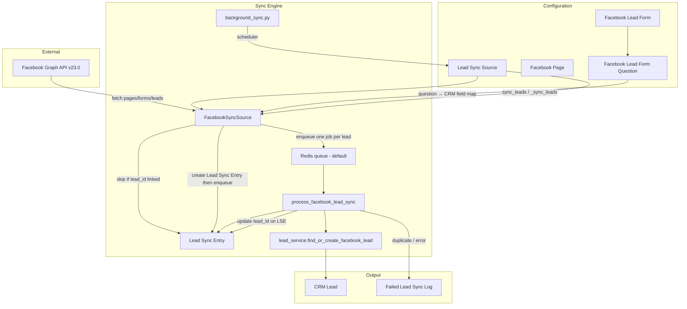
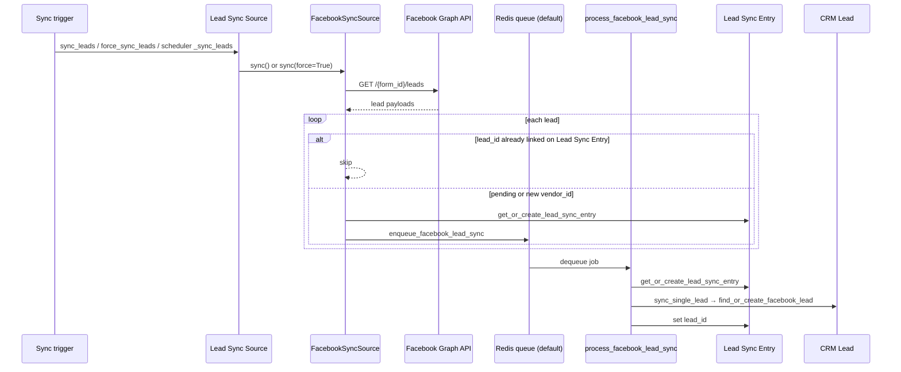

# Lead Sync Source — Technical Documentation

**DocType:** `Lead Sync Source`  
**Module:** Lead Syncing (`crm` app)  
**Status:** Beta  
**Product guide:** [../product/lead_sync_source.md](../product/lead_sync_source.md)

---

## Overview

Lead Sync Source is the configuration and orchestration layer for automatically importing leads from external platforms into `CRM Lead`. It currently supports **Facebook Lead Ads** and is designed to be extended for additional source types.

Each record represents one integration endpoint — typically one Facebook Lead Form — with its own sync schedule, field mappings, and failure logs.

---

## Architecture



### Code layout

| Path | Purpose |
|---|---|
| `crm/lead_syncing/doctype/lead_sync_source/lead_sync_source.py` | DocType controller, validation, sync entry points |
| `crm/lead_syncing/doctype/lead_sync_source/facebook.py` | Facebook Graph API client, fetch/enqueue, per-lead worker |
| `crm/lead_syncing/background_sync.py` | Scheduler-driven batch sync |
| `crm/lead_syncing/doctype/facebook_page/` | Cached Facebook pages |
| `crm/lead_syncing/doctype/facebook_lead_form/` | Cached lead gen forms and question metadata |
| `crm/lead_syncing/doctype/failed_lead_sync_log/` | Failure/duplicate logs and retry |
| `core/platform/doctype/lead_sync_entry/` | Audit trail: raw vendor payload before CRM import |
| `core/services/crm_lead/lead_service.py` | Lead creation logic (`find_or_create_facebook_lead`) |
| `crm/lead_syncing/config.py` | Global Config helpers for force sync role gating |

---

## Data model

### Entity relationships

| Parent | Child | Link field | Cardinality |
|---|---|---|---|
| `Lead Sync Source` | `Failed Lead Sync Log` | `source` | 1:N |
| `Lead Sync Source` | `Lead Sync Entry` | `lead_sync_source` | 1:N |
| `Facebook Page` | `Facebook Lead Form` | `page` | 1:N |
| `Facebook Lead Form` | `Facebook Lead Form Question` | `parent` (child table) | 1:N |
| `Lead Sync Source` | `Facebook Page` | `facebook_page` | N:1 |
| `Lead Sync Source` | `Facebook Lead Form` | `facebook_lead_form` | N:1 (unique) |

### `Lead Sync Source`

| Field | Type | Required | Notes |
|---|---|---|---|
| `type` | Select (`Facebook`) | Yes | Default: `Facebook` |
| `access_token` | Password | No | Hidden. Populated from site config |
| `enabled` | Check | No | Default: `1` |
| `background_sync_frequency` | Select | Yes | Every 5/10/15 min, Hourly, Daily, Monthly |
| `last_synced_at` | Datetime | No | Legacy read-only field on DocType; **not updated by sync** |
| `facebook_page` | Link → `Facebook Page` | No | |
| `facebook_lead_form` | Link → `Facebook Lead Form` | No | Unique across all sources |

### `Facebook Page`

Autoname: `id` (Facebook page ID)

| Field | Type |
|---|---|
| `page_name` | Data |
| `category` | Data |
| `account_id` | Data |
| `access_token` | Small Text |

### `Facebook Lead Form`

Autoname: `id` (Facebook form ID)

| Field | Type |
|---|---|
| `form_name` | Data |
| `page` | Link → `Facebook Page` |
| `questions` | Table → `Facebook Lead Form Question` |

### `Facebook Lead Form Question` (child table)

| Field | Type | Notes |
|---|---|---|
| `label` | Data | Display label |
| `key` | Data | Required. Facebook `field_data` key |
| `type` | Data | Facebook question type |
| `id` | Data | Facebook question ID |
| `mapped_to_crm_field` | Autocomplete | CRM Lead fieldname |

### `Failed Lead Sync Log`

| Field | Type | Options |
|---|---|---|
| `type` | Select | Duplicate, Failure, Synced |
| `source` | Link → `Lead Sync Source` | |
| `lead_data` | Code (JSON) | Raw Facebook lead payload |
| `traceback` | Code | Stack trace for failures |

### `Lead Sync Entry`

DocType name: `Lead Sync Entry` (module: Platform, `core` app)

Every fetched vendor lead is recorded in **`Lead Sync Entry` before CRM import**. A row is created during orchestration (before enqueue) and is guaranteed again inside the worker via `get_or_create_lead_sync_entry()`. `vendor_id` is unique and used as the idempotency key.

| Field | Type | Notes |
|---|---|---|
| `vendor_id` | Data | Required. Unique. Facebook lead ID for Facebook sync |
| `vendor_name` | Data | Vendor label (e.g. `Facebook`) |
| `lead_sync_source` | Link → `Lead Sync Source` | Parent source |
| `lead_id` | Link → `CRM Lead` | Set after successful import; empty while pending |
| `raw` | JSON | Full vendor payload (see [Raw payload format](#raw-payload-format)) |
| `submitted_at` | Datetime | Vendor submission time (`created_time` for Facebook) |

### `CRM Lead` fields written by sync

| Field | Type | Notes |
|---|---|---|
| `facebook_lead_id` | Data | Unique |
| `facebook_form_id` | Data | Campaign-scoped duplicate check |
| `facebook_raw_data` | JSON | Full Facebook response |
| `mobile_no` | Data | Required for upsert |
| `source` / `source_id` | Link | From `CRM Lead Source` (Facebook) |

---

## Configuration

### Site config — Facebook access token

```json
{
  "facebook_lead_sync_access_token": "<token>"
}
```

Set via `sites/<site>/site_config.json` or `bench set-config facebook_lead_sync_access_token <token>`.

`LeadSyncSource.validate()` throws if the token is missing. `get_facebook_access_token()` reads from `frappe.conf` first, then falls back to the password field.

### Global Config — force sync roles

Create a **Global Config** record:

| Field | Value |
|---|---|
| `key` | `lead_sync_force_sync_roles` |
| `value` | JSON array of Frappe role names, e.g. `["Administrator", "System Manager"]` |

Users with at least one listed role can see **Force sync** in CRM Settings and call `force_sync_leads`. If the config is missing or empty, force sync is disabled for everyone.

Helper module: `crm/lead_syncing/config.py` (`get_force_sync_roles`, `user_can_force_sync_leads`, `ensure_user_can_force_sync_leads`).

### Prerequisites

1. **CRM Lead Source (required):** A record with `source_name = "Facebook"` and `purpose = Manual Selection` must exist before sync can run. `FacebookSyncSource.sync_single_lead` looks up this record to set `source` and `source_id` on imported leads. Sync fails if it is missing.
2. **Facebook access token** in site config (`facebook_lead_sync_access_token`)
3. **Scheduler and workers** running for background sync (`long` queue for orchestration, `default` queue for per-lead import jobs)
4. **Tab permission** `LEAD_SYNCING` for users accessing Settings UI

### Permissions

| Role | Access |
|---|---|
| System Manager | Full CRUD on all Lead Syncing DocTypes |
| Sales Manager | Full CRUD on all Lead Syncing DocTypes |

---

## Sync flow

Sync is a **three-stage pipeline**:

1. **Orchestration** — fetch leads from Facebook (last 24h for normal sync; all leads for force sync). For each lead without a linked `lead_id`, create a `Lead Sync Entry`, then enqueue one Redis job.
2. **Audit** — the worker ensures a `Lead Sync Entry` exists (reuses pending rows from failed imports).
3. **Consumption** — map fields, upsert `CRM Lead`, then set `Lead Sync Entry.lead_id`.



### 1. Source creation (`before_insert`)

```
validate() → check token, duplicate form constraint
before_insert() → fetch_and_store_pages_from_facebook(token)
  → GET /me (validate token)
  → GET /me/accounts (list pages)
  → create Facebook Page records
  → GET /{page_id}/leadgen_forms (per page)
  → create Facebook Lead Form + questions
```

### 2. Lead fetch

Facebook leads are fetched for the **last 24 hours** (`now - 1 day`) during normal sync and scheduled sync. Sync does **not** use `Lead Sync Source.last_synced_at`. Each Graph API call writes an **`Api hit log`** record with the full JSON response (stored in MariaDB `LONGTEXT`), redacted request params, status code, and duration.

```
GET https://graph.facebook.com/v23.0/{form_id}/leads
  ?access_token=...
  &fields=id,created_time,field_data
  &limit=100000
  &filtering=[{"field":"time_created","operator":"GREATER_THAN","value":<yesterday_unix_timestamp>}]
```

**Force sync** (`force_sync_leads`) calls the same endpoint **without** the `filtering` parameter, returning all leads available for the form. Access is controlled by Global Config key `lead_sync_force_sync_roles` (JSON array of Frappe role names). Vendor deduplication via `Lead Sync Entry.vendor_id` still applies — only leads not yet recorded are enqueued.

Before enqueueing, `FacebookSyncSource.is_vendor_fully_synced(vendor_id)` skips only when a `Lead Sync Entry` exists **and** `lead_id` is already set. Pending entries (no `lead_id`) are re-enqueued on the next sync so failed imports can be retried automatically.

### 3. Enqueue per lead

`FacebookSyncSource.sync()` fetches from Facebook. For each lead that is not fully synced, it **creates the `Lead Sync Entry` first**, then calls `enqueue_facebook_lead_sync()`:

```python
# facebook.py
LEAD_SYNC_QUEUE = "default"

frappe.enqueue(
    process_facebook_lead_sync,
    queue=LEAD_SYNC_QUEUE,
    lead=lead,
    form_id=form_id,
    source_name=source_name,
    job_id=f"facebook_lead_sync:{source_name}:{lead_id}",
    deduplicate=True,
    now=bool(frappe.conf.developer_mode),
)
```

| Behavior | Detail |
|---|---|
| Queue | `default` (Frappe RQ / Redis) |
| Job ID | `facebook_lead_sync:{source_name}:{facebook_lead_id}` |
| Deduplication | Skips enqueue if the same job is already `QUEUED` or `STARTED` |
| Vendor dedup | Skips only when `Lead Sync Entry.lead_id` is set; pending entries are retried |
| Developer mode | `now=True` — processes each lead inline without a worker |

### 4. Queue worker — `process_facebook_lead_sync`

Each worker job:

1. Loads `Lead Sync Source` by `source_name`
2. Resolves the Facebook access token via `get_facebook_access_token()`
3. Instantiates `FacebookSyncSource` and calls `sync_single_lead(lead)`

Manual retry from **Failure logs** bypasses the queue and calls `sync_single_lead(..., raise_exception=True)` directly.

### 5. `Lead Sync Entry` then CRM import

`sync_single_lead` always ensures the audit record exists **before** CRM import:

```python
# facebook.py — sync_single_lead (simplified)
vendor_id = lead["id"]

lead_entry_doc = get_or_create_lead_sync_entry(
    vendor_id=vendor_id,
    fb_raw_data=build_facebook_raw_data(lead),
    submitted_at=lead.get("created_time"),
)

if lead_entry_doc.lead_id:
    return  # already processed

crm_lead_doc = lead_service.find_or_create_facebook_lead(...)
frappe.db.set_value("Lead Sync Entry", lead_entry_doc.name, "lead_id", crm_lead_doc.name)
```

| Step | Behavior |
|---|---|
| Entry exists with `lead_id` | Stop — already processed |
| Entry exists without `lead_id` | Reuse entry and retry CRM import |
| No entry | Insert new `Lead Sync Entry`, then import |
| `UniqueValidationError` on insert | Fetch existing row by `vendor_id` and continue |

`submitted_at` is stored using `frappe.utils.get_datetime_str()` so Facebook timezone-aware timestamps are MySQL-compatible.

#### Raw payload format

Stored in `Lead Sync Entry.raw`:

```json
{
  "id": "1422324429744028",
  "created_time": "2026-07-23T09:33:38+0000",
  "field_data": [
    { "name": "full_name", "values": ["Akash Akash"] },
    { "name": "phone_number", "values": ["+917090169161"] }
  ],
  "additional_info": {
    "ad_id": "120249932100780770",
    "ad_name": "LAL BLR UG Inf (16 July) ad video",
    "campaign_name": "BLR UG Inf (23June) Campaign",
    "form_id": "1468972281940698",
    "platform": "ig",
    "is_organic": false
  }
}
```

- `field_data` keys vary per Facebook Lead Form.
- `additional_info` is populated by `fetch_fb_lead_info()` when the Graph API call succeeds.

### 6. Lead transformation

```python
# facebook.py — sync_single_lead
lead_data = {item["name"]: item["values"][0] for item in lead["field_data"]}
crm_lead_data = {mapping[k]: v for k, v in lead_data.items() if k in mapping}
crm_lead_data["facebook_lead_id"] = lead["id"]
crm_lead_data["facebook_form_id"] = self.form_id
fb_raw_data = self.build_facebook_raw_data(lead)  # includes additional_info when Graph API succeeds

lead_service.find_or_create_facebook_lead(
    mobile_no=crm_lead_data["mobile_no"],
    source=source_name,
    source_id=source_id,
    facebook_raw_data=fb_raw_data,
    other_info=crm_lead_data,
)
```

`build_facebook_raw_data` calls `fetch_fb_lead_info(fb_lead_id)` (Graph API `GET /{lead-id}`) and nests the response under `facebook_raw_data.additional_info`. If that call fails, sync still proceeds with the list-sync payload only; the error is logged via `frappe.log_error`.

### 7. Lead upsert (`lead_service.find_or_create_facebook_lead`)

| Condition | Action |
|---|---|
| No `mobile_no` | Throws validation error → logged as Failure |
| Invalid phone | Throws validation error → logged as Failure |
| No existing lead for `mobile_no`, new `facebook_lead_id` | Insert `CRM Lead`, apply mapped fields + `facebook_raw_data` (with `additional_info` when available) |
| Existing lead, saved `facebook_lead_id` == incoming | Raises `DuplicateLeadError` → logged as Duplicate |
| Existing lead, saved `facebook_lead_id` empty or different from incoming | Update existing lead: set `source`/`source_id` to Facebook, refresh Facebook fields and `facebook_raw_data`; **preserve `lead_name`** if already set |
| Incoming `facebook_lead_id` already on a **different** lead | Raises `DuplicateLeadError` → logged as Duplicate |

Facebook sync **creates or updates** leads matched by `mobile_no` based on `facebook_lead_id` comparison; identical `facebook_lead_id` on the same lead is treated as a duplicate retry.

---

## Background jobs and queues

| Stage | Entry point | Queue | Worker method |
|---|---|---|---|
| Orchestration | `Lead Sync Source.sync_leads` → `_sync_leads` → `FacebookSyncSource.sync()` | `long` | `_sync_leads` |
| Per-lead import | `enqueue_facebook_lead_sync()` | `default` | `process_facebook_lead_sync` |

Production requires Frappe background workers listening on both queues (typically via `bench start` or dedicated `bench worker` processes).

In `developer_mode`, `sync_leads` runs `_sync_leads` synchronously and each per-lead job runs with `now=True` (no worker required for local testing).

---

## Validation rules

| Rule | Location | Behavior |
|---|---|---|
| Access token required | `validate()` | Blocks save |
| One enabled source per form | `validate_same_fb_form_active()` | Blocks save if another enabled source uses same `facebook_lead_form` |
| Lead form required for sync | `_sync_leads()` | Throws on manual/scheduled sync |
| Duplicate by mapped fields + form | `validate_duplicate_lead()` | Logs as Duplicate, skips lead |
| Duplicate by `facebook_lead_id` | DB unique constraint | Logs as Duplicate, skips lead |
| Duplicate by `vendor_id` | `Lead Sync Entry.vendor_id` unique | Skip only when `lead_id` is linked; pending entries retried |

---

## Scheduling

Registered in `crm/hooks.py` → `scheduler_events`:

| `background_sync_frequency` | Hook | Trigger |
|---|---|---|
| Every 5 Minutes | `sync_leads_from_sources_5_minutes` | `*/5 * * * *` |
| Every 10 Minutes | `sync_leads_from_sources_10_minutes` | `*/10 * * * *` |
| Every 15 Minutes | `sync_leads_from_sources_15_minutes` | `*/15 * * * *` |
| Hourly | `sync_leads_from_sources_hourly` | `hourly_long` |
| Daily | `sync_leads_from_sources_daily` | `daily_long` |
| Monthly | `sync_leads_from_sources_monthly` | `monthly_long` |

`background_sync.sync_leads_from_all_enabled_sources(frequency)` loads all sources where `enabled=1` and matching frequency, then calls `_sync_leads()` per source. Per-source errors are logged via `frappe.log_error` without stopping the batch.

---

## Manual sync

| Entry point | Behavior |
|---|---|
| `Lead Sync Source.sync_leads` (whitelisted) | Enqueues `_sync_leads` on `long` queue |
| `_sync_leads` → `FacebookSyncSource.sync()` | Fetches leads from the **last 24 hours** on Facebook, enqueues one job per lead on `default` queue |
| `Lead Sync Source.force_sync_leads` (whitelisted) | Requires role in Global Config `lead_sync_force_sync_roles`; enqueues `_force_sync_leads` on `long` queue |
| `_force_sync_leads` → `FacebookSyncSource.sync(force=True)` | Fetches **all** leads from Facebook (no `time_created` filter), enqueues one job per new `vendor_id` |
| `developer_mode` | Runs orchestration and per-lead jobs synchronously |
| Desk custom button | Calls `sync_leads` via `lead_sync_source.js` |
| CRM Settings "Sync now" | Calls `sync_leads` via `useDocument` |
| CRM Settings "Force sync" | Visible when `can_force_sync_leads` is true; calls `force_sync_leads` via `useDocument` |

---

## API reference

| Method | Module | Description |
|---|---|---|
| `Lead Sync Source.sync_leads` | `lead_sync_source.py` | Trigger sync (last 24h; enqueue or inline) |
| `Lead Sync Source.force_sync_leads` | `lead_sync_source.py` | Force full historical sync (no datetime filter); role-gated via Global Config |
| `Lead Sync Source.can_force_sync_leads` | `lead_sync_source.py` | Returns whether the current user may force sync |
| `get_force_sync_roles` / `user_can_force_sync_leads` | `lead_syncing/config.py` | Read `lead_sync_force_sync_roles` from Global Config |
| `FacebookSyncSource.sync` | `facebook.py` | Fetch leads from Facebook and enqueue import jobs |
| `FacebookSyncSource.fetch_leads` | `facebook.py` | `force=False` (default): last 24h via `time_created` filter; `force=True`: all leads |
| `enqueue_facebook_lead_sync` | `facebook.py` | Push one lead payload onto Redis (`default` queue) |
| `process_facebook_lead_sync` | `facebook.py` | Worker: import a single queued Facebook lead |
| `FacebookSyncSource.sync_single_lead` | `facebook.py` | Map fields and call `find_or_create_facebook_lead` |
| `fetch_and_store_pages_from_facebook` | `facebook.py` | Fetch and cache pages/forms |
| `get_pages_with_forms` | `facebook.py` | Return cached pages with forms |
| `get_lead_sync_entries` | `lead_sync_source.py` | List sync entries with date range + search filters |
| `get_lead_sync_entry` | `lead_sync_source.py` | Single entry detail including `raw` JSON |
| `Failed Lead Sync Log.retry_sync` | `failed_lead_sync_log.py` | Retry single failed lead (direct, not queued) |

#### `get_lead_sync_entries` parameters

| Param | Type | Description |
|---|---|---|
| `source` | string | Lead Sync Source name |
| `from_date` | date (optional) | Filter `submitted_at >= from_date 00:00:00` |
| `to_date` | date (optional) | Filter `submitted_at <= to_date 23:59:59` |
| `search` | string (optional) | `LIKE` match on `vendor_id` OR `lead_id` |
| `start` | int | Pagination offset |
| `page_length` | int | Page size (default 20) |

#### `get_lead_sync_entries` response

```json
{
  "entries": [ /* Lead Sync Entry rows including raw */ ],
  "total_count": 2517,
  "has_next_page": true
}
```

| Field | Type | Description |
|---|---|---|
| `entries` | list | Page of sync entry rows (`name`, `vendor_id`, `vendor_name`, `lead_id`, `submitted_at`, `creation`, `raw`) |
| `total_count` | int | Total matching rows for the current filters (used by UI tab badge) |
| `has_next_page` | bool | `start + page_length < total_count` |

### Facebook Graph API

| Endpoint | Purpose |
|---|---|
| `GET /me` | Validate token, get account ID |
| `GET /me/accounts` | List pages |
| `GET /{page_id}/leadgen_forms` | List forms and questions |
| `GET /{form_id}/leads` | Fetch leads (optional `filtering` on `time_created` for last 24h) |

Base: `https://graph.facebook.com/v23.0`

---

## Error handling and retry

All sync failures are recorded in two places:

1. **`Failed Lead Sync Log`** — user-facing duplicate/failure records with retry in CRM Settings
2. **Frappe Error Log** (`frappe.log_error`) — server-side diagnostics with traceback for every error path

| Stage | Error log title (examples) | User-visible log |
|---|---|---|
| Facebook fetch | `Facebook lead sync fetch failed` | — |
| Orchestration (per lead) | `Facebook lead sync orchestration failed` | — |
| Worker setup | `Facebook lead sync worker failed` | — |
| CRM import | `Facebook lead sync import failed` | Failure |
| Duplicate import | `Facebook lead sync duplicate` | Duplicate |
| `additional_info` fetch | `Facebook lead additional_info fetch failed` | — (sync continues) |
| Scheduled sync | `Scheduled lead sync failed for source {name}` | — |
| Manual sync | `Lead sync failed for source {name}` | — |
| Force sync | `Lead force sync failed for source {name}` | — |

| Error | Log type | Per-lead behavior |
|---|---|---|
| `DuplicateLeadError` | Duplicate + Error Log | Skip, worker completes |
| `UniqueValidationError` | Duplicate + Error Log | Skip, worker completes |
| Other exception | Failure + Error Log | Skip with traceback, worker completes |

Queue worker failures are isolated per lead — one bad lead does not block others in the batch.

Pending `Lead Sync Entry` rows (no `lead_id`) are automatically picked up on the next scheduled or manual sync.

`FailedLeadSyncLog.retry_sync`:
1. Loads parent `Lead Sync Source`
2. Calls `FacebookSyncSource.sync_single_lead(lead_data, raise_exception=True)` **directly** (bypasses queue)
3. Sets log `type` to `Synced` on success

---

## Frontend

| Component | Role |
|---|---|
| `LeadSyncSourcePage.vue` | List ↔ form navigation |
| `LeadSyncSources.vue` | Source list, enable/disable, delete |
| `LeadSyncSourceForm.vue` | Create/edit, mapping grid, sync now, force sync, tabs; **prefetches** first sync-entries page |
| `LeadSyncEntries.vue` | Sync entries list, date range filter, search, detail view; reuses parent prefetch |
| `leadSyncEntryUtils.js` | Parse `raw` JSON into form responses + additional info rows |
| `FailureLogs.vue` | Failure log viewer with retry |
| `leadSyncSourceConfig.js` | Supported source types |

Settings path: **Settings → Integrations → Lead syncing**

Each source form has three tabs (when editing):

| Tab | Purpose |
|---|---|
| **Details** | Page/form selection, field mapping, **Sync now**, **Force sync** (role-gated) |
| **Sync entries (`N`)** | Paginated list of `Lead Sync Entry` records with date range filter and vendor/lead ID search; click a row for detail (form responses, additional info, raw JSON). Tab label includes `total_count` when known |
| **Failure logs** | Failed/duplicate imports with retry |

### Sync entries prefetch

Opening an existing source (not create mode) triggers an early `get_lead_sync_entries` call from `LeadSyncSourceForm.vue`:

| Behavior | Detail |
|---|---|
| When | As soon as the source name is known (`watch` on `[isLocal, syncSource.name]`) |
| Request | `source`, `start=0`, `page_length=20` (no date/search filters) |
| Tab label | `Sync entries (total_count)` once the response returns |
| Tab open | `LeadSyncEntries.vue` reuses the prefetched first page — no duplicate fetch unless filters / load-more / clear require a refresh |
| Count updates | Child emits `update:totalCount` after filtered fetches so the tab badge stays in sync |

Field mapping grid loads `Facebook Lead Form.questions` and populates `mapped_to_crm_field` from `CRM Lead` field metadata.

**Product guide:** [../product/lead_sync_source.md](../product/lead_sync_source.md)

---

## Known limitations

1. No pagination on lead fetch (`limit: 100000`)
2. Only Facebook source type implemented
3. `mobile_no` mapping is mandatory for lead creation
4. Access token is global (site config), not per-source
5. Mandatory CRM field mapping validation is disabled
6. Beta feature in UI
7. Fetch window is fixed at last 24 hours for normal/scheduled sync — use **Force sync** for full historical backfill (role-gated via Global Config)
8. Pending sync entries (no `lead_id`) are retried automatically on the next sync run
9. Per-lead jobs require a worker on the `default` queue (in addition to `long` for orchestration)
10. In `developer_mode`, manual sync runs inline in the web process (no RQ worker required for testing)

---

## Extending for new source types

1. Add type to `Lead Sync Source.type` options
2. Create sync class (follow `FacebookSyncSource` pattern):
   - `sync()` — fetch from external API (last 24h window) and enqueue one job per new `vendor_id`
   - `sync_single_lead()` — create `Lead Sync Entry`, transform, write to CRM, set `lead_id`
   - `enqueue_*` / `process_*` worker entry points for Redis queue consumption
3. Wire into `_sync_leads()` and `before_insert()`
4. Add conditional fields in DocType JSON
5. Register in `leadSyncSourceConfig.js`
6. Add UI in `LeadSyncSourceForm.vue`
7. Implement `retry_sync` for the new type (direct processing, not queued)

---

## Tests

Run the lead syncing test suite:

```bash
bench --site <site> run-tests --module crm.lead_syncing.test_config
bench --site <site> run-tests --module crm.lead_syncing.test_facebook_sync
bench --site <site> run-tests --module crm.lead_syncing.doctype.lead_sync_source.test_lead_sync_source
```

| Module | Coverage |
|---|---|
| `test_config.py` | Global Config force-sync roles, permission helpers |
| `test_facebook_sync.py` | Sync entry creation, orchestration, worker, error logging, fetch filters, duplicates |
| `test_lead_sync_source.py` | APIs (`get_lead_sync_entries`, `can_force_sync_leads`), sync/force_sync orchestration |

Shared fixtures live in `test_lead_syncing_utils.py`.

---

## File reference

```
apps/crm/crm/lead_syncing/
├── background_sync.py
├── config.py
├── test_config.py
├── test_facebook_sync.py
├── test_lead_syncing_utils.py
└── doctype/
    ├── lead_sync_source/
    │   ├── lead_sync_source.py
    │   ├── test_lead_sync_source.py
    │   ├── lead_sync_source.json
    │   ├── lead_sync_source.js
    │   └── facebook.py
    ├── facebook_page/
    ├── facebook_lead_form/
    ├── facebook_lead_form_question/
    └── failed_lead_sync_log/

apps/core/core/platform/doctype/lead_sync_entry/

apps/crm/frontend/src/components/Settings/LeadSyncing/
├── LeadSyncSourcePage.vue
├── LeadSyncSources.vue
├── LeadSyncSourceForm.vue
├── LeadSyncSourceListItem.vue
├── LeadSyncEntries.vue
├── leadSyncEntryUtils.js
├── FailureLogs.vue
├── leadSyncFailureLogUtils.js
└── leadSyncSourceConfig.js

apps/core/core/services/crm_lead/lead_service.py
```
