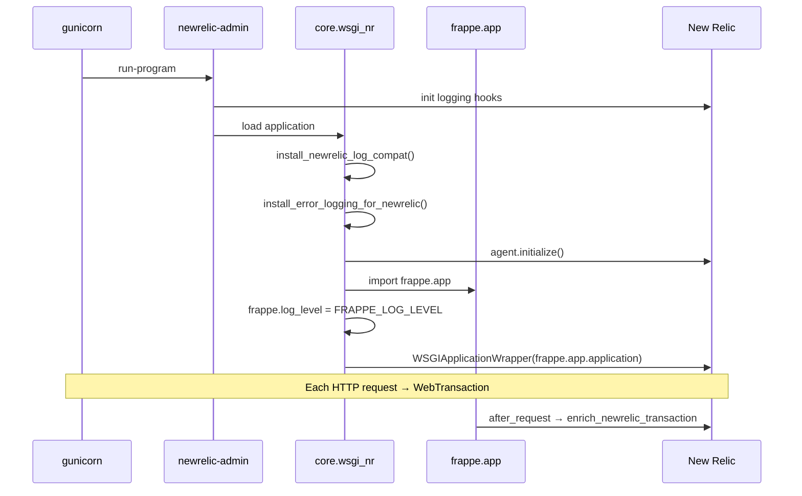

# New Relic Integration — Technical Documentation

**Module:** `core.observability` + `core.wsgi_nr`  
**Agent:** `newrelic` Python package `>=10.0,<11`  
**Status:** Live

---

## Overview

This document covers New Relic–specific implementation details: agent bootstrap, transaction enrichment, custom events, background tasks, log forwarding, and operational runbooks.

For the broader observability module layout, see [readme.md](readme.md).

---

## Bootstrap sequence

### Web (gunicorn)



**Entry module:** `core/wsgi_nr.py`

```python
application = newrelic.agent.WSGIApplicationWrapper(frappe.app.application)
```

### Worker / scheduler

Workers load `core/hooks.py` at startup, which installs log compat and error patches. `background_tasks.before_job` calls `newrelic.agent.initialize()` on first use and opens a `BackgroundTask` per job.

Workers do **not** need `wsgi_nr`, but they **do** need:

- `newrelic` package installed
- Valid agent configuration (env or ini)
- `monitor_mode = true` for data to be sent

Start workers through bench as usual (`bench worker`, `bench schedule`); job hooks attach NR transactions automatically.

---

## Transaction enrichment

**Function:** `core.observability.newrelic.enrich_newrelic_transaction(response, request)`

**Hook:** `after_request` in `core/hooks.py`

Runs only when `newrelic.agent.current_transaction()` is not `None`.

### Custom attributes set

| Attribute | Source |
|---|---|
| `frappe.site` | `frappe.local.site` |
| `frappe.user` | `frappe.local.session.user` |
| `http.status_code` | `response.status_code` |
| `http.method` | `request.method` |
| `http.path` | `request.path` |
| `http.remote_addr` | `request.remote_addr` |
| `request.body` | `format_request_body(request, max_length=4000)` |
| `frappe.cmd` | `frappe.local.form_dict.cmd` (when present) |

### Transaction naming

```python
if cmd:
    newrelic.agent.set_transaction_name(f"/api/method/{cmd}", "WebTransaction")
elif path:
    newrelic.agent.set_transaction_name(path, "WebTransaction")
```

Naming by `frappe.cmd` makes APM group by whitelisted API method (e.g. `/api/method/crm.api.lead.get_lead`) rather than generic `/api/method` paths.

### Body capture limits

- NR custom attribute max length: **4000** characters (`_NR_ATTRIBUTE_MAX_LENGTH`)
- Redaction and truncation logic: `core/observability/request_logging.py`
- Binary and multipart bodies replaced with `<mime body omitted>`

---

## Custom events API

### `record_custom_event(event_type, attributes=None)`

**Module:** `core.observability.newrelic`

```python
def record_custom_event(event_type: str, attributes: dict | None = None) -> None:
    ...
    newrelic.agent.record_custom_event(event_type, params)
```

Behavior:

- Lazy-imports `newrelic.agent`; returns silently if unavailable
- Merges caller `attributes` with auto `frappe.site`
- Skips `None` values
- JSON-serializes `dict`, `list`, `tuple` values
- Catches all exceptions; logs to `core.observability` logger

### Whitelisted HTTP endpoint

**Path:** `core/api/observability/observability.py`

```python
@frappe.whitelist(methods=["POST"])
def track_lead_views(lead_ids, view_type="list", route_name=None):
```

| Parameter | Type | Notes |
|---|---|---|
| `lead_ids` | list or JSON string | Max **100** per request |
| `view_type` | str | `list` or `detail` |
| `route_name` | str | Vue route name |

Returns `{"recorded": N}`. Guest user → `{"recorded": 0}` without error.

Event type: `EnumValues.CrmEventTypes.CrmLeadViewed` → `"CrmLeadViewed"`.

### Server-side usage example

```python
from core.observability.newrelic import record_custom_event
from core.constants.enums import EnumValues

record_custom_event(
    EnumValues.CrmEventTypes.CrmLeadViewed,
    {
        "frappe.user": frappe.session.user,
        "lead_id": lead_name,
        "view_type": "detail",
        "route_name": "Lead",
    },
)
```

Custom events do not require an active web transaction.

---

## Background task instrumentation

**Module:** `core.observability.background_tasks`

### Scheduler detection

```python
SCHEDULED_JOB_METHOD = "frappe.core.doctype.scheduled_job_type.scheduled_job_type.run_scheduled_job"

def is_scheduled_job(method: str) -> bool:
    return SCHEDULED_JOB_METHOD in method
```

For scheduler jobs, `kwargs["job_type"]` holds the dotted path to the scheduled function. Display name:

```python
# crm.lead_syncing...sync_facebook_leads → "Scheduler Sync Facebook Leads"
func_name = job_type.rsplit(".", 1)[-1]
readable = func_name.replace("_", " ").strip().title()
return f"Scheduler {readable}"
```

### Queue jobs

Uses `frappe.local.job.job_name` as queue name when available; transaction name is the raw `method` argument to `before_job`.

### Lifecycle

```python
task = agent.BackgroundTask(application, name=name, group=group)
task.__enter__()
frappe.local.newrelic_background_task = task
# ... job runs ...
task.__exit__(None, None, None)
```

`after_job` always calls `_stop_background_task()` to avoid leaking task context across jobs in the same worker process.

---

## Log forwarding

### Problem

1. Frappe logs dict messages → NR sees `{}` or opaque blobs
2. Frappe uses `%s` formatting with `args` → NR may not interpolate
3. Frappe production default log level is ERROR → INFO/DEBUG never reach NR

### Solutions in this codebase

| Layer | Fix |
|---|---|
| `logging.py` | Materialize `record.msg` at creation time |
| `error_logging.py` | Emit full traceback via `frappe.logger("frappe", with_more_info=True).error(...)` |
| `wsgi_nr.py` | Override `frappe.log_level` from `FRAPPE_LOG_LEVEL` (default DEBUG) |
| Process wrapper | `newrelic-admin run-program` instruments stdlib logging |

Log correlation with traces uses Frappe's monitor trace ID when available:

```python
from frappe.monitor import get_trace_id
ctx["trace_id"] = get_trace_id()
```

---

## Configuration reference

### Environment variables (recommended for Docker / CI)

```bash
export NEW_RELIC_LICENSE_KEY="..."
export NEW_RELIC_APP_NAME="FRAPPE_PROD"
export NEW_RELIC_MONITOR_MODE=true
export NEW_RELIC_DISTRIBUTED_TRACING_ENABLED=true
export NEW_RELIC_APPLICATION_LOGGING_ENABLED=true
export NEW_RELIC_APPLICATION_LOGGING_FORWARDING_ENABLED=true
export FRAPPE_LOG_LEVEL=INFO   # optional; wsgi_nr only
```

### `newrelic.ini` example (site directory)

```ini
[newrelic]
license_key = YOUR_KEY
app_name = FRAPPE_DEV
monitor_mode = true
host = collector.eu01.nr-data.net
otlp_host = otlp.eu01.nr-data.net
distributed_tracing.enabled = true
application_logging.enabled = true
application_logging.forwarding.enabled = true

[dev]
monitor_mode = true
```

Place at `sites/{site}/newrelic.ini` or pass path to `newrelic.agent.initialize(config_file=...)`.

Agent discovers config via:

1. `NEW_RELIC_CONFIG_FILE` env var
2. `newrelic.ini` in working directory / standard search paths
3. Environment variables alone (when using `newrelic-admin`)

---

## NRQL reference

### Transaction queries

```sql
-- Error rate by API method (last hour)
SELECT percentage(count(*), WHERE error IS true) AS 'Error rate'
FROM Transaction
WHERE appName = 'FRAPPE_PROD'
FACET name
SINCE 1 hour ago

-- Slowest whitelisted methods
SELECT average(duration) FROM Transaction
WHERE appName = 'FRAPPE_PROD' AND frappe.cmd IS NOT NULL
FACET frappe.cmd
SINCE 1 day ago
LIMIT 20

-- Failures for one site
SELECT count(*) FROM Transaction
WHERE appName = 'FRAPPE_PROD' AND frappe.site = 'prod.carrum.co.in' AND error IS true
FACET http.status_code, name
SINCE 1 day ago
```

### Log queries

```sql
-- Recent Frappe errors with trace correlation
SELECT message, trace.id FROM Log
WHERE message LIKE '%Frappe log_error%'
SINCE 1 hour ago
LIMIT 100
```

### Custom event queries

```sql
SELECT count(*) FROM CrmLeadViewed
FACET lead_id, view_type
SINCE 1 day ago
LIMIT 50
```

Event types appear in NR after first ingestion (may take a few minutes).

---

## Deployment checklist

- [ ] `newrelic` installed in bench env (`bench pip install -e apps/core`)
- [ ] License key and app name configured (env or ini)
- [ ] Web process uses `core.wsgi_nr:application` behind `newrelic-admin run-program`
- [ ] `NEW_RELIC_MONITOR_MODE=true` in non-local environments
- [ ] Log forwarding enabled if Logs UI is required
- [ ] Distinct `NEW_RELIC_APP_NAME` per environment
- [ ] EU vs US collector region matches license key
- [ ] Workers and scheduler processes restarted after config changes
- [ ] Alerts configured on production app error rate / critical `frappe.cmd` transactions

---

## Troubleshooting

| Symptom | Likely cause | Action |
|---|---|---|
| No transactions in APM | Wrong entry point | Confirm gunicorn target is `core.wsgi_nr:application` |
| Only gunicorn logs, no app logs | Missing `newrelic-admin` or log level | Use `run-program`; check `FRAPPE_LOG_LEVEL` |
| Empty log messages | Record factory not loaded | Ensure `core` hooks load (app installed on site) |
| Generic `/api/method` names | Enrichment hook not firing | Verify `after_request` hook; check agent transaction exists |
| No custom events | Agent disabled or wrong app | Check `monitor_mode`; query `FROM CrmLeadViewed` after traffic |
| No scheduler transactions | Worker missing config | Same ini/env as web; restart `bench worker` |
| Errors without stack trace | Patches not applied | Confirm `install_error_logging_for_newrelic()` in hooks import path |
| Double initialization warnings | Harmless | `initialize()` is idempotent in agent and `wsgi_nr` |

### Verify agent in bench console

```python
import newrelic.agent
newrelic.agent.initialize()
app = newrelic.agent.application()
print(app.name, app.active)
```

### Verify custom event path

```python
from core.observability.newrelic import record_custom_event
record_custom_event("TestEvent", {"hello": "world"})
# Check NR: SELECT * FROM TestEvent SINCE 5 minutes ago
```

---

## Security notes

- `request.body` on transactions may contain business data — redaction is keyword-based, not field-aware per DocType.
- Do not add secrets to custom event attributes.
- NR license keys in `site_config.json` or ini files are secrets — prefer env injection in production.
- Archived integration under `archived/apps/frappe_newrelic_integration-2026-07-22/` is reference only; do not reinstall alongside `core.observability`.

---

## Related documentation

- [Observability — technical overview](readme.md)
- [Observability — product overview](../../product/observability/readme.md)
- [New Relic integration — product guide](../../product/observability/newrelic.md)
- [New Relic Python agent docs](https://docs.newrelic.com/docs/apm/agents/python-agent/)
