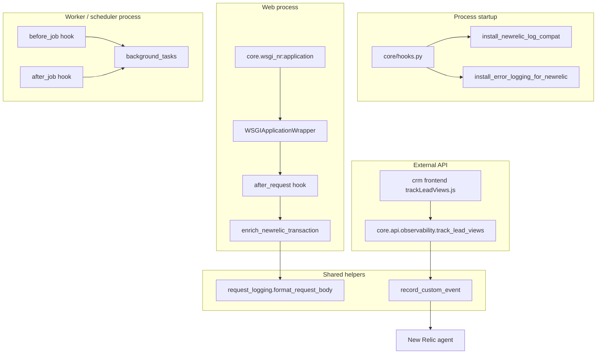

# Observability — Technical Documentation

**Module:** `core.observability`  
**App:** `core`  
**Status:** Live

---

## Overview

The observability stack enriches Frappe/Frappe-bench processes with telemetry suitable for **New Relic APM, Logs, and Custom Events**. It lives in the `core` app and is loaded for all processes via `core/hooks.py`.

Design goals:

1. **Zero per-request log spam** — request metadata goes on the APM transaction, not duplicate log lines.
2. **Complete error visibility** — Frappe errors emit full tracebacks to Python logs for NR log forwarding.
3. **NR log compatibility** — dict- and `%`-formatted log messages are materialized before NR's logging hook reads them.
4. **Background coverage** — queue workers and schedulers get Non-Web transactions.
5. **Safe defaults** — secret redaction and payload truncation in shared helpers.

New Relic–specific wiring is documented in [newrelic.md](newrelic.md).

---

## Architecture



---

## Code layout

| Path | Purpose |
|---|---|
| `core/observability/newrelic.py` | APM transaction enrichment; `record_custom_event()` |
| `core/observability/request_logging.py` | Request body serialization, redaction, truncation; optional API request log helper |
| `core/observability/logging.py` | Log record factory for NR log forwarding compatibility |
| `core/observability/error_logging.py` | Patches `frappe.log_error` / `log_error_snapshot` for full traceback logging |
| `core/observability/background_tasks.py` | `before_job` / `after_job` Non-Web transaction wrappers |
| `core/wsgi_nr.py` | Gunicorn WSGI entry point with NR agent init and app wrapper |
| `core/api/observability/observability.py` | Whitelisted API for frontend custom events |
| `core/hooks.py` | Registers hooks and installs log/error patches at import time |
| `core/constants/enums.py` | `EnumValues.CrmEventTypes` — custom event type constants |
| `crm/frontend/src/utils/trackLeadViews.js` | Frontend helper calling the observability API |

Dependency: `newrelic>=10.0,<11` in `core/pyproject.toml`.

---

## Hook registration

From `core/hooks.py`:

```python
# Module import time (all processes: web, worker, scheduler, console)
install_newrelic_log_compat()
install_error_logging_for_newrelic()

before_job = ["core.observability.background_tasks.before_job"]
after_job = ["core.observability.background_tasks.after_job"]

after_request = [
    "core.observability.newrelic.enrich_newrelic_transaction"
    # "core.observability.request_logging.log_api_request_body",  # disabled
]
```

`log_api_request_body` remains available but is **commented out** — request context is intended for APM attributes instead of structured log lines.

---

## Module reference

### `logging.py` — NR log record factory

New Relic's logging instrumentation reads `record.msg` directly. Frappe often logs dict payloads (e.g. from `log_request`) or defers `%` formatting via `record.args`, which produces empty or unreadable messages in NR Logs.

`install_newrelic_log_compat()` replaces the global `logging.LogRecordFactory` to:

- Serialize dict messages (request-shaped dicts → `METHOD path → status user=...`)
- Call `getMessage()` early and clear `args`

Idempotent; safe to call from both `hooks.py` and `wsgi_nr.py`.

### `error_logging.py` — full exception logging

Frappe's default `log_error_snapshot` persists to the Error Log doctype but only logs `"New Exception collected in error log"` to Python logs.

`install_error_logging_for_newrelic()` monkey-patches:

- `frappe.utils.error.log_error`
- `frappe.utils.error.log_error_snapshot`
- `frappe.app.log_error_snapshot` (module-level binding)
- `frappe.log_error` (public API)

Each patch preserves original Frappe behavior and additionally emits:

```
Frappe log_error_snapshot [ValidationError]: Title | site=... | user=... | cmd=... | trace_id=...
<full traceback>
```

LDAP and excluded exception types follow Frappe's original skip rules.

### `request_logging.py` — body formatting

`format_request_body(request, *, max_length=None)`:

- Skips binary / multipart content types
- Parses JSON and form bodies
- Redacts keys matching `_SECRET_KEYWORDS` (`password`, `token`, `secret`, `key`, …)
- Truncates to `api_request_body_log_max_length` from site config (default **10 000** chars) or explicit `max_length`

Used by `enrich_newrelic_transaction` with `max_length=4000` for NR custom attributes.

### `background_tasks.py` — Non-Web transactions

| Entry | Detection | NR group | Transaction name |
|---|---|---|---|
| Scheduler | `method` contains `run_scheduled_job` | `Scheduler` | `Scheduler {Readable Job Name}` |
| Queue worker | all other `before_job` calls | `Task` | Python `method` string |

Uses `newrelic.agent.BackgroundTask` context manager stored on `frappe.local.newrelic_background_task`. Calls `newrelic.agent.initialize()` if needed (worker processes may not use `wsgi_nr`).

### `newrelic.py`

See [newrelic.md](newrelic.md) for attribute lists and `record_custom_event` contract.

---

## Web entry point

Production web processes should use `core.wsgi_nr:application` instead of `frappe.app.application` directly.

`core/wsgi_nr.py`:

1. Installs log compat + error logging patches
2. Calls `newrelic.agent.initialize()`
3. Imports Frappe **after** NR init
4. Sets `frappe.log_level` from `FRAPPE_LOG_LEVEL` (default `DEBUG`) so NR log forwarding receives sub-ERROR levels in production
5. Wraps the app with `newrelic.agent.WSGIApplicationWrapper`

Recommended gunicorn invocation:

```bash
newrelic-admin run-program gunicorn ... core.wsgi_nr:application
```

Why both `newrelic-admin` and `WSGIApplicationWrapper`?

- `newrelic-admin` — hooks Python's `logging` module for log forwarding
- `WSGIApplicationWrapper` — creates web transactions (required for gunicorn ≥ 22 where automatic gunicorn instrumentation is unreliable)

---

## Frontend integration

**File:** `crm/frontend/src/utils/trackLeadViews.js`

```javascript
await call('core.api.observability.observability.track_lead_views', {
  lead_ids: ids,
  view_type: viewType,   // 'list' | 'detail'
  route_name: routeName,
})
```

Called from:

- `crm/frontend/src/pages/Leads.vue` — list load (batch)
- `crm/frontend/src/pages/Lead.vue` — detail view

Errors are swallowed so telemetry never breaks the UI.

---

## Configuration

### New Relic agent

Configuration follows the [standard Python agent](https://docs.newrelic.com/docs/apm/agents/python-agent/configuration/python-agent-configuration/) — typically via environment variables or a `newrelic.ini` file on the site path (e.g. `sites/{site}/newrelic.ini`).

Common settings:

| Setting | Env var | Notes |
|---|---|---|
| License key | `NEW_RELIC_LICENSE_KEY` | Required |
| App name | `NEW_RELIC_APP_NAME` | One name per environment |
| Monitor mode | `NEW_RELIC_MONITOR_MODE` | `true` in monitored envs |
| Distributed tracing | `NEW_RELIC_DISTRIBUTED_TRACING_ENABLED` | Default on |
| Log forwarding | `NEW_RELIC_APPLICATION_LOGGING_FORWARDING_ENABLED` | Requires `newrelic-admin` or equivalent |
| Log level (Frappe) | `FRAPPE_LOG_LEVEL` | Set in `wsgi_nr.py`; default `DEBUG` |

EU accounts: collector host derived from license key prefix (`eu01` → `collector.eu01.nr-data.net`).

`site_config.json` may contain legacy `newrelic_*` keys for documentation or tooling; the active `core.observability` code reads configuration through the **Python agent** (env / ini), not `frappe.conf`.

### Frappe site config

| Key | Default | Purpose |
|---|---|---|
| `api_request_body_log_max_length` | `10000` | Max serialized body length in `format_request_body` |

---

## Adding a new custom event

1. Add a constant to `EnumValues.CrmEventTypes` in `core/constants/enums.py`.
2. Call `record_custom_event(event_type, attributes)` from server-side code, or expose a whitelisted API under `core/api/observability/`.
3. Keep attributes flat (strings/numbers); dicts/lists are JSON-serialized automatically.
4. Avoid PII beyond what product requires; never pass secrets.
5. Document the event in product and technical New Relic docs.

`record_custom_event` always adds `frappe.site` when available. Failures are logged to `core.observability` logger and do not raise.

---

## Graceful degradation

All NR integrations use lazy `import newrelic.agent` inside try/except:

- Agent not installed → no-op
- No active transaction → enrichment skipped
- `record_custom_event` failure → logged, request continues

Local dev without the agent or without `wsgi_nr` works unchanged.

---

## Testing locally

1. Install dependencies: `bench pip install -e apps/core` (pulls `newrelic`).
2. Add `sites/{site}/newrelic.ini` or export `NEW_RELIC_*` env vars.
3. Start web with NR wrapper:
   ```bash
   NEW_RELIC_APP_NAME=FRAPPE_LOCAL bench --site dev serve
   # or gunicorn with newrelic-admin + core.wsgi_nr:application
   ```
4. Generate traffic; verify transactions in NR APM within 1–2 minutes.
5. Trigger `frappe.log_error("test")` and confirm full traceback in NR Logs.

---

## Migration note

An earlier standalone app `frappe_newrelic_integration` was archived under `archived/apps/frappe_newrelic_integration-2026-07-22/`. Observability logic now lives natively in `core.observability` with a simpler surface: no separate bootstrap app, ini generation from site config, or duplicate web transaction wrapping in `before_request`.

---

## Related documentation

- [New Relic integration — technical documentation](newrelic.md)
- [Observability — product overview](../../product/observability/readme.md)
- [New Relic integration — product guide](../../product/observability/newrelic.md)
