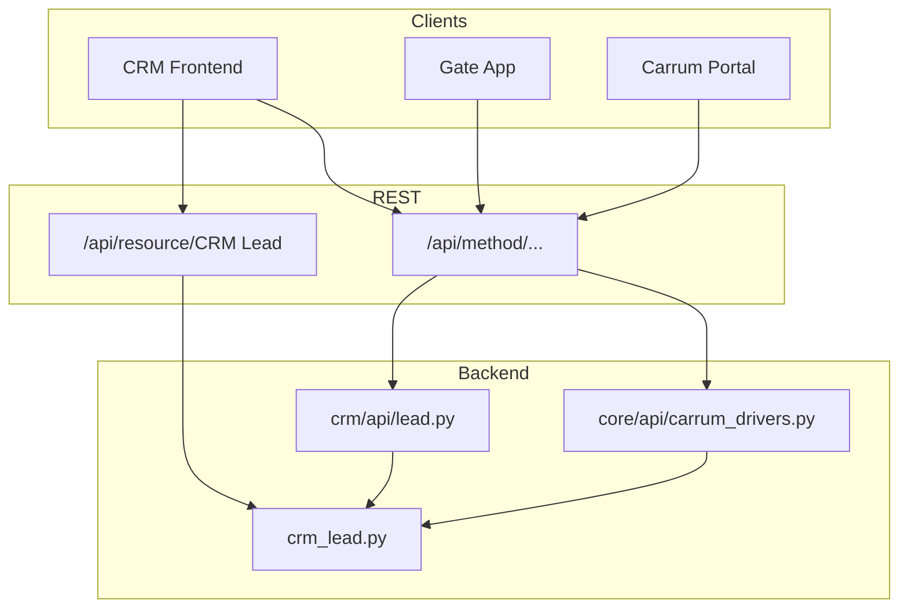

# CRM Lead — Resource API

**DocType:** `CRM Lead`  
**Module:** FCRM (`crm` app)  
**REST base:** `/api/resource/CRM%20Lead`  
**Display ID:** `name` field — `AAAA0001`–`ZZZZ9999` (Redis-backed sequence)  
**Status:** Live

---

## Overview

`CRM Lead` is the central record for prospects, drivers, and vendors. Mobile number (`mobile_no`) is the deduplication key.

| Access type | Documentation |
|---|---|
| REST CRUD | [GET](get.md) · [POST](post.md) · [PUT](put.md) · [DELETE](delete.md) |
| Method APIs | [methods.md](methods.md) |
| Field schema | [fields.md](fields.md) |
| Generic REST guide | [../api.md](../api.md) |

---

## Architecture



### Code layout

| Path | Purpose |
|---|---|
| `crm/fcrm/doctype/crm_lead/crm_lead.py` | Controller, ID sequence, validations, Take Action handlers |
| `crm/fcrm/doctype/crm_lead/crm_lead.json` | Field schema |
| `crm/api/lead.py` | Whitelisted method APIs |
| `crm/api/doc.py` | List scoping, Hub Visit filters |
| `core/api/carrum_drivers.py` | Portal webhooks |

---

## Quick reference

```bash
# Get one lead
GET /api/resource/CRM%20Lead/AAAA0001

# List in-hub leads
GET /api/resource/CRM%20Lead?filters=[["hub_visit_status","=","IN_HUB"]]

# Create (prefer crm.api.lead.create_lead for business rules)
POST /api/resource/CRM%20Lead

# Partial update
PUT /api/resource/CRM%20Lead/AAAA0001

# Delete
DELETE /api/resource/CRM%20Lead/AAAA0001
```

---

## Validation highlights

| Rule | Notes |
|---|---|
| Unique `mobile_no` | 10-digit Indian format |
| Unique KYC fields | `aadhar_no`, `pancard_number`, `driving_license_number` |
| Status transition lock | Telecaller/OA agents restricted on certain changes |
| Hub fee | Immutable after first non-blank save |

Full list: [fields.md](fields.md) and [methods.md](methods.md).

---

## Related

- [Lead walkin done](../lead_walkin_done/README.md) — walk-in audit records linked via `walkin_form_link`
- [Walk-in Form](../../walkin_form.md)
- [Lead Sync Source](../../lead_sync_source.md)
