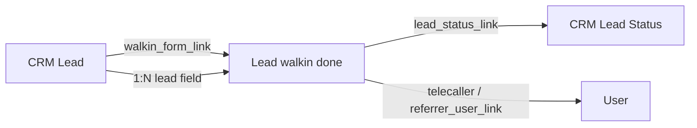

# Lead walkin done — Resource API

**DocType:** `Lead walkin done`  
**Module:** Platform (`core` app)  
**REST base:** `/api/resource/Lead%20walkin%20done`  
**Naming:** Hash-based autoname (e.g. `a1b2c3d4e5`)  
**Status:** Live

---

## Overview

`Lead walkin done` is an **audit record** created each time an onboarding agent submits the walk-in form for a CRM Lead. It snapshots disposition, source, remarks, callback/visit scheduling, and referrer details at submission time.


| Access type         | Documentation                                                                    |
| ------------------- | -------------------------------------------------------------------------------- |
| REST CRUD           |                                                                                  |
| Primary create path | [CRM Lead methods — take_lead_actions](../crm_lead/methods.md#take_lead_actions) |
| Walk-in flow        | [Walk-in Form](../../walkin_form.md)                                             |
| Generic REST guide  | [../api.md](../api.md)                                                           |


---


## Relationships




| Parent             | Child              | Link field         | Cardinality |
| ------------------ | ------------------ | ------------------ | ----------- |
| `CRM Lead`         | `Lead walkin done` | `lead`             | 1:N         |
| `CRM Lead`         | Latest walk-in     | `walkin_form_link` | 1:1 pointer |
| `Lead walkin done` | `CRM Lead Status`  | `lead_status_link` | N:1         |


---


## Primary creation path

Production walk-in submissions **do not** use raw REST POST. They go through:

```
POST /api/method/crm.api.lead.take_lead_actions
{ "action": "mark_walk_in_done", ... }
```

Which calls `CRM Lead.mark_walk_in_done()` → creates `Lead walkin done` → updates the parent lead.

Direct REST POST is available for admin/testing but bypasses walk-in validation and event side-effects.

---


## Field summary


| Field                   | Type                   | Set on create | Notes                                              |
| ----------------------- | ---------------------- | ------------- | -------------------------------------------------- |
| `lead`                  | Link → CRM Lead        | Yes           | Required                                           |
| `lead_status_link`      | Link → CRM Lead Status | Yes           | Disposition FK                                     |
| `primary_status`        | Data                   | Yes           | Snapshot                                           |
| `secondary_status`      | Data                   | Yes           | Snapshot                                           |
| `source`                | Data                   | Yes           | Source label                                       |
| `remarks`               | Small Text             | No            | Agent comment                                      |
| `callback_at`           | Datetime               | No            | Callback or visit datetime                         |
| `callback_type`         | Select                 | No            | `Callback`                                         |
| `telecaller`            | Link → User            | No            | When source is telecaller                          |
| `business_type`         | Data                   | No            | Required in walk-in form UI (all primary statuses) |
| `referrer_name`         | Data                   | No            | Referral snapshot                                  |
| `referrer_mobile_no`    | Data                   | No            |                                                    |
| `referrer_user_link`    | Link → User            | No            |                                                    |
| `created_by`            | Link → User            | Yes           | Submitting agent                                   |
| `walkin_form_filled_at` | Datetime               | Auto          | Defaults to `creation` in `before_save`            |


Full field details: [fields.md](fields.md)

---


## Permissions


| Layer                         | Rule                                                                 |
| ----------------------------- | -------------------------------------------------------------------- |
| DocType JSON                  | System Manager — full CRUD                                           |
| Runtime (`role_perm_service`) | CRM agent roles: create, read, select, write                         |
| Walk-in submit                | Onboarding / Telecaller Lead / Administrator via `mark_walk_in_done` |


---


## Quick reference

```bash
# Get one walk-in record
GET /api/resource/Lead%20walkin%20done/{name}

# List walk-ins for a lead
GET /api/resource/Lead%20walkin%20done?filters=[["lead","=","AAAA0001"]]

# Submit walk-in (preferred)
POST /api/method/crm.api.lead.take_lead_actions
```

---


## Related

- [CRM Lead](../crm_lead/README.md)
- [Walk-in Form — Technical](../../walkin_form.md)
- [Walk-in Form — Product Guide](../../../product/walkin_form.md)

