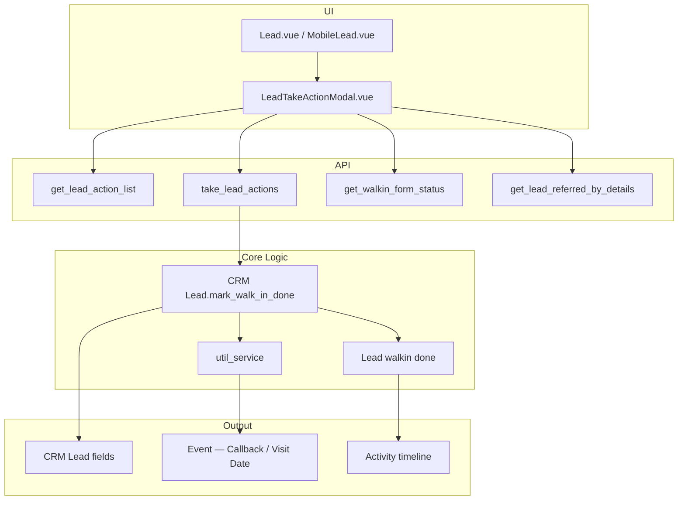

# Walk-in Form — Technical Documentation

**DocType:** `Lead walkin done`  
**Module:** Platform (`core` app)  
**Status:** Live

---

## Overview

The walk-in form is the hub onboarding workflow for recording a completed physical visit. Agents submit it via **Take Action → Mark WalkIn Done** on a `CRM Lead`.

Each submission:

1. Creates a `Lead walkin done` audit record
2. Updates lead status, source, and hub visit fields
3. Completes open `Visit Date` events
4. Optionally creates `Callback` or `Visit Date` events
5. Appears on the lead activity timeline

---

## Architecture



### Code layout

| Path | Purpose |
|---|---|
| `crm/fcrm/doctype/crm_lead/crm_lead.py` | `get_lead_action_list()`, `mark_walk_in_done()` |
| `crm/api/lead.py` | Whitelisted APIs: action list, take action, walk-in statuses |
| `crm/api/activities.py` | Timeline entries for walk-in submissions |
| `crm/api/referral.py` | Referrer details for Referral source |
| `crm/api/doc.py` | Hub Visit and Scheduled Walk-In list scoping |
| `crm/overrides/event.py` | Done/Override enrichment for Visit Date events |
| `core/platform/doctype/lead_walkin_done/` | Audit DocType |
| `core/services/util_service.py` | Visit event completion, callback/visit event creation |
| `core/constants/enums.py` | `MARK_WALK_IN_DONE`, `HubVisitStatus`, `WalkIn` |
| `frontend/src/components/Modals/LeadTakeActionModal.vue` | Walk-in form UI |
| `frontend/src/composables/useWalkinSourceSelection.js` | Source label + special source detection |
| `frontend/src/composables/useWalkinBusinessTypeOptions.js` | Hub-scoped business type options |
| `frontend/src/pages/WalkIn.vue` | Scheduled Walk-In list |
| `frontend/src/pages/HubVisit.vue` | Hub Visit list |
| `frontend/src/pages/CrmSettings/WalkInStatus.vue` | Admin: Onboarding status config |

---

## Data model

### Entity relationships

| Parent | Child / Related | Link field | Cardinality |
|---|---|---|---|
| `CRM Lead` | `Lead walkin done` | `lead` | 1:N |
| `CRM Lead` | `Lead walkin done` (latest) | `walkin_form_link` | 1:1 |
| `Lead walkin done` | `CRM Lead Status` | `lead_status_link` | N:1 |
| `CRM Lead` | `Event` | `reference_docname` | 1:N |
| `CRM Lead Source` (purpose=WalkIn) | Walk-in form source picker | — | N:1 per submission |

### `Lead walkin done`

| Field | Type | Notes |
|---|---|---|
| `lead` | Link → `CRM Lead` | Required |
| `source` | Data | Source label snapshot |
| `primary_status` | Data | Snapshot from status row |
| `secondary_status` | Data | Snapshot from status row |
| `lead_status_link` | Link → `CRM Lead Status` | FK to disposition row |
| `remarks` | Small Text | Agent comment |
| `callback_at` | Datetime | Callback or visit datetime |
| `callback_type` | Select | `Callback` / `Visit Date` |
| `telecaller` | Link → `User` | When source is telecaller |
| `business_type` | Data | Required on every walk-in submission (hub-scoped in UI) |
| `created_by` | Link → `User` | Submitting agent |
| `walkin_form_filled_at` | Datetime | Defaults to `creation` in `before_save` |
| `referrer_name` | Data | Snapshot when source is referrals |
| `referrer_mobile_no` | Data | Referrer phone snapshot |
| `referrer_user_link` | Link → `User` | Referrer Frappe user when resolved |

### `CRM Lead` walk-in fields

| Field | Type | Notes |
|---|---|---|
| `walkin_form_filled_at` | Datetime | Last submission time |
| `walkin_form_link` | Link → `Lead walkin done` | Latest submission |
| `total_walkin_forms_filled` | Int | Counter; supports repeat visits |
| `hub_visit_status` | Select | `NOT_IN_HUB` / `IN_HUB` / `HUB_VISITED` |

### `CRM Lead Status` (walk-in config)

Filtered by `custom_role = Onboarding`. Flags used by form:

| Flag | Effect |
|---|---|
| `is_callback` | Show callback datetime picker |
| `is_visit_date_required` | Show future visit datetime picker |
| `is_remarks_required` | Comment mandatory |
| `is_lead_name_required` | Name mandatory if lead has no name |
| `custom_primary_status` | Primary disposition label |
| `lead_status` | Secondary disposition label |
| `position` | Sort order in UI |

### `CRM Lead Source`

Walk-in form source picker filters: `purpose = WalkIn`.

Special sources (matched case-insensitively by name/id):

| Source | Behavior |
|---|---|
| `referrals` | Loads referrer details from Carrum portal |
| `telecaller` | Requires telecaller agent selection |

---

## Submission flow

### 1. Action visibility (`get_lead_action_list`)

`mark_walk_in_done` is offered when user role is:

- `Administrator`, or
- `Onboarding`, or
- `Telecaller Lead`

```python
# crm_lead.py
actions.append({
    "action": "mark_walk_in_done",
    "label": "Mark WalkIn Done",
    "walkin_form_required": True,
})
```

### 2. Form load (frontend)

| API | Purpose |
|---|---|
| `crm.api.lead.get_walkin_form_status` | Onboarding status rows grouped by primary status |
| `crm.api.lead.get_lead_action_list` | Available actions for lead |
| `crm.api.referral.get_lead_referred_by_details` | Referrer info when source = referrals |
| Hub telecaller users endpoint | Telecaller dropdown when source = telecaller |

### 3. Submit (`take_lead_actions`)

**Endpoint:** `POST /api/method/crm.api.lead.take_lead_actions`

| Parameter | Type | Required | Description |
|---|---|---|---|
| `lead_id` | string | Yes | CRM Lead `name` (display ID) |
| `action` | string | Yes | Must be `mark_walk_in_done` |
| `source` | string | Yes | Source label (from WalkIn-purpose CRM Lead Source) |
| `source_pk` | string | No | `CRM Lead Source.name` — stored on lead as `source_id` |
| `lead_status` | string | Yes | `CRM Lead Status.name` (aliases: `lead_status_pk`, `status_pk`) |
| `remarks` | string | Conditional | Required when status has `is_remarks_required` |
| `comment` | string | No | Alias for `remarks` |
| `lead_name` | string | Conditional | Required when status has `is_lead_name_required` and lead has no name |
| `business_type` | string | Yes (UI) | Hub-scoped product interest; required for all primary statuses in the walk-in form. Server falls back to lead `business_type_name` if omitted. |
| `callback_datetime` | datetime | Conditional | When disposition requires callback (`is_callback`) |
| `scheduled_visit_date` | datetime | Conditional | When disposition requires visit date (`is_visit_date_required`) |
| `callback_type` | string | No | `Callback` or `Visit Date` — inferred from datetime fields if omitted |
| `callback_at` / `callback_time` | datetime | No | Legacy aliases for callback/visit datetime |
| `telecaller` | string | Conditional | Frappe username or hub telecaller id when source is **telecaller** |
| `hub_id` | string | No | Applied when `lead_type = LEAD` and lead has no hub |
| `hub_name` | string | No | Hub display name (→ `custom_hub_name`) |
| `referrer_name` / `external_user_name` | string | No | Referral source — stored on walk-in record |
| `referrer_mobile_no` / `external_phone_number` | string | No | Referral source |
| `referrer_user_link` | string | No | Link → User for referrer |
| `remind_before_minutes` | int | No | Callback event reminder (default `0`) |
| `expected_call_duration_minutes` | int | No | Callback event duration (default `5`) |

```bash
curl -b cookies.txt -X POST 'https://<your-site>/api/method/crm.api.lead.take_lead_actions' \
  -H 'Content-Type: application/json' \
  -H 'X-Frappe-CSRF-Token: <csrf_token>' \
  -d '{
    "lead_id": "AAAA0001",
    "action": "mark_walk_in_done",
    "source": "Google",
    "source_pk": "<crm_lead_source.name>",
    "lead_status": "<crm_lead_status.name>",
    "remarks": "Interested in Black rental",
    "business_type": "Black",
    "hub_id": "<hub-uuid>",
    "hub_name": "Bengaluru Hub"
  }'
```

**Callback disposition example:**

```bash
curl -b cookies.txt -X POST 'https://<your-site>/api/method/crm.api.lead.take_lead_actions' \
  -H 'Content-Type: application/json' \
  -H 'X-Frappe-CSRF-Token: <csrf_token>' \
  -d '{
    "lead_id": "AAAA0001",
    "action": "mark_walk_in_done",
    "source": "Telecaller",
    "source_pk": "<crm_lead_source.name>",
    "lead_status": "<callback_status_pk>",
    "remarks": "Call back tomorrow morning",
    "callback_datetime": "2026-07-15 10:00:00",
    "callback_type": "Callback",
    "telecaller": "tc.agent@example.com",
    "business_type": "Black"
  }'
```

**Referral source example:**

```bash
curl -b cookies.txt -X POST 'https://<your-site>/api/method/crm.api.lead.take_lead_actions' \
  -H 'Content-Type: application/json' \
  -H 'X-Frappe-CSRF-Token: <csrf_token>' \
  -d '{
    "lead_id": "AAAA0001",
    "action": "mark_walk_in_done",
    "source": "referrals",
    "source_pk": "<crm_lead_source.name>",
    "lead_status": "<crm_lead_status.name>",
    "remarks": "Referred by existing driver",
    "referrer_name": "Raj Kumar",
    "referrer_mobile_no": "9123456789",
    "referrer_user_link": "driver.agent@example.com",
    "business_type": "Black"
  }'
```

### 4. Server processing (`mark_walk_in_done`)

```
assert_role_for_walkin()
validate status, source, remarks, name
create Lead walkin done record
if lead not Drop/Converted → update status fields
update source / source_id
mark_visit_date_events_as_completed(lead_id)
if callback_datetime → create_event_for_callback()
if scheduled_visit_date → create_event_for_visit_date()
set hub_visit_status = HUB_VISITED
set walkin_form_filled_at, walkin_form_link
increment total_walkin_forms_filled
if LEAD type and no hub_id → set hub_id, custom_hub_name
save lead
```

---

## Event integration

| Trigger | Method | Effect |
|---|---|---|
| Walk-in submitted | `mark_visit_date_events_as_completed()` | Open Visit Date events → `callback_status = Completed` |
| Callback disposition | `create_event_for_callback()` | New `Callback` event |
| Future visit disposition | `create_event_for_visit_date()` | New `Visit Date` event |
| Unscheduled walk-in | `create_event_for_walkin_completed()` | **Defined but not called** |

### Scheduled Walk-In list enrichment

`CustomEvent.parse_list_data()` adds:

| Column | Logic |
|---|---|
| **Done** | Linked lead has `hub_visit_status == HUB_VISITED` |
| **Override** | A newer Visit Date event exists for the same lead |

---

## Gate App integration

`crm.api.lead.update_lead` (Gate App webhook):

| Scenario | Behavior |
|---|---|
| New lead (by phone) | Creates lead, sets `IN_HUB`, gate ticket fields |
| Existing lead | Sets `IN_HUB`, **clears** `walkin_form_filled_at` and `walkin_form_link`, updates gate ticket |

Walk-in form submission later sets `hub_visit_status = HUB_VISITED`.

---

## Activity timeline

`crm.api.activities.append_lead_walkin_done_activities()` adds entries with:

```python
{
    "activity_type": "lead_walkin_done",
    "data": {
        "source": ...,
        "primary_status": ...,
        "secondary_status": ...,
        "remarks": ...,
        "callback_at": ...,
        "business_type": ...,
        "walkin_form_filled_at": ...,
        "referrer_name": ...,
        "referrer_mobile_no": ...,
    }
}
```

Rendered in `Activities.vue` as **Walk-in Form Submitted**, with `walkin_form_filled_at` shown as the submission timestamp when present.

---

## Permissions

| Layer | Rule |
|---|---|
| Action visibility | `get_lead_action_list()` — Onboarding / Telecaller Lead / Administrator |
| `get_walkin_form_status` | `_assert_role_for_walkin()` — same roles |
| `mark_walk_in_done()` | Inline `assert_role_for_walkin()` — throws `PermissionError` |
| DocType `Lead walkin done` | JSON: System Manager; runtime: `role_perm_service` grants CRM agent roles |
| Saves | `ignore_permissions=True` on walk-in done and lead saves |

---

## Validation rules

| Rule | Location | Behavior |
|---|---|---|
| Role check | `mark_walk_in_done()` | Throws if not Onboarding / Telecaller Lead / Admin |
| Status required | `mark_walk_in_done()` | Throws if `lead_status` missing |
| Source required | `mark_walk_in_done()` | Throws if `source` missing |
| Remarks required | Status flag `is_remarks_required` | Throws if empty |
| Name required | Status flag `is_lead_name_required` | Throws if lead has no name |
| Invalid callback type | `mark_walk_in_done()` | Throws on type mismatch |
| Telecaller not found | `_resolve_walkin_telecaller_user()` | Throws if unresolvable |
| Referral details | Frontend | Blocks submit until portal data loads |
| Business type | Frontend | Required for every walk-in submission (hub-scoped options) |

### Status update exceptions

| Lead state | Status fields updated? |
|---|---|
| Normal | Yes |
| `primary_status = Drop` | No — visit still recorded |
| `primary_status = Converted` | No — visit still recorded |

---

## API reference

Full CRM Lead REST and method API documentation: **[CRM Lead — Resource API](resource/crm_lead/README.md)** · **[Lead walkin done](resource/lead_walkin_done/README.md)** · **[Generic REST guide](resource/api.md)**

### Walk-in endpoints

| Method | HTTP | Auth | Description |
|---|---|---|---|
| `crm.api.lead.get_lead_action_list` | POST | Session | Returns available actions including walk-in |
| `crm.api.lead.take_lead_actions` | POST | Session | Executes `mark_walk_in_done` (and other actions) |
| `crm.api.lead.get_walkin_form_status` | GET/POST | Onboarding / Telecaller Lead | Onboarding status rows for form |
| `crm.api.referral.get_lead_referred_by_details` | GET/POST | Session | Referrer details when source = referrals |
| `crm.api.lead.get_telecaller_user_options` | GET/POST | Session | Hub telecaller dropdown options |
| `crm.api.lead.update_lead` | POST | Session / Gate App | Sets `IN_HUB`, clears walk-in pointers |

### Load form data (curl)

**Available actions for a lead:**

```bash
curl -b cookies.txt -X POST 'https://<your-site>/api/method/crm.api.lead.get_lead_action_list' \
  -H 'Content-Type: application/json' \
  -H 'X-Frappe-CSRF-Token: <csrf_token>' \
  -d '{"lead_id": "AAAA0001"}'
```

**Walk-in disposition options:**

```bash
curl -b cookies.txt 'https://<your-site>/api/method/crm.api.lead.get_walkin_form_status'
```

**Referrer details (referrals source):**

```bash
curl -b cookies.txt -G 'https://<your-site>/api/method/crm.api.referral.get_lead_referred_by_details' \
  --data-urlencode 'lead_id=AAAA0001'
```

**Hub telecaller options:**

```bash
curl -b cookies.txt 'https://<your-site>/api/method/crm.api.lead.get_telecaller_user_options'
```

### Gate App webhook (curl)

```bash
curl -b cookies.txt -X POST 'https://<your-site>/api/method/crm.api.lead.update_lead' \
  -H 'Content-Type: application/json' \
  -H 'X-Frappe-CSRF-Token: <csrf_token>' \
  -d '{
    "phoneNo": "9876543210",
    "ticketNo": "GT-1001",
    "createdAt": "2026-07-14T10:30:00+05:30",
    "hubId": "<hub-uuid>",
    "hubName": "Bengaluru Hub",
    "category": "Walk-in",
    "subCategory": "New Lead"
  }'
```

| Parameter | Type | Required | Description |
|---|---|---|---|
| `phoneNo` | string | Yes | Visitor mobile (normalized to 10-digit Indian) |
| `ticketNo` | string | No | Gate ticket number → `gate_ticket_no` |
| `createdAt` | datetime | No | → `custom_gate_ticket_generated_at` (IST) |
| `hubId` | string | No | → `hub_id` (new leads; existing LEAD only) |
| `hubName` | string | No | → `custom_hub_name` |
| `category` | string | No | → `hubvisit_category` |
| `subCategory` | string | No | → `hubvisit_subcategory` |

---

## Configuration

### CRM Settings — Walk-In Status

Path: **CRM Settings → Walk-In Status**

- DocType: `CRM Lead Status`
- Filter: `custom_role = Onboarding`
- Quick entry layout: `Walk-In Status Quick Entry` (`crm_fields_layout.py`)
- Defaults API: `get_lead_status_create_defaults(usage='walkin_status')`

### CRM Settings — Lead Source

Path: **CRM Settings → Lead source**

- Create sources with `purpose = WalkIn`
- Include `referrals` and `telecaller` for special flows

> Default install seeds `"Walk In"` with `purpose = Manual Selection` — not usable by walk-in form picker.

### Tab permissions

Seeded in `seed_default_crm_tab_permissions.py`:

- `Scheduled Walk-In`
- `Hub Visit`

---

## Agent performance metrics

Walk-in KPIs derived from `Event` rows with `event_category = Visit Date`:

| Metric | Source |
|---|---|
| `new_walkin_schedules` | Visit Date events created today (excl. Override) |
| `scheduled_walkin` | Visit Date events scheduled for today |
| `completed_scheduled_walkin` | Today's visits with status Completed |
| `unique_schedules_walkin` | Distinct leads with Visit Date events created today |

Computed in `agent_performance.py` and `agent_performance_dashboard.py`.

---

## Known limitations

1. `create_event_for_walkin_completed()` is implemented but **never invoked** — unscheduled walk-ins do not auto-create a completed Visit Date event
2. No failure log or retry queue (unlike Lead Sync Source)
3. Referral source depends on Carrum portal API availability
4. `test_lead_walkin_done.py` is a stub — no behavioral tests
5. Walk-in form sources must be manually configured (`purpose = WalkIn`)

---

## File reference

```
apps/core/core/platform/doctype/lead_walkin_done/
├── lead_walkin_done.json
├── lead_walkin_done.py
└── lead_walkin_done.js

apps/core/core/services/
├── util_service.py          # mark_visit_date_events_as_completed, create_event_for_*
├── role_perm_service.py     # Agent permissions on Lead walkin done
├── agent_performance.py     # Walk-in schedule metrics
└── agent_performance_dashboard.py

apps/core/core/constants/enums.py

apps/crm/crm/fcrm/doctype/crm_lead/
├── crm_lead.py              # mark_walk_in_done, get_lead_action_list
└── crm_lead.json            # walkin + hub_visit fields

apps/crm/crm/api/
├── lead.py                  # get_walkin_form_status, take_lead_actions
├── activities.py            # Timeline entries
├── referral.py              # Referrer details
└── doc.py                   # List view scoping

apps/crm/crm/overrides/event.py

apps/crm/frontend/src/
├── components/Modals/LeadTakeActionModal.vue
├── composables/useWalkinSourceSelection.js
├── composables/useWalkinBusinessTypeOptions.js
├── pages/WalkIn.vue
├── pages/HubVisit.vue
└── pages/CrmSettings/WalkInStatus.vue
```
